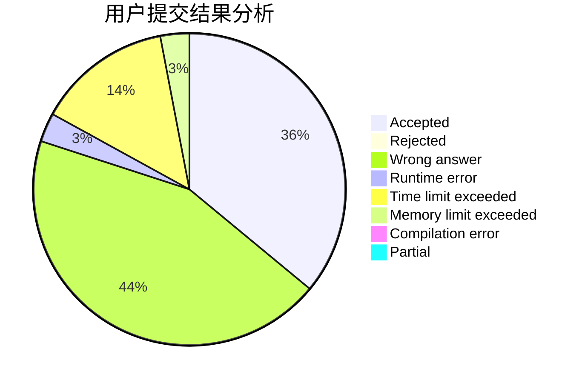
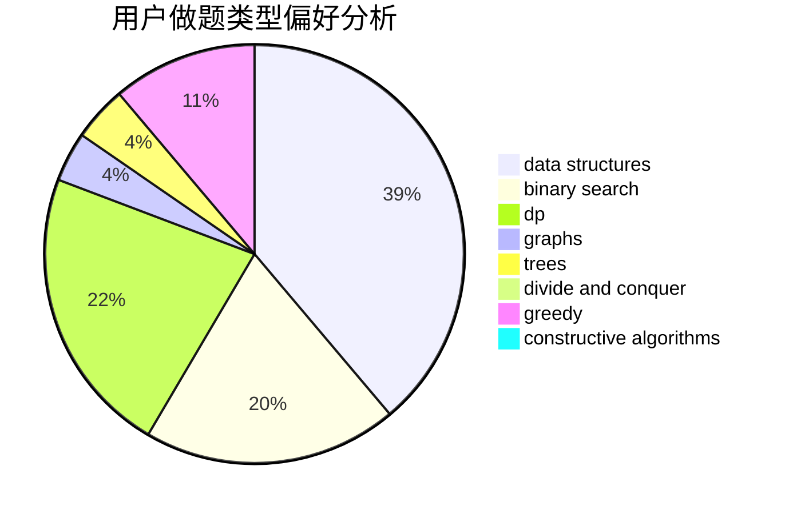
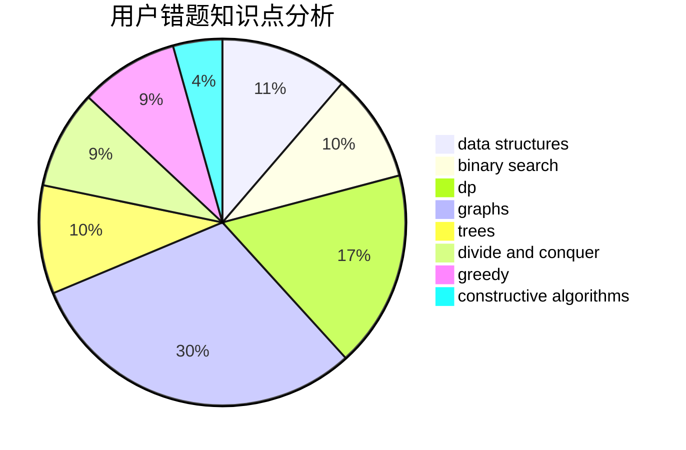

# LebronDurant

<!-- tabs:start -->

#### **用户提交结果分析**

#### **用户做题类型偏好分析**

#### **用户错题知识点分析**

<!-- tabs:end -->
# 推荐题目
[1404E](https://codeforces.com/contest/1404/problem/E)		flows,
                        graph matchings,
                        graphs		  
[582D](https://codeforces.com/contest/582/problem/D)		dp,
                        math,
                        number theory		  
[954B](https://codeforces.com/contest/954/problem/B)		implementation,
                        strings		  
[1267C](https://codeforces.com/contest/1267/problem/C)		constructive algorithms		  
[477C](https://codeforces.com/contest/477/problem/C)		dsu,graphs,sortings,trees		  
[1244F](https://codeforces.com/contest/1244/problem/F)		constructive algorithms,
                        implementation		  
[482C](https://codeforces.com/contest/482/problem/C)		bitmasks,
                        dp,
                        probabilities		  
[293E](https://codeforces.com/contest/293/problem/E)		data structures,
                        divide and conquer,
                        trees		  
[372C](https://codeforces.com/contest/372/problem/C)		data structures,
                        dp,
                        math		  
[319E](https://codeforces.com/contest/319/problem/E)		data structures		  
