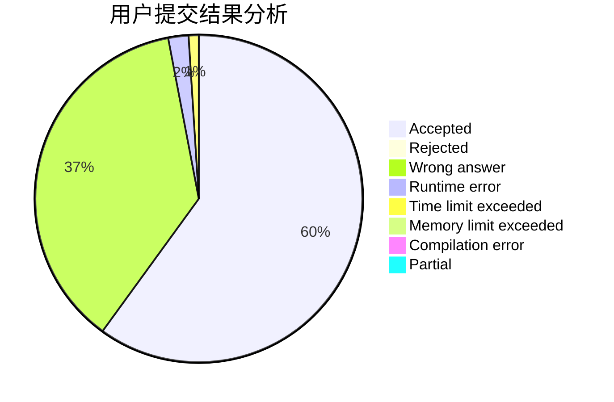
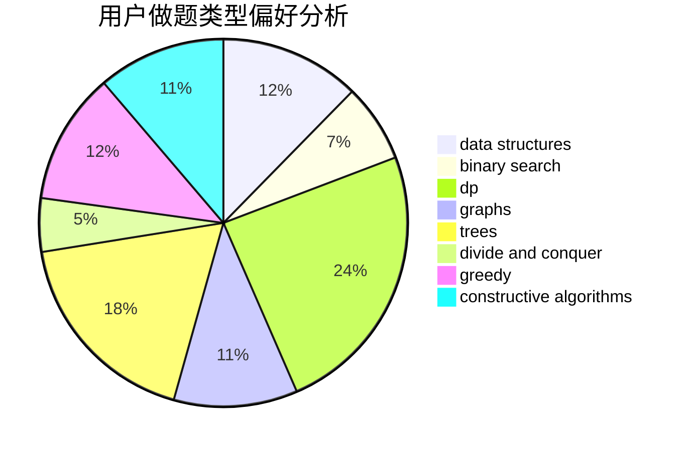
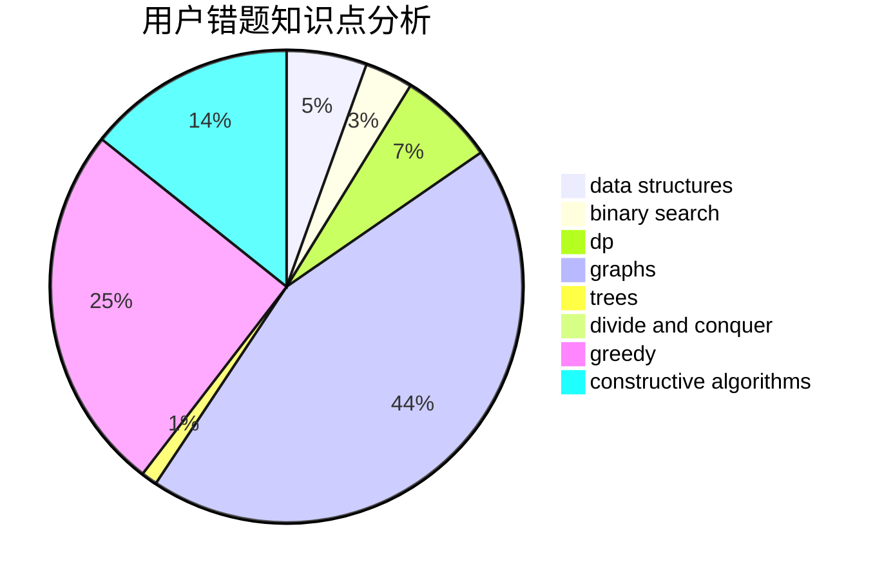

# Lecxcy

<!-- tabs:start -->

#### **用户提交结果分析**

#### **用户做题类型偏好分析**

#### **用户错题知识点分析**

<!-- tabs:end -->
# 推荐题目
[1322E](https://codeforces.com/contest/1322/problem/E)		data structures		  
[1038C](https://codeforces.com/contest/1038/problem/C)		greedy,
                        sortings		  
[672B](https://codeforces.com/contest/672/problem/B)		constructive algorithms,
                        implementation,
                        strings		  
[136B](https://codeforces.com/contest/136/problem/B)		implementation,
                        math		  
[534B](https://codeforces.com/contest/534/problem/B)		dp,
                        greedy,
                        math		  
[425C](https://codeforces.com/contest/425/problem/C)		data structures,
                        dp		  
[860D](https://codeforces.com/contest/860/problem/D)		dsu,graphs,sortings,trees		  
[39D](https://codeforces.com/contest/39/problem/D)		math		  
[1347E](https://codeforces.com/contest/1347/problem/E)		dsu,graphs,sortings,trees		  
[594D](https://codeforces.com/contest/594/problem/D)		data structures,
                        number theory		  
