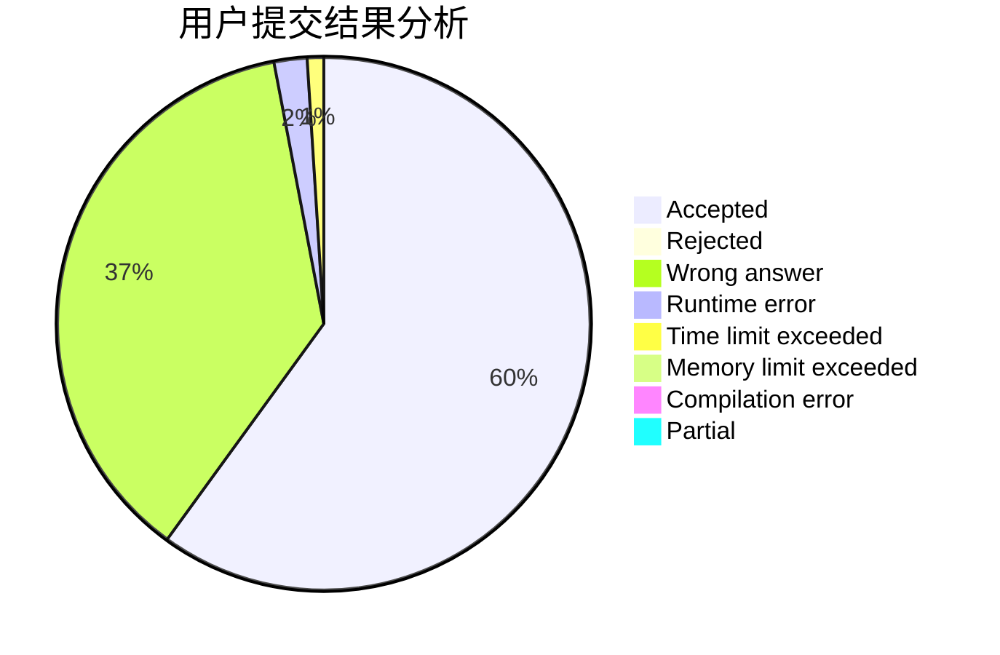
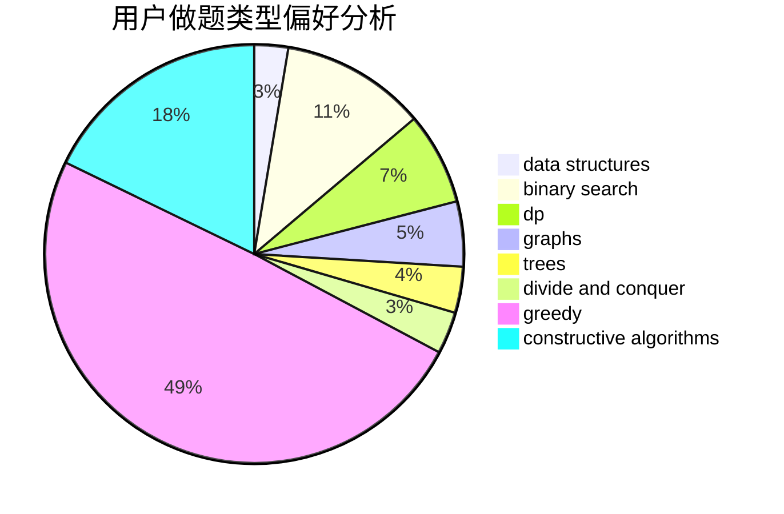
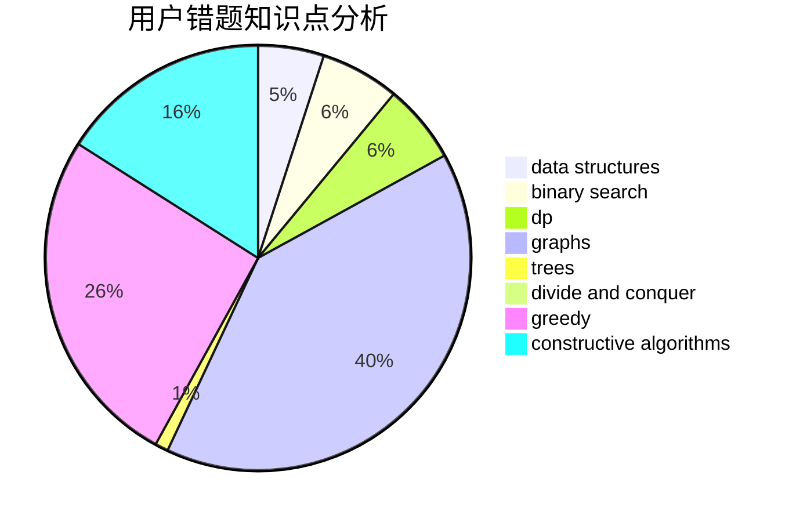

# Lecxcy

<!-- tabs:start -->

#### **用户提交结果分析**

#### **用户做题类型偏好分析**

#### **用户错题知识点分析**

<!-- tabs:end -->
# 推荐题目
[1313B](https://codeforces.com/contest/1313/problem/B)		constructive algorithms,
                        greedy,
                        implementation,
                        math		  
[1037H](https://codeforces.com/contest/1037/problem/H)		data structures,
                        string suffix structures		  
[645F](https://codeforces.com/contest/645/problem/F)		combinatorics,
                        math,
                        number theory		  
[1362C](https://codeforces.com/contest/1362/problem/C)		bitmasks,
                        greedy,
                        math		  
[510D](https://codeforces.com/contest/510/problem/D)		bitmasks,
                        brute force,
                        dp,
                        math		  
[39B](https://codeforces.com/contest/39/problem/B)		greedy		  
[841D](https://codeforces.com/contest/841/problem/D)		dsu,graphs,sortings,trees		  
[369B](https://codeforces.com/contest/369/problem/B)		constructive algorithms,
                        implementation,
                        math		  
[1340F](https://codeforces.com/contest/1340/problem/F)		brute force,
                        data structures,
                        hashing		  
[574C](https://codeforces.com/contest/574/problem/C)		dsu,graphs,sortings,trees		  
