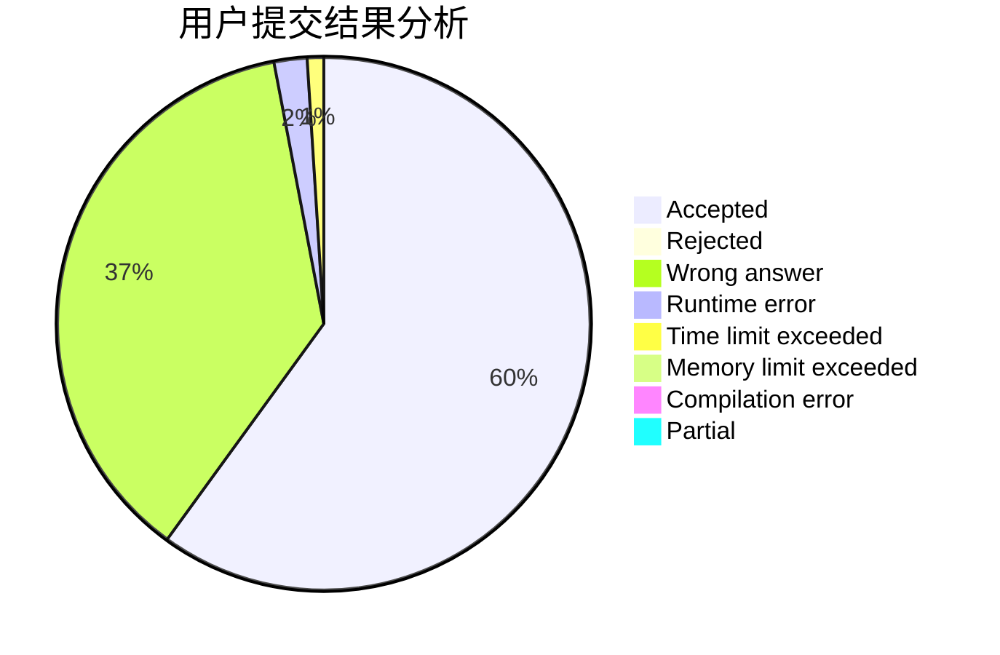
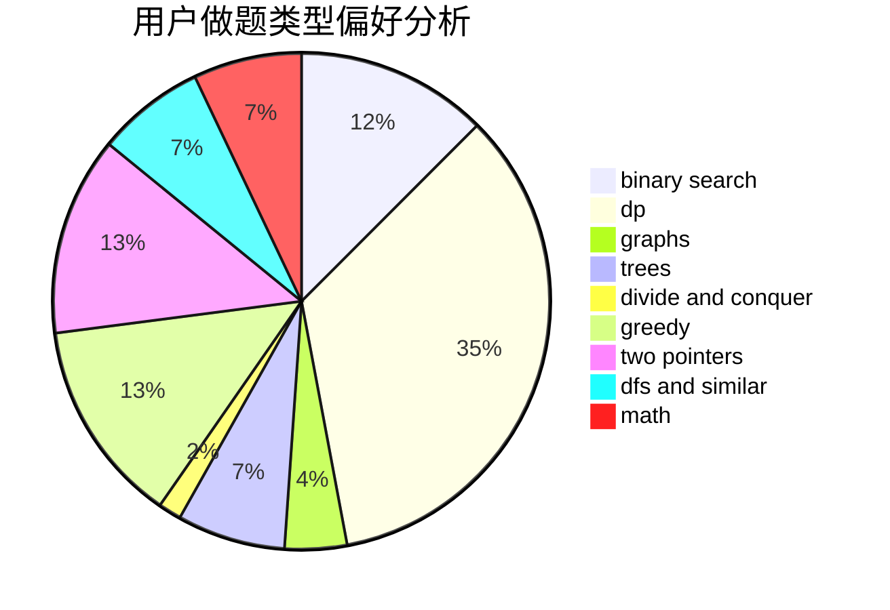

# Lecxcy

<!-- tabs:start -->

#### **用户提交结果分析**

#### **用户做题类型偏好分析**

<!-- tabs:end -->
# 推荐题目
[1322E](https://codeforces.com/contest/1322/problem/E)
[1038C](https://codeforces.com/contest/1038/problem/C)
[672B](https://codeforces.com/contest/672/problem/B)
[136B](https://codeforces.com/contest/136/problem/B)
[534B](https://codeforces.com/contest/534/problem/B)
[425C](https://codeforces.com/contest/425/problem/C)
[860D](https://codeforces.com/contest/860/problem/D)
[39D](https://codeforces.com/contest/39/problem/D)
[1347E](https://codeforces.com/contest/1347/problem/E)
[594D](https://codeforces.com/contest/594/problem/D)
