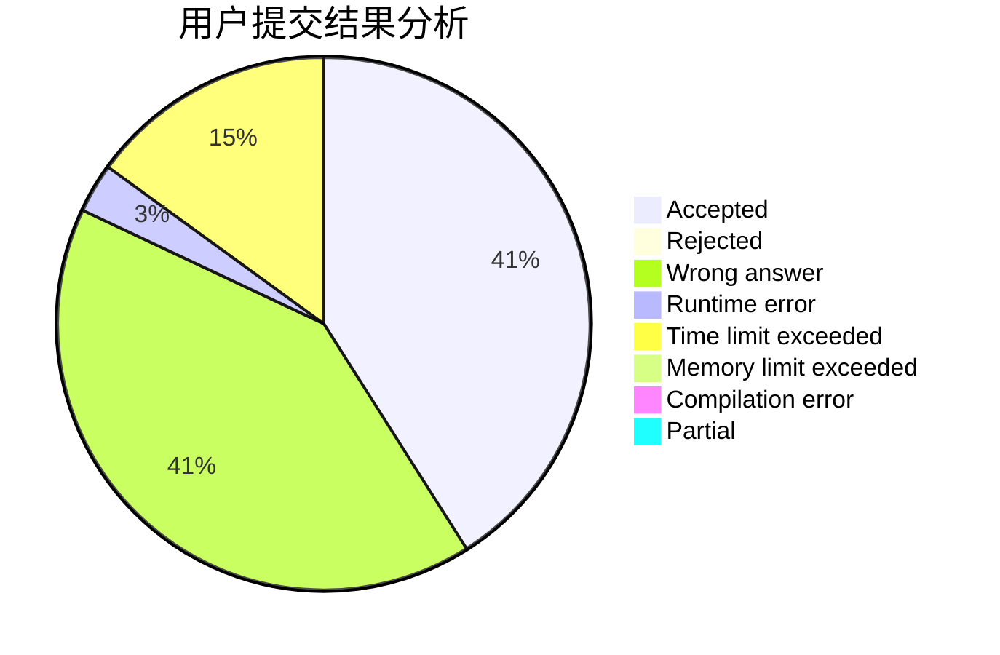
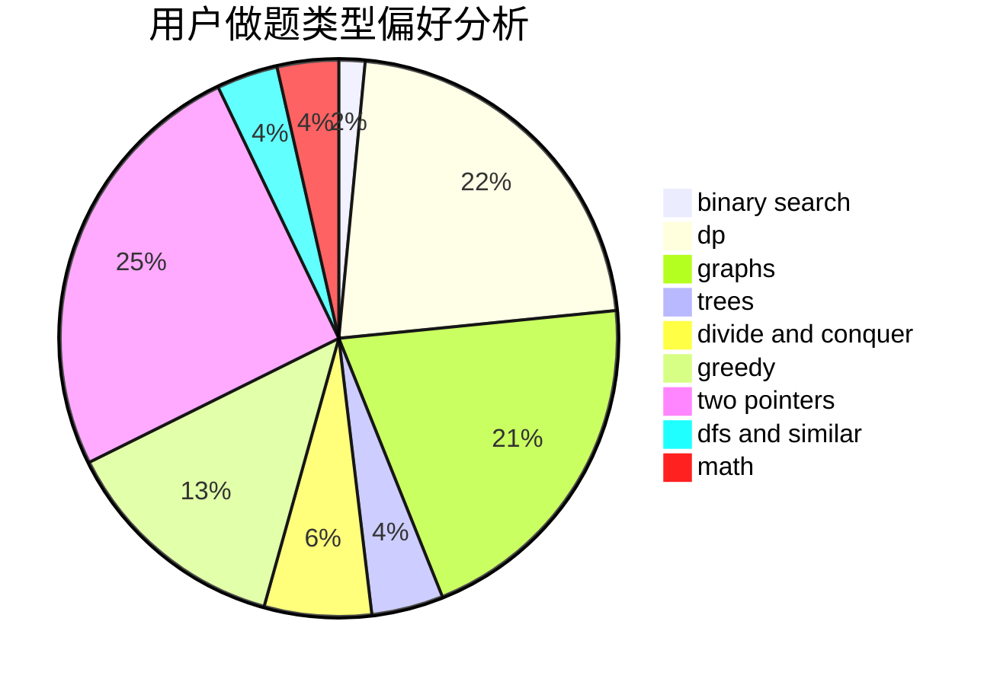

# LegendNI

<!-- tabs:start -->

#### **用户提交结果分析**

#### **用户做题类型偏好分析**

<!-- tabs:end -->
# 推荐题目
[1485F](https://codeforces.com/contest/1485/problem/F)
[960G](https://codeforces.com/contest/960/problem/G)
[715E](https://codeforces.com/contest/715/problem/E)
[666A](https://codeforces.com/contest/666/problem/A)
[534B](https://codeforces.com/contest/534/problem/B)
[1023A](https://codeforces.com/contest/1023/problem/A)
[11962](https://codeforces.com/contest/1196/problem/2)
[567A](https://codeforces.com/contest/567/problem/A)
[17C](https://codeforces.com/contest/17/problem/C)
[1103B](https://codeforces.com/contest/1103/problem/B)
