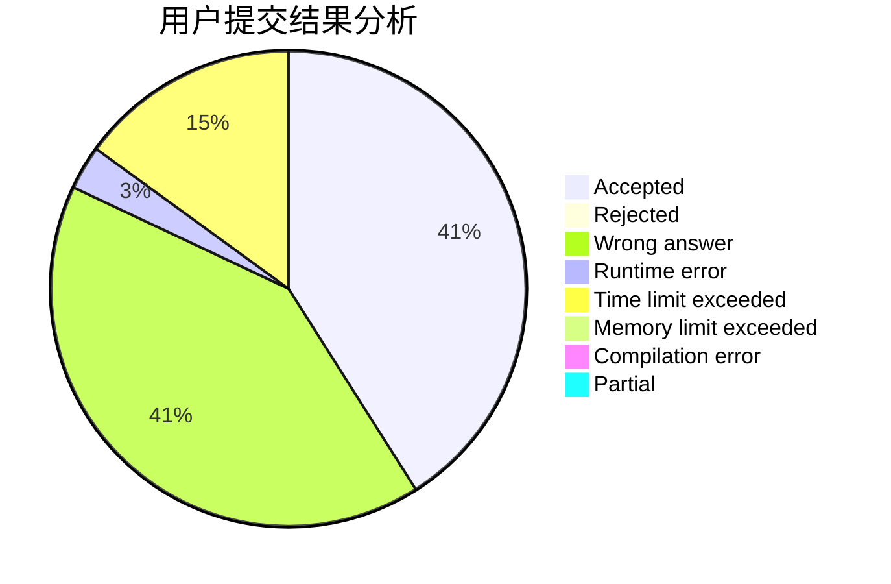
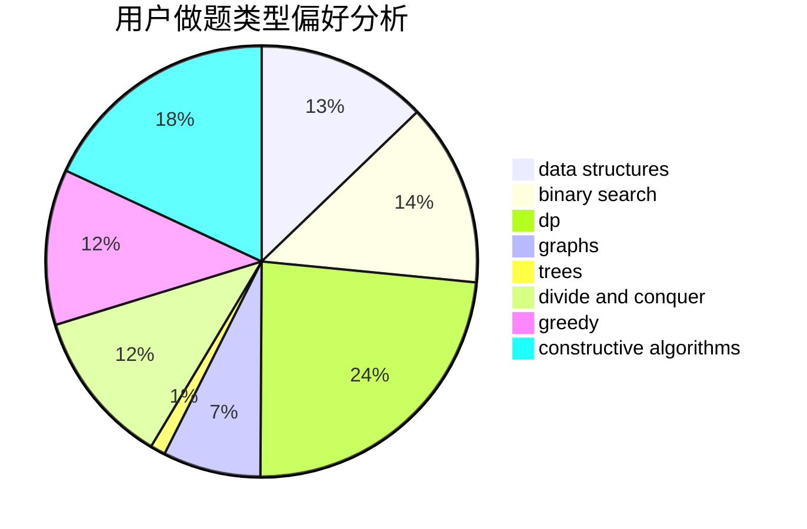
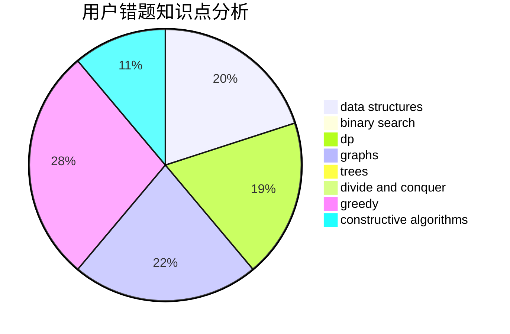

# LegendNI

<!-- tabs:start -->

#### **用户提交结果分析**

#### **用户做题类型偏好分析**

#### **用户错题知识点分析**

<!-- tabs:end -->
# 推荐题目
[1477A](https://codeforces.com/contest/1477/problem/A)		constructive algorithms,
                        math,
                        number theory		  
[939D](https://codeforces.com/contest/939/problem/D)		dfs and similar,
                        dsu,
                        graphs,
                        greedy,
                        strings		  
[699A](https://codeforces.com/contest/699/problem/A)		implementation		  
[633F](https://codeforces.com/contest/633/problem/F)		dfs and similar,
                        dp,
                        graphs,
                        trees		  
[510D](https://codeforces.com/contest/510/problem/D)		bitmasks,
                        brute force,
                        dp,
                        math		  
[1020C](https://codeforces.com/contest/1020/problem/C)		dsu,graphs,sortings,trees		  
[1190B](https://codeforces.com/contest/1190/problem/B)		games		  
[542E](https://codeforces.com/contest/542/problem/E)		graphs,
                        shortest paths		  
[158A](https://codeforces.com/contest/158/problem/A)		*special problem,
                        implementation		  
[1102E](https://codeforces.com/contest/1102/problem/E)		combinatorics,
                        sortings		  
