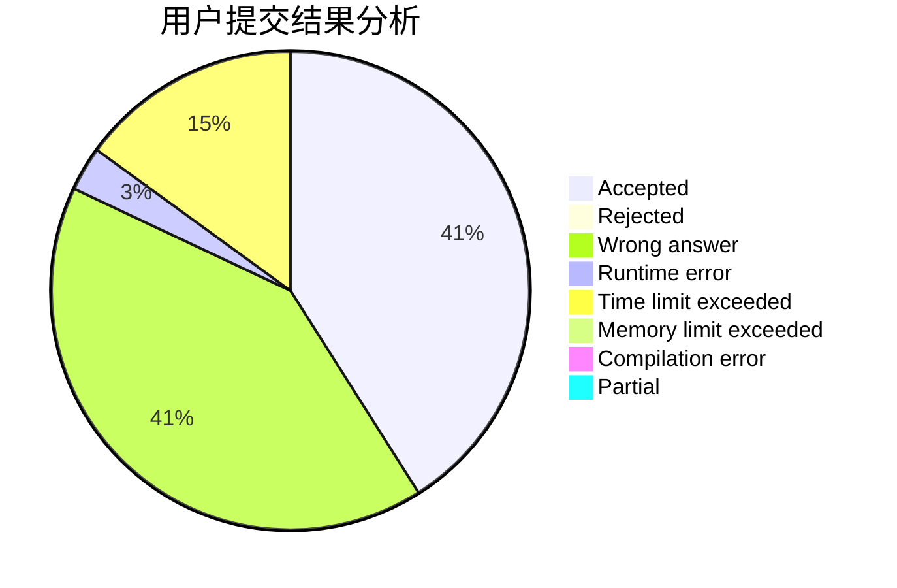
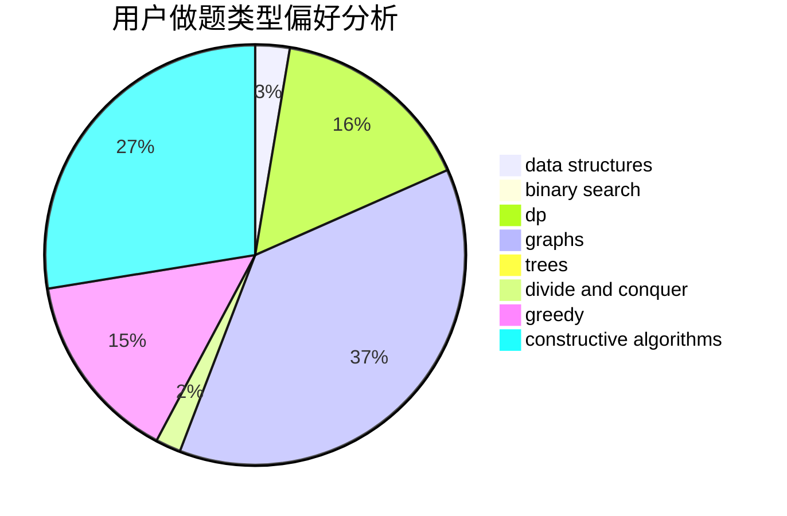
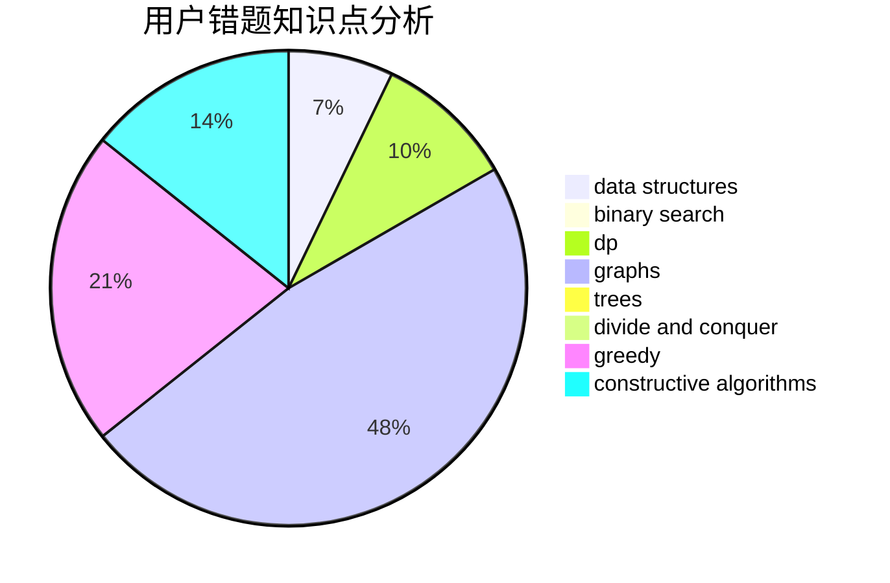

# LegendNI

<!-- tabs:start -->

#### **用户提交结果分析**

#### **用户做题类型偏好分析**

#### **用户错题知识点分析**

<!-- tabs:end -->
# 推荐题目
[1485F](https://codeforces.com/contest/1485/problem/F)		combinatorics,
                        data structures,
                        dp,
                        sortings		  
[960G](https://codeforces.com/contest/960/problem/G)		combinatorics,
                        dp,
                        fft,
                        math		  
[715E](https://codeforces.com/contest/715/problem/E)		combinatorics,
                        fft,
                        graphs,
                        math		  
[666A](https://codeforces.com/contest/666/problem/A)		dp,
                        implementation,
                        strings		  
[534B](https://codeforces.com/contest/534/problem/B)		dp,
                        greedy,
                        math		  
[1023A](https://codeforces.com/contest/1023/problem/A)		brute force,
                        implementation,
                        strings		  
[11962](https://codeforces.com/contest/1196/problem/2)		dsu,graphs,sortings,trees		  
[567A](https://codeforces.com/contest/567/problem/A)		greedy,
                        implementation		  
[17C](https://codeforces.com/contest/17/problem/C)		dp		  
[1103B](https://codeforces.com/contest/1103/problem/B)		binary search,
                        constructive algorithms,
                        interactive		  
