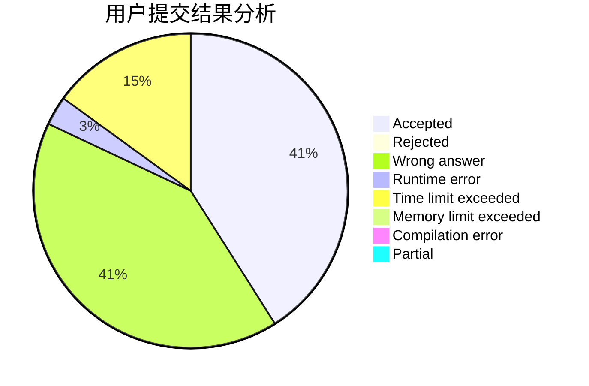
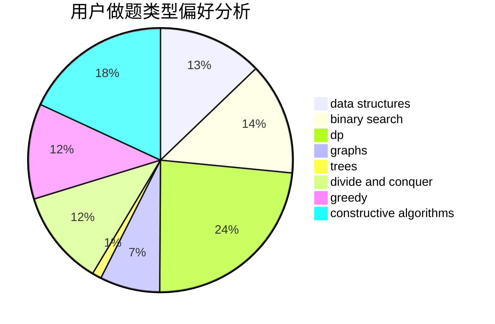
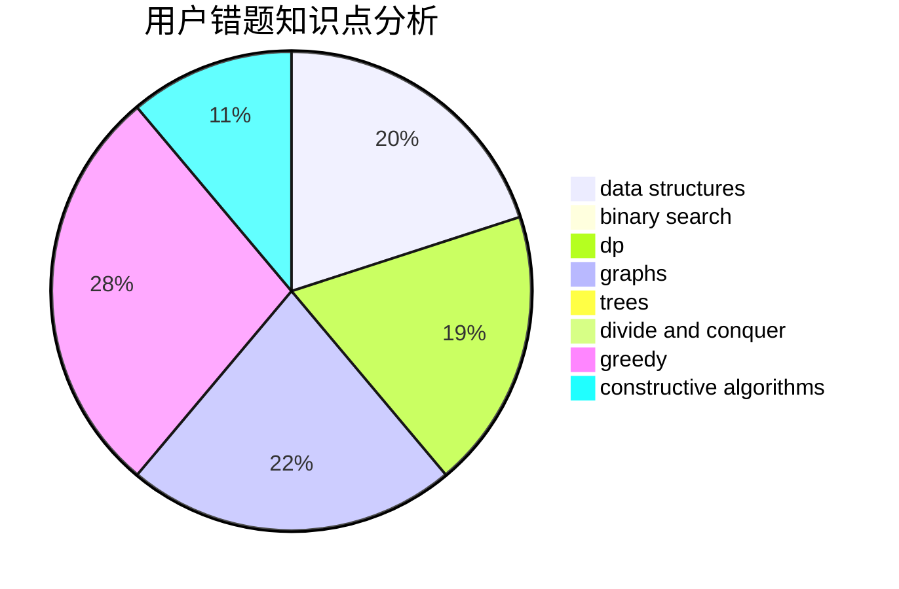

# LegendNI
<!-- tabs:start -->
#### **用户提交结果分析**

#### **用户做题类型偏好分析**

#### **用户错题知识点分析**

<!-- tabs:end -->
# 推荐题目
[Sort the Numbers](https://codeforces.com/contest/1376/problem/A1)		nan		  
[Fox And Jumping](http://codeforces.com/problemset/problem/510/D)		bitmasks,
                        brute force,
                        dp,
                        math		  
[Nikita and game](http://codeforces.com/problemset/problem/842/E)		binary search,
                        dfs and similar,
                        divide and conquer,
                        graphs,
                        trees		  
[Next Round](http://codeforces.com/problemset/problem/158/A)		*special problem,
                        implementation		  
[Playing on Graph](http://codeforces.com/problemset/problem/542/E)		graphs,
                        shortest paths		  
[Sereja and Table](http://codeforces.com/problemset/problem/425/B)		bitmasks,
                        greedy		  
[Monotonic Renumeration](http://codeforces.com/problemset/problem/1102/E)		combinatorics,
                        sortings		  
[Travel Cards](http://codeforces.com/problemset/problem/847/K)		greedy,
                        implementation,
                        sortings		  
[Playlist for Polycarp (hard version)](http://codeforces.com/problemset/problem/1185/G2)		combinatorics,
                        dp		  
[Elections](https://codeforces.com/contest/1020/problem/C)		greedy		  
<!-- tabs:start -->
#### **data structures**
[Sort the Numbers](http://codeforces.com/problemset/problem/660/F)		binary search,
                        data structures,
                        geometry,
                        ternary search		  
[Fox And Jumping](http://codeforces.com/problemset/problem/552/D)		brute force,
                        combinatorics,
                        data structures,
                        geometry,
                        math,
                        sortings		  
[Nikita and game](http://codeforces.com/problemset/problem/368/B)		data structures,
                        dp		  
[Next Round](http://codeforces.com/problemset/problem/1059/E)		binary search,
                        data structures,
                        dp,
                        greedy,
                        trees		  
[Playing on Graph](http://codeforces.com/problemset/problem/1492/C)		binary search,
                        data structures,
                        dp,
                        greedy,
                        two pointers		  
[Sereja and Table](http://codeforces.com/problemset/problem/1492/C)		binary search,
                        data structures,
                        dp,
                        greedy,
                        two pointers		  
[Monotonic Renumeration](http://codeforces.com/problemset/problem/1490/G)		binary search,
                        data structures,
                        math		  
[Travel Cards](http://codeforces.com/problemset/problem/1479/D)		binary search,
                        bitmasks,
                        brute force,
                        data structures,
                        probabilities,
                        trees		  
[Playlist for Polycarp (hard version)](http://codeforces.com/problemset/problem/1497/A)		brute force,
                        data structures,
                        greedy,
                        sortings		  
[Elections](http://codeforces.com/problemset/problem/1491/C)		brute force,
                        data structures,
                        dp,
                        greedy,
                        implementation		  
#### **binary search**
[Sort the Numbers](http://codeforces.com/problemset/problem/842/E)		binary search,
                        dfs and similar,
                        divide and conquer,
                        graphs,
                        trees		  
[Fox And Jumping](http://codeforces.com/problemset/problem/660/F)		binary search,
                        data structures,
                        geometry,
                        ternary search		  
[Nikita and game](http://codeforces.com/problemset/problem/471/C)		binary search,
                        brute force,
                        greedy,
                        math		  
[Next Round](http://codeforces.com/problemset/problem/1059/E)		binary search,
                        data structures,
                        dp,
                        greedy,
                        trees		  
[Playing on Graph](http://codeforces.com/problemset/problem/1492/C)		binary search,
                        data structures,
                        dp,
                        greedy,
                        two pointers		  
[Sereja and Table](http://codeforces.com/problemset/problem/1486/B)		binary search,
                        geometry,
                        shortest paths,
                        sortings		  
[Monotonic Renumeration](http://codeforces.com/problemset/problem/1492/C)		binary search,
                        data structures,
                        dp,
                        greedy,
                        two pointers		  
[Travel Cards](http://codeforces.com/problemset/problem/1463/D)		binary search,
                        constructive algorithms,
                        greedy,
                        two pointers		  
[Playlist for Polycarp (hard version)](http://codeforces.com/problemset/problem/1490/G)		binary search,
                        data structures,
                        math		  
[Elections](http://codeforces.com/problemset/problem/1479/D)		binary search,
                        bitmasks,
                        brute force,
                        data structures,
                        probabilities,
                        trees		  
#### **dp**
[Sort the Numbers](http://codeforces.com/problemset/problem/510/D)		bitmasks,
                        brute force,
                        dp,
                        math		  
[Fox And Jumping](http://codeforces.com/problemset/problem/1185/G2)		combinatorics,
                        dp		  
[Nikita and game](http://codeforces.com/problemset/problem/1473/G)		combinatorics,
                        dp,
                        fft,
                        math		  
[Next Round](http://codeforces.com/problemset/problem/1172/C2)		dp,
                        probabilities		  
[Playing on Graph](http://codeforces.com/problemset/problem/57/D)		dp,
                        math		  
[Sereja and Table](http://codeforces.com/problemset/problem/277/D)		dp,
                        probabilities		  
[Monotonic Renumeration](http://codeforces.com/problemset/problem/372/B)		brute force,
                        divide and conquer,
                        dp		  
[Travel Cards](http://codeforces.com/problemset/problem/633/F)		dfs and similar,
                        dp,
                        graphs,
                        trees		  
[Playlist for Polycarp (hard version)](http://codeforces.com/problemset/problem/368/B)		data structures,
                        dp		  
[Elections](http://codeforces.com/problemset/problem/1059/E)		binary search,
                        data structures,
                        dp,
                        greedy,
                        trees		  
#### **graph**
[Sort the Numbers](http://codeforces.com/problemset/problem/842/E)		binary search,
                        dfs and similar,
                        divide and conquer,
                        graphs,
                        trees		  
[Fox And Jumping](http://codeforces.com/problemset/problem/542/E)		graphs,
                        shortest paths		  
[Nikita and game](http://codeforces.com/problemset/problem/939/D)		dfs and similar,
                        dsu,
                        graphs,
                        greedy,
                        strings		  
[Next Round](http://codeforces.com/problemset/problem/871/E)		graphs,
                        greedy,
                        trees		  
[Playing on Graph](http://codeforces.com/problemset/problem/1210/D)		graphs		  
[Sereja and Table](http://codeforces.com/problemset/problem/575/B)		dfs and similar,
                        graphs,
                        trees		  
[Monotonic Renumeration](http://codeforces.com/problemset/problem/633/F)		dfs and similar,
                        dp,
                        graphs,
                        trees		  
[Travel Cards](http://codeforces.com/problemset/problem/1267/F)		graphs		  
[Playlist for Polycarp (hard version)](http://codeforces.com/problemset/problem/875/C)		2-sat,
                        dfs and similar,
                        graphs,
                        implementation		  
[Elections](http://codeforces.com/problemset/problem/1487/C)		brute force,
                        constructive algorithms,
                        dfs and similar,
                        graphs,
                        greedy,
                        implementation,
                        math		  
#### **trees**
[Sort the Numbers](http://codeforces.com/problemset/problem/842/E)		binary search,
                        dfs and similar,
                        divide and conquer,
                        graphs,
                        trees		  
[Fox And Jumping](http://codeforces.com/problemset/problem/871/E)		graphs,
                        greedy,
                        trees		  
[Nikita and game](http://codeforces.com/problemset/problem/575/B)		dfs and similar,
                        graphs,
                        trees		  
[Next Round](http://codeforces.com/problemset/problem/633/F)		dfs and similar,
                        dp,
                        graphs,
                        trees		  
[Playing on Graph](http://codeforces.com/problemset/problem/1059/E)		binary search,
                        data structures,
                        dp,
                        greedy,
                        trees		  
[Sereja and Table](http://codeforces.com/problemset/problem/455/B)		dfs and similar,
                        dp,
                        games,
                        implementation,
                        strings,
                        trees		  
[Monotonic Renumeration](http://codeforces.com/problemset/problem/1479/D)		binary search,
                        bitmasks,
                        brute force,
                        data structures,
                        probabilities,
                        trees		  
[Travel Cards](http://codeforces.com/problemset/problem/1511/C)		brute force,
                        data structures,
                        implementation,
                        trees		  
[Playlist for Polycarp (hard version)](http://codeforces.com/problemset/problem/1499/F)		combinatorics,
                        dfs and similar,
                        dp,
                        trees		  
[Elections](http://codeforces.com/problemset/problem/1491/E)		brute force,
                        dfs and similar,
                        divide and conquer,
                        number theory,
                        trees		  
#### **divide and conquer**
[Sort the Numbers](http://codeforces.com/problemset/problem/842/E)		binary search,
                        dfs and similar,
                        divide and conquer,
                        graphs,
                        trees		  
[Fox And Jumping](http://codeforces.com/problemset/problem/372/B)		brute force,
                        divide and conquer,
                        dp		  
[Nikita and game](http://codeforces.com/problemset/problem/1461/D)		binary search,
                        brute force,
                        data structures,
                        divide and conquer,
                        implementation,
                        sortings		  
[Next Round](http://codeforces.com/problemset/problem/1466/G)		combinatorics,
                        divide and conquer,
                        hashing,
                        math,
                        string suffix structures,
                        strings		  
[Playing on Graph](http://codeforces.com/problemset/problem/1490/D)		dfs and similar,
                        divide and conquer,
                        implementation		  
[Sereja and Table](https://codeforces.com/contest/1483/problem/C)		data structures,
                        divide and conquer,
                        dp		  
[Monotonic Renumeration](http://codeforces.com/problemset/problem/1491/E)		brute force,
                        dfs and similar,
                        divide and conquer,
                        number theory,
                        trees		  
[Travel Cards](http://codeforces.com/problemset/problem/1303/G)		data structures,
                        divide and conquer,
                        geometry,
                        trees		  
[Playlist for Polycarp (hard version)](http://codeforces.com/problemset/problem/1494/D)		constructive algorithms,
                        data structures,
                        dfs and similar,
                        divide and conquer,
                        dsu,
                        greedy,
                        sortings,
                        trees		  
[Elections](http://codeforces.com/problemset/problem/1482/E)		data structures,
                        divide and conquer,
                        dp		  
#### **greedy**
[Sort the Numbers](http://codeforces.com/problemset/problem/425/B)		bitmasks,
                        greedy		  
[Fox And Jumping](http://codeforces.com/problemset/problem/847/K)		greedy,
                        implementation,
                        sortings		  
[Nikita and game](https://codeforces.com/contest/1020/problem/C)		greedy		  
[Next Round](http://codeforces.com/problemset/problem/939/D)		dfs and similar,
                        dsu,
                        graphs,
                        greedy,
                        strings		  
[Playing on Graph](http://codeforces.com/problemset/problem/1117/B)		greedy,
                        math,
                        sortings		  
[Sereja and Table](http://codeforces.com/problemset/problem/871/E)		graphs,
                        greedy,
                        trees		  
[Monotonic Renumeration](http://codeforces.com/problemset/problem/402/A)		greedy,
                        math		  
[Travel Cards](http://codeforces.com/problemset/problem/1218/I)		2-sat,
                        dfs and similar,
                        greedy		  
[Playlist for Polycarp (hard version)](http://codeforces.com/problemset/problem/471/C)		binary search,
                        brute force,
                        greedy,
                        math		  
[Elections](http://codeforces.com/problemset/problem/1059/E)		binary search,
                        data structures,
                        dp,
                        greedy,
                        trees		  
#### **constructive algorithms**
[Sort the Numbers](http://codeforces.com/problemset/problem/1477/A)		constructive algorithms,
                        math,
                        number theory		  
[Fox And Jumping](http://codeforces.com/problemset/problem/1405/B)		constructive algorithms,
                        implementation		  
[Nikita and game](http://codeforces.com/problemset/problem/1493/A)		constructive algorithms,
                        greedy		  
[Next Round](http://codeforces.com/problemset/problem/1463/D)		binary search,
                        constructive algorithms,
                        greedy,
                        two pointers		  
[Playing on Graph](https://codeforces.com/contest/1456/problem/B)		bitmasks,
                        brute force,
                        constructive algorithms		  
[Sereja and Table](http://codeforces.com/problemset/problem/1492/D)		bitmasks,
                        constructive algorithms,
                        greedy,
                        math		  
[Monotonic Renumeration](https://codeforces.com/contest/1504/problem/D)		constructive algorithms,
                        games,
                        interactive		  
[Travel Cards](https://codeforces.com/contest/1483/problem/A)		brute force,
                        constructive algorithms,
                        greedy,
                        implementation		  
[Playlist for Polycarp (hard version)](https://codeforces.com/contest/1457/problem/D)		bitmasks,
                        brute force,
                        constructive algorithms		  
[Elections](http://codeforces.com/problemset/problem/1513/A)		constructive algorithms,
                        implementation		  
#### **sortings**
[Sort the Numbers](http://codeforces.com/problemset/problem/1102/E)		combinatorics,
                        sortings		  
[Fox And Jumping](http://codeforces.com/problemset/problem/847/K)		greedy,
                        implementation,
                        sortings		  
[Nikita and game](http://codeforces.com/problemset/problem/1117/B)		greedy,
                        math,
                        sortings		  
[Next Round](http://codeforces.com/problemset/problem/552/D)		brute force,
                        combinatorics,
                        data structures,
                        geometry,
                        math,
                        sortings		  
[Playing on Graph](http://codeforces.com/problemset/problem/843/A)		dfs and similar,
                        dsu,
                        implementation,
                        math,
                        sortings		  
[Sereja and Table](http://codeforces.com/problemset/problem/1427/A)		math,
                        sortings		  
[Monotonic Renumeration](http://codeforces.com/problemset/problem/437/B)		bitmasks,
                        greedy,
                        implementation,
                        sortings		  
[Travel Cards](http://codeforces.com/problemset/problem/1025/A)		implementation,
                        sortings		  
[Playlist for Polycarp (hard version)](http://codeforces.com/problemset/problem/1486/B)		binary search,
                        geometry,
                        shortest paths,
                        sortings		  
[Elections](https://codeforces.com/contest/1496/problem/C)		geometry,
                        greedy,
                        math,
                        sortings		  
<!-- tabs:end -->
