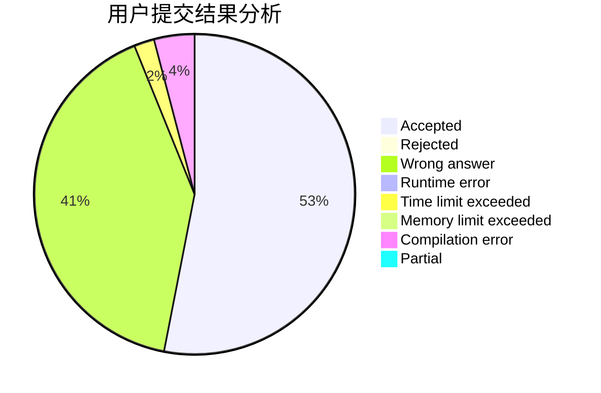
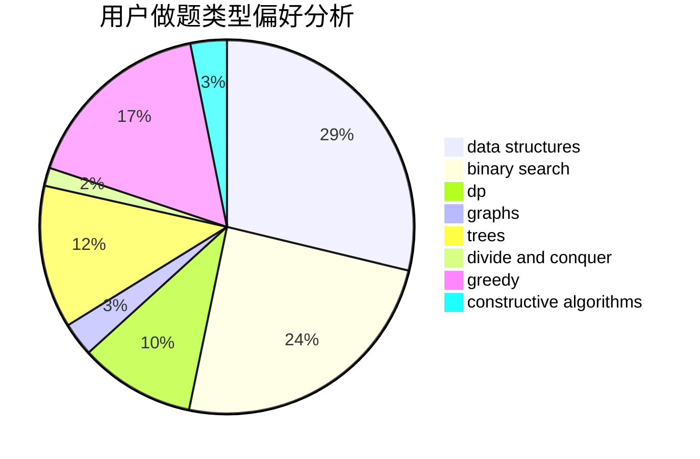
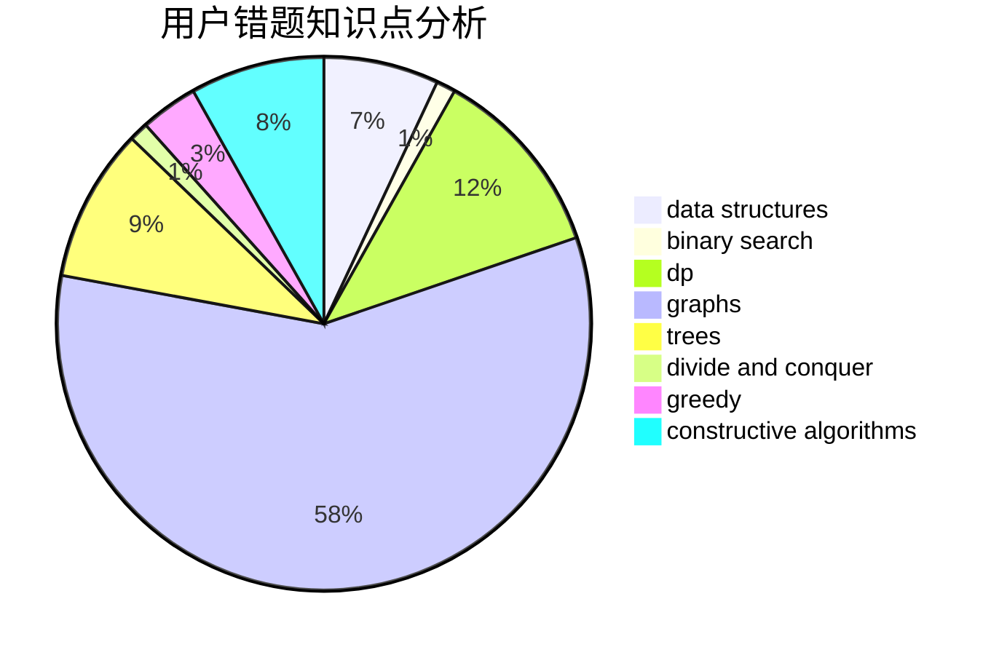

# Legilimens2020

<!-- tabs:start -->

#### **用户提交结果分析**

#### **用户做题类型偏好分析**

#### **用户错题知识点分析**

<!-- tabs:end -->
# 推荐题目
[1295F](https://codeforces.com/contest/1295/problem/F)		combinatorics,
                        dp,
                        probabilities		  
[1271C](https://codeforces.com/contest/1271/problem/C)		brute force,
                        geometry,
                        greedy,
                        implementation		  
[1332G](https://codeforces.com/contest/1332/problem/G)		data structures		  
[730A](https://codeforces.com/contest/730/problem/A)		greedy,
                        implementation		  
[416D](https://codeforces.com/contest/416/problem/D)		greedy,
                        implementation,
                        math		  
[713E](https://codeforces.com/contest/713/problem/E)		binary search,
                        dp		  
[812A](https://codeforces.com/contest/812/problem/A)		implementation		  
[599E](https://codeforces.com/contest/599/problem/E)		bitmasks,
                        dp,
                        trees		  
[50A](https://codeforces.com/contest/50/problem/A)		greedy,
                        math		  
[707C](https://codeforces.com/contest/707/problem/C)		math,
                        number theory		  
