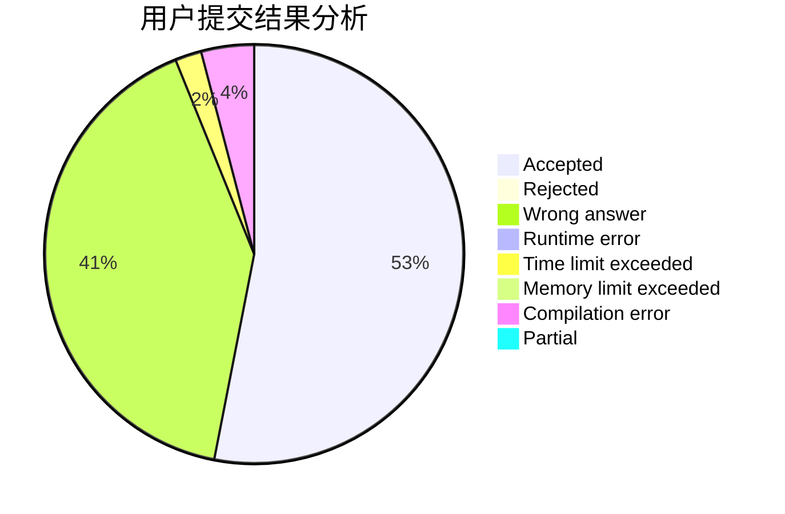
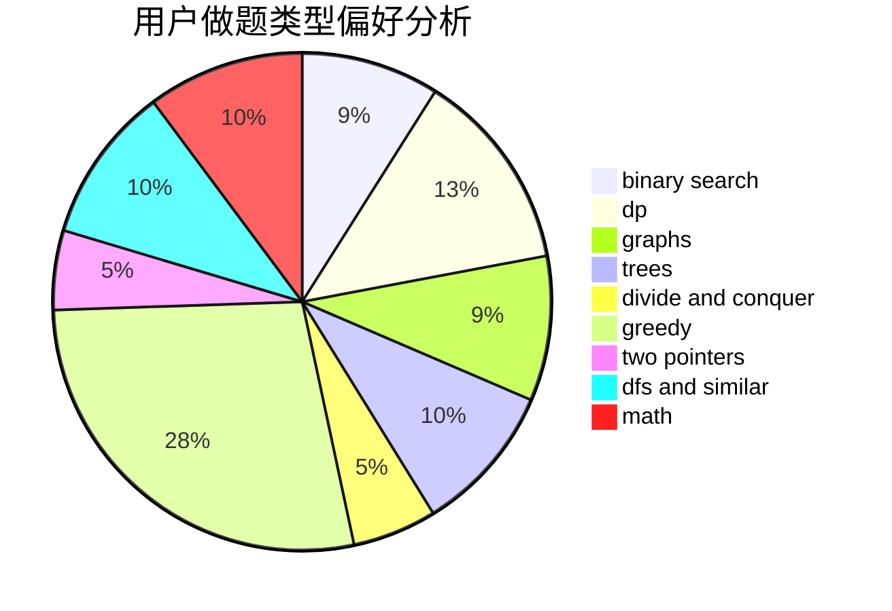

# Legilimens2020

<!-- tabs:start -->

#### **用户提交结果分析**

#### **用户做题类型偏好分析**

<!-- tabs:end -->
# 推荐题目
[1303B](https://codeforces.com/contest/1303/problem/B)
[1280E](https://codeforces.com/contest/1280/problem/E)
[1339D](https://codeforces.com/contest/1339/problem/D)
[746G](https://codeforces.com/contest/746/problem/G)
[441D](https://codeforces.com/contest/441/problem/D)
[732E](https://codeforces.com/contest/732/problem/E)
[830D](https://codeforces.com/contest/830/problem/D)
[618A](https://codeforces.com/contest/618/problem/A)
[533A](https://codeforces.com/contest/533/problem/A)
[725E](https://codeforces.com/contest/725/problem/E)
