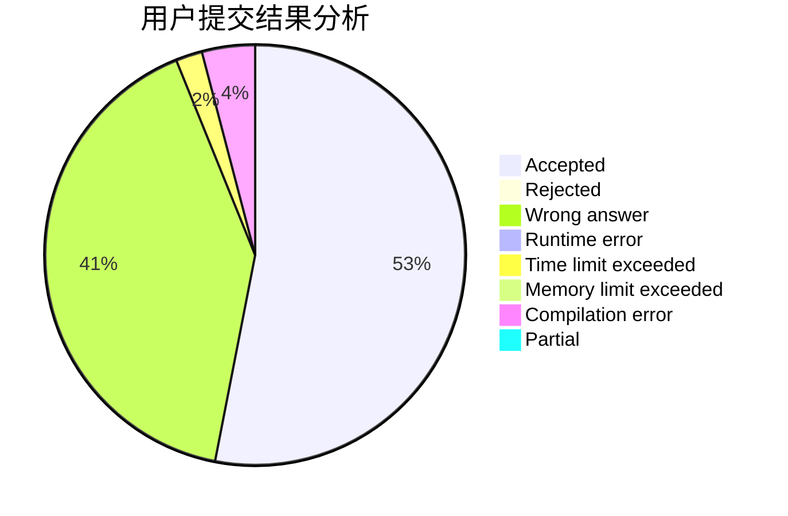
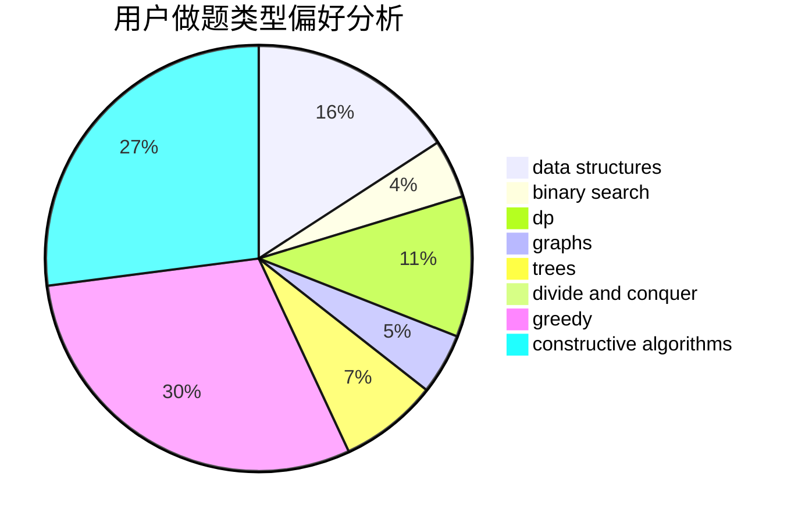
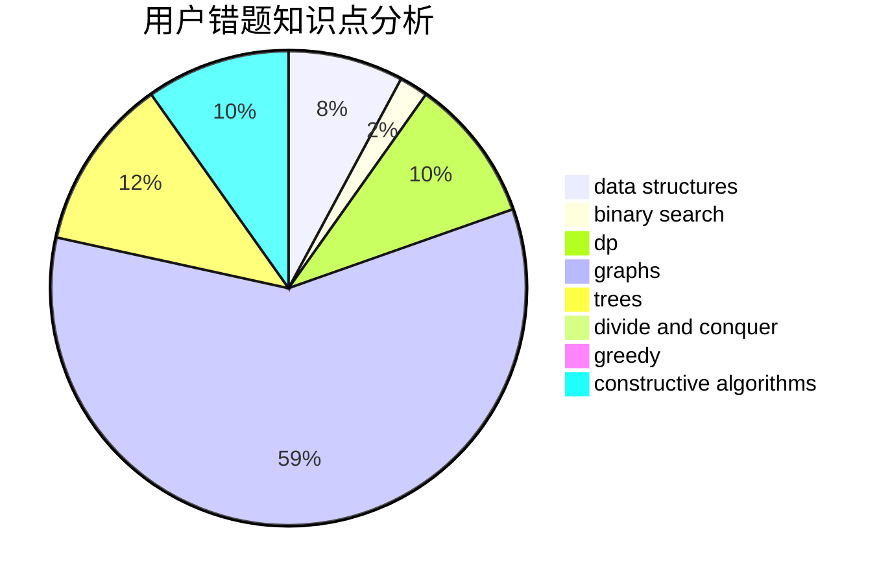

# Legilimens2020

<!-- tabs:start -->

#### **用户提交结果分析**

#### **用户做题类型偏好分析**

#### **用户错题知识点分析**

<!-- tabs:end -->
# 推荐题目
[1303B](https://codeforces.com/contest/1303/problem/B)		math		  
[1280E](https://codeforces.com/contest/1280/problem/E)		math		  
[1339D](https://codeforces.com/contest/1339/problem/D)		dsu,graphs,sortings,trees		  
[746G](https://codeforces.com/contest/746/problem/G)		constructive algorithms,
                        graphs,
                        trees		  
[441D](https://codeforces.com/contest/441/problem/D)		constructive algorithms,
                        dsu,
                        graphs,
                        implementation,
                        math,
                        string suffix structures		  
[732E](https://codeforces.com/contest/732/problem/E)		greedy,
                        sortings		  
[830D](https://codeforces.com/contest/830/problem/D)		combinatorics,
                        dp,
                        graphs,
                        trees		  
[618A](https://codeforces.com/contest/618/problem/A)		implementation		  
[533A](https://codeforces.com/contest/533/problem/A)		binary search,
                        data structures,
                        dfs and similar,
                        greedy,
                        trees		  
[725E](https://codeforces.com/contest/725/problem/E)		brute force,
                        greedy		  
