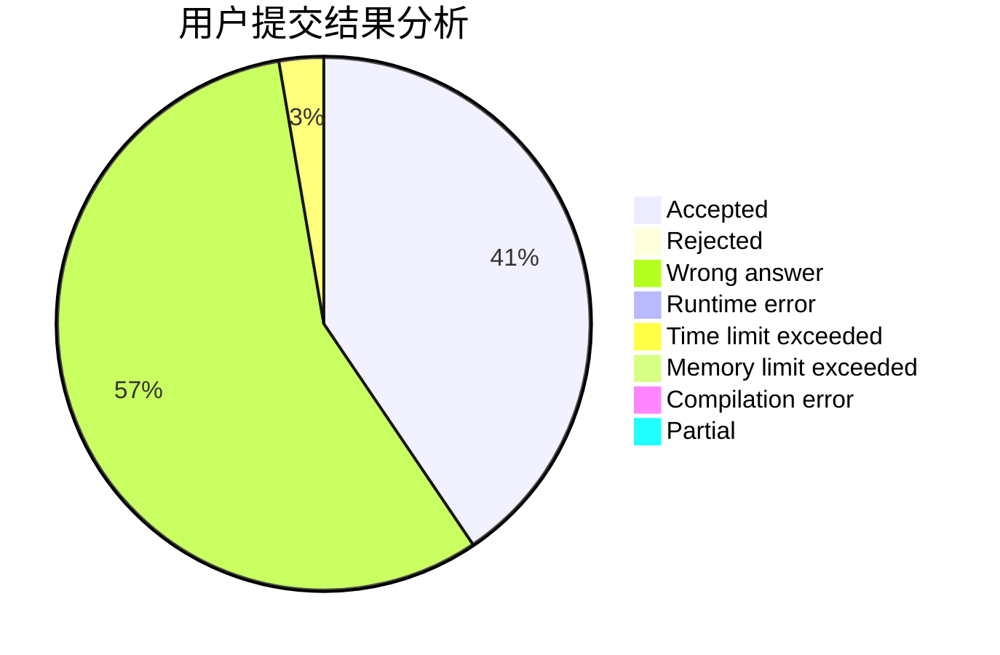
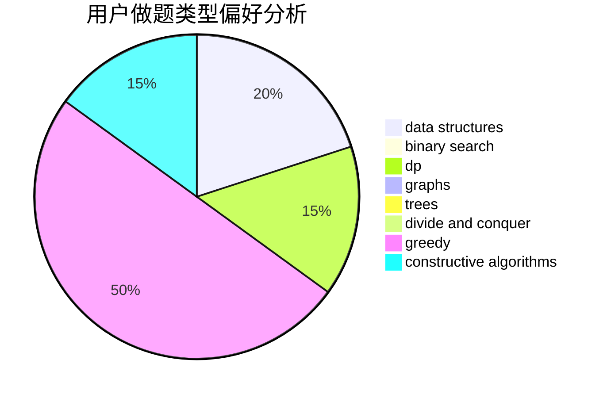

# 6102wudi

<!-- tabs:start -->

#### **用户提交结果分析**

#### **用户做题类型偏好分析**

#### **用户错题知识点分析**

<!-- tabs:end -->
# 推荐题目
[1404B](https://codeforces.com/contest/1404/problem/B)		dfs and similar,
                        dp,
                        games,
                        trees		  
[1404E](https://codeforces.com/contest/1404/problem/E)		flows,
                        graph matchings,
                        graphs		  
[13783](https://codeforces.com/contest/1378/problem/3)		dsu,graphs,sortings,trees		  
[1403A](https://codeforces.com/contest/1403/problem/A)		*special problem,
                        2-sat,
                        binary search,
                        data structures,
                        graphs,
                        interactive,
                        sortings,
                        two pointers		  
[1402B](https://codeforces.com/contest/1402/problem/B)		*special problem,
                        geometry,
                        sortings		  
[1245A](https://codeforces.com/contest/1245/problem/A)		math,
                        number theory		  
[1403C](https://codeforces.com/contest/1403/problem/C)		*special problem,
                        combinatorics,
                        dp,
                        implementation,
                        math		  
[1404D](https://codeforces.com/contest/1404/problem/D)		constructive algorithms,
                        dfs and similar,
                        interactive,
                        math,
                        number theory		  
[1404A](https://codeforces.com/contest/1404/problem/A)		implementation,
                        strings		  
[1354F](https://codeforces.com/contest/1354/problem/F)		constructive algorithms,
                        dp,
                        flows,
                        graph matchings,
                        greedy,
                        sortings		  
