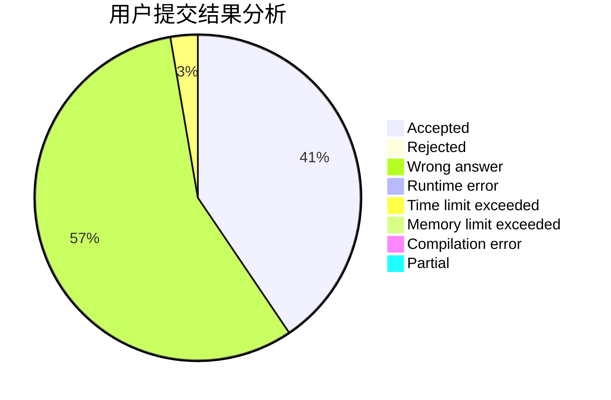
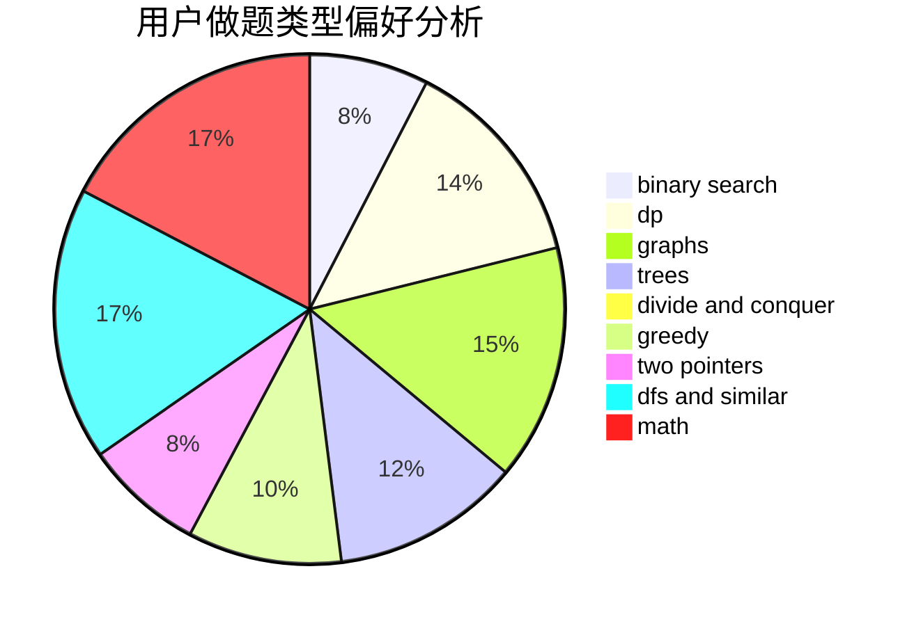

# 6102wudi

<!-- tabs:start -->

#### **用户提交结果分析**

#### **用户做题类型偏好分析**

<!-- tabs:end -->
# 推荐题目
[1404B](https://codeforces.com/contest/1404/problem/B)
[1404E](https://codeforces.com/contest/1404/problem/E)
[13783](https://codeforces.com/contest/1378/problem/3)
[1403A](https://codeforces.com/contest/1403/problem/A)
[1402B](https://codeforces.com/contest/1402/problem/B)
[1245A](https://codeforces.com/contest/1245/problem/A)
[1403C](https://codeforces.com/contest/1403/problem/C)
[1404D](https://codeforces.com/contest/1404/problem/D)
[1404A](https://codeforces.com/contest/1404/problem/A)
[1354F](https://codeforces.com/contest/1354/problem/F)
