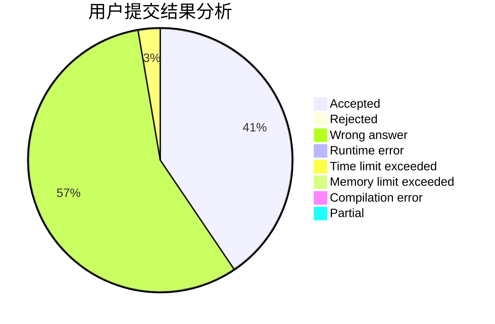
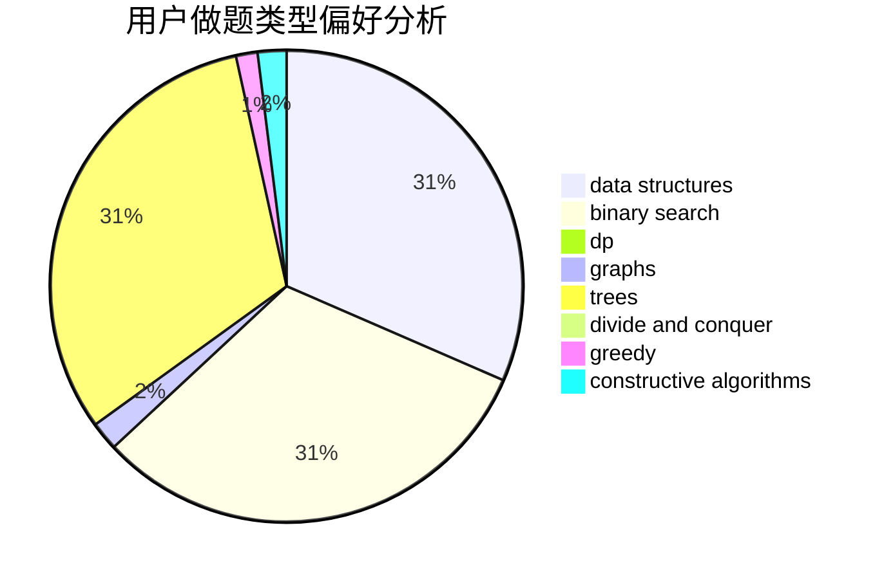

# 6102wudi

<!-- tabs:start -->

#### **用户提交结果分析**

#### **用户做题类型偏好分析**

#### **用户错题知识点分析**

<!-- tabs:end -->
# 推荐题目
[1395D](https://codeforces.com/contest/1395/problem/D)		dsu,graphs,sortings,trees		  
[1396A](https://codeforces.com/contest/1396/problem/A)		constructive algorithms,
                        greedy,
                        number theory		  
[1370A](https://codeforces.com/contest/1370/problem/A)		greedy,
                        implementation,
                        math,
                        number theory		  
[1394E](https://codeforces.com/contest/1394/problem/E)		strings		  
[1394C](https://codeforces.com/contest/1394/problem/C)		binary search,
                        geometry,
                        ternary search		  
[1239F](https://codeforces.com/contest/1239/problem/F)		graphs,
                        implementation		  
[1395B](https://codeforces.com/contest/1395/problem/B)		constructive algorithms		  
[1395F](https://codeforces.com/contest/1395/problem/F)		dsu,graphs,sortings,trees		  
[1395C](https://codeforces.com/contest/1395/problem/C)		bitmasks,
                        brute force,
                        dp,
                        greedy		  
[1348A](https://codeforces.com/contest/1348/problem/A)		greedy,
                        math		  
