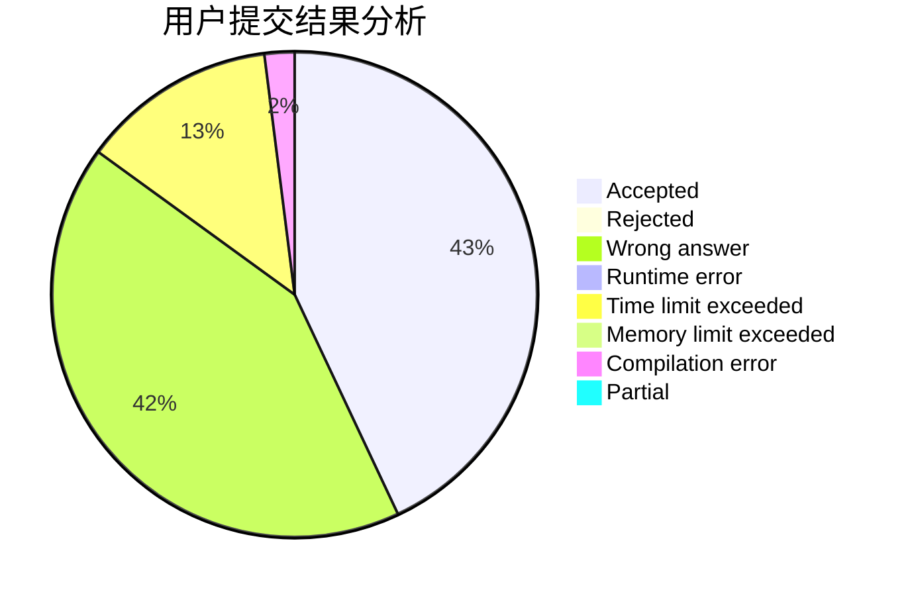
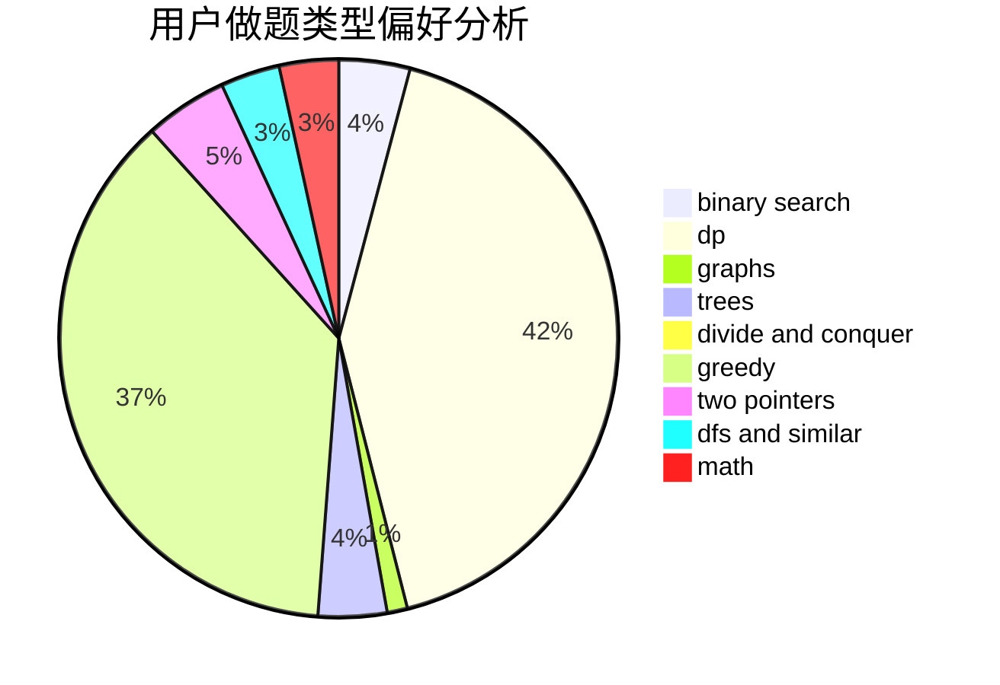

# LeiLeiKunLe

<!-- tabs:start -->

#### **用户提交结果分析**

#### **用户做题类型偏好分析**

<!-- tabs:end -->
# 推荐题目
[1326C](https://codeforces.com/contest/1326/problem/C)
[1278C](https://codeforces.com/contest/1278/problem/C)
[1353E](https://codeforces.com/contest/1353/problem/E)
[383E](https://codeforces.com/contest/383/problem/E)
[429B](https://codeforces.com/contest/429/problem/B)
[1047A](https://codeforces.com/contest/1047/problem/A)
[1250I](https://codeforces.com/contest/1250/problem/I)
[19A](https://codeforces.com/contest/19/problem/A)
[864E](https://codeforces.com/contest/864/problem/E)
[900A](https://codeforces.com/contest/900/problem/A)
