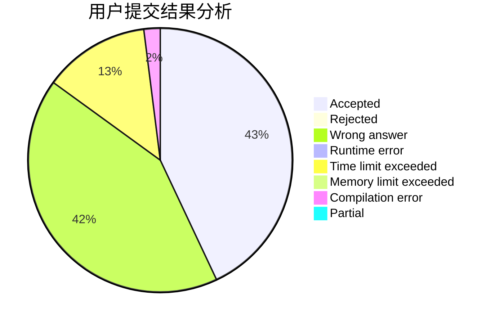
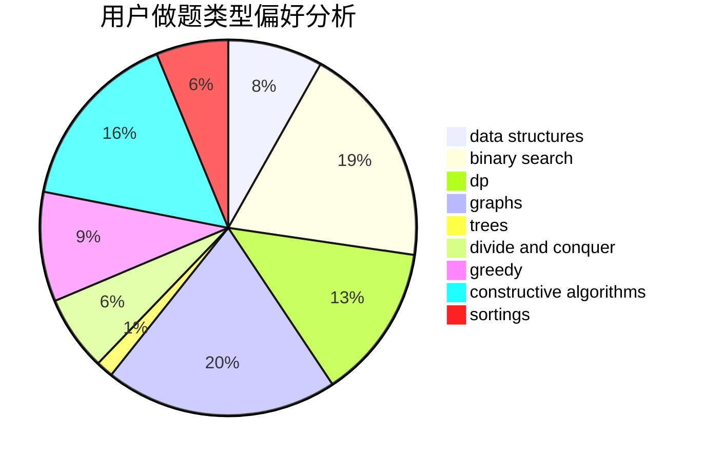
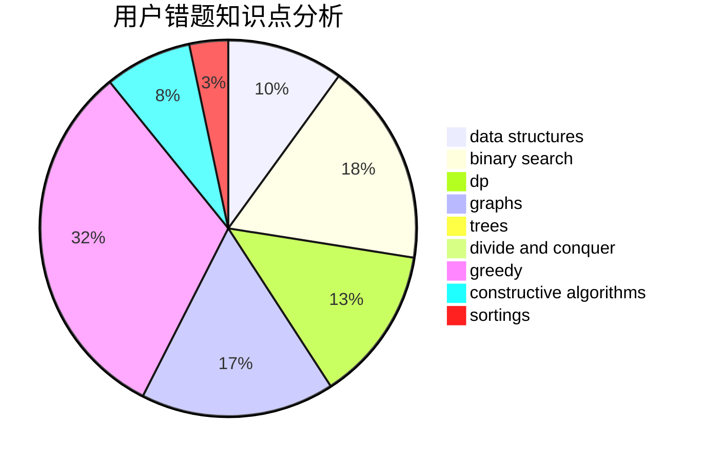

# LeiLeiKunLe
<!-- tabs:start -->
#### **用户提交结果分析**

#### **用户做题类型偏好分析**

#### **用户错题知识点分析**

<!-- tabs:end -->
# 推荐题目
[1369A](http://codeforces.com/problemset/problem/1369/A)		geometry,
                        math		  
[1476G](http://codeforces.com/problemset/problem/1476/G)		data structures,
                        hashing,
                        sortings,
                        two pointers		  
[131A](http://codeforces.com/problemset/problem/131/A)		implementation,
                        strings		  
[148A](http://codeforces.com/problemset/problem/148/A)		constructive algorithms,
                        implementation,
                        math		  
[875A](http://codeforces.com/problemset/problem/875/A)		brute force,
                        math		  
[846C](http://codeforces.com/problemset/problem/846/C)		brute force,
                        data structures,
                        dp		  
[358D](http://codeforces.com/problemset/problem/358/D)		dp,
                        greedy		  
[1246A](https://codeforces.com/contest/1246/problem/A)		bitmasks,
                        brute force,
                        math		  
[1159D](https://codeforces.com/contest/1159/problem/D)		constructive algorithms,
                        math,
                        strings		  
[171H](http://codeforces.com/problemset/problem/171/H)		*special problem,
                        implementation		  
<!-- tabs:start -->
#### **data structures**
[1476G](http://codeforces.com/problemset/problem/1476/G)		data structures,
                        hashing,
                        sortings,
                        two pointers		  
[846C](http://codeforces.com/problemset/problem/846/C)		brute force,
                        data structures,
                        dp		  
[1106B](http://codeforces.com/problemset/problem/1106/B)		data structures,
                        implementation		  
[833D](http://codeforces.com/problemset/problem/833/D)		data structures,
                        divide and conquer,
                        implementation,
                        trees		  
[819B](http://codeforces.com/problemset/problem/819/B)		data structures,
                        implementation,
                        math		  
[552D](http://codeforces.com/problemset/problem/552/D)		brute force,
                        combinatorics,
                        data structures,
                        geometry,
                        math,
                        sortings		  
[297E](http://codeforces.com/problemset/problem/297/E)		data structures		  
[1492C](http://codeforces.com/problemset/problem/1492/C)		binary search,
                        data structures,
                        dp,
                        greedy,
                        two pointers		  
[1490G](http://codeforces.com/problemset/problem/1490/G)		binary search,
                        data structures,
                        math		  
[1479D](http://codeforces.com/problemset/problem/1479/D)		binary search,
                        bitmasks,
                        brute force,
                        data structures,
                        probabilities,
                        trees		  
#### **binary search**
[737A](https://codeforces.com/contest/737/problem/A)		binary search,
                        greedy,
                        sortings		  
[253B](http://codeforces.com/problemset/problem/253/B)		binary search,
                        dp,
                        sortings,
                        two pointers		  
[1169C](https://codeforces.com/contest/1169/problem/C)		binary search,
                        greedy		  
[1240E](https://codeforces.com/contest/1240/problem/E)		binary search,
                        math,
                        number theory		  
[1434A](https://codeforces.com/contest/1434/problem/A)		binary search,
                        brute force,
                        dp,
                        implementation,
                        sortings,
                        two pointers		  
[1492C](http://codeforces.com/problemset/problem/1492/C)		binary search,
                        data structures,
                        dp,
                        greedy,
                        two pointers		  
[1463D](http://codeforces.com/problemset/problem/1463/D)		binary search,
                        constructive algorithms,
                        greedy,
                        two pointers		  
[1490G](http://codeforces.com/problemset/problem/1490/G)		binary search,
                        data structures,
                        math		  
[1479D](http://codeforces.com/problemset/problem/1479/D)		binary search,
                        bitmasks,
                        brute force,
                        data structures,
                        probabilities,
                        trees		  
[1436E](http://codeforces.com/problemset/problem/1436/E)		binary search,
                        data structures,
                        two pointers		  
#### **dp**
[846C](http://codeforces.com/problemset/problem/846/C)		brute force,
                        data structures,
                        dp		  
[358D](http://codeforces.com/problemset/problem/358/D)		dp,
                        greedy		  
[486D](http://codeforces.com/problemset/problem/486/D)		dfs and similar,
                        dp,
                        math,
                        trees		  
[936B](http://codeforces.com/problemset/problem/936/B)		dfs and similar,
                        dp,
                        games,
                        graphs		  
[1013E](https://codeforces.com/contest/1013/problem/E)		dp		  
[794G](http://codeforces.com/problemset/problem/794/G)		combinatorics,
                        dp,
                        math		  
[253B](http://codeforces.com/problemset/problem/253/B)		binary search,
                        dp,
                        sortings,
                        two pointers		  
[1065F](http://codeforces.com/problemset/problem/1065/F)		dfs and similar,
                        dp,
                        trees		  
[768D](http://codeforces.com/problemset/problem/768/D)		dp,
                        math,
                        probabilities		  
[1245F](http://codeforces.com/problemset/problem/1245/F)		bitmasks,
                        brute force,
                        combinatorics,
                        dp		  
#### **graph**
[1346D](http://codeforces.com/problemset/problem/1346/D)		*special problem,
                        graphs,
                        greedy		  
[883B](http://codeforces.com/problemset/problem/883/B)		constructive algorithms,
                        graphs,
                        greedy		  
[575B](http://codeforces.com/problemset/problem/575/B)		dfs and similar,
                        graphs,
                        trees		  
[936B](http://codeforces.com/problemset/problem/936/B)		dfs and similar,
                        dp,
                        games,
                        graphs		  
[780E](http://codeforces.com/problemset/problem/780/E)		constructive algorithms,
                        dfs and similar,
                        graphs		  
[1487C](http://codeforces.com/problemset/problem/1487/C)		brute force,
                        constructive algorithms,
                        dfs and similar,
                        graphs,
                        greedy,
                        implementation,
                        math		  
[1437C](http://codeforces.com/problemset/problem/1437/C)		dp,
                        flows,
                        graph matchings,
                        greedy,
                        math,
                        sortings		  
[1470D](http://codeforces.com/problemset/problem/1470/D)		constructive algorithms,
                        dfs and similar,
                        graph matchings,
                        graphs,
                        greedy		  
[1476C](http://codeforces.com/problemset/problem/1476/C)		dp,
                        graphs,
                        greedy		  
[1304D](http://codeforces.com/problemset/problem/1304/D)		constructive algorithms,
                        graphs,
                        greedy,
                        two pointers		  
#### **trees**
[833D](http://codeforces.com/problemset/problem/833/D)		data structures,
                        divide and conquer,
                        implementation,
                        trees		  
[486D](http://codeforces.com/problemset/problem/486/D)		dfs and similar,
                        dp,
                        math,
                        trees		  
[575B](http://codeforces.com/problemset/problem/575/B)		dfs and similar,
                        graphs,
                        trees		  
[1065F](http://codeforces.com/problemset/problem/1065/F)		dfs and similar,
                        dp,
                        trees		  
[526G](http://codeforces.com/problemset/problem/526/G)		greedy,
                        trees		  
[1479D](http://codeforces.com/problemset/problem/1479/D)		binary search,
                        bitmasks,
                        brute force,
                        data structures,
                        probabilities,
                        trees		  
[1511C](http://codeforces.com/problemset/problem/1511/C)		brute force,
                        data structures,
                        implementation,
                        trees		  
[1499F](http://codeforces.com/problemset/problem/1499/F)		combinatorics,
                        dfs and similar,
                        dp,
                        trees		  
[1491E](http://codeforces.com/problemset/problem/1491/E)		brute force,
                        dfs and similar,
                        divide and conquer,
                        number theory,
                        trees		  
[1466D](http://codeforces.com/problemset/problem/1466/D)		data structures,
                        greedy,
                        sortings,
                        trees		  
#### **divide and conquer**
[833D](http://codeforces.com/problemset/problem/833/D)		data structures,
                        divide and conquer,
                        implementation,
                        trees		  
[1461D](http://codeforces.com/problemset/problem/1461/D)		binary search,
                        brute force,
                        data structures,
                        divide and conquer,
                        implementation,
                        sortings		  
[1466G](http://codeforces.com/problemset/problem/1466/G)		combinatorics,
                        divide and conquer,
                        hashing,
                        math,
                        string suffix structures,
                        strings		  
[1490D](http://codeforces.com/problemset/problem/1490/D)		dfs and similar,
                        divide and conquer,
                        implementation		  
[1483C](https://codeforces.com/contest/1483/problem/C)		data structures,
                        divide and conquer,
                        dp		  
[1491E](http://codeforces.com/problemset/problem/1491/E)		brute force,
                        dfs and similar,
                        divide and conquer,
                        number theory,
                        trees		  
[1303G](http://codeforces.com/problemset/problem/1303/G)		data structures,
                        divide and conquer,
                        geometry,
                        trees		  
[1494D](http://codeforces.com/problemset/problem/1494/D)		constructive algorithms,
                        data structures,
                        dfs and similar,
                        divide and conquer,
                        dsu,
                        greedy,
                        sortings,
                        trees		  
[1482E](http://codeforces.com/problemset/problem/1482/E)		data structures,
                        divide and conquer,
                        dp		  
[566C](http://codeforces.com/problemset/problem/566/C)		dfs and similar,
                        divide and conquer,
                        trees		  
#### **greedy**
[358D](http://codeforces.com/problemset/problem/358/D)		dp,
                        greedy		  
[909A](http://codeforces.com/problemset/problem/909/A)		brute force,
                        greedy,
                        sortings		  
[1346D](http://codeforces.com/problemset/problem/1346/D)		*special problem,
                        graphs,
                        greedy		  
[883B](http://codeforces.com/problemset/problem/883/B)		constructive algorithms,
                        graphs,
                        greedy		  
[1046C](http://codeforces.com/problemset/problem/1046/C)		greedy		  
[609A](http://codeforces.com/problemset/problem/609/A)		greedy,
                        implementation,
                        sortings		  
[737A](https://codeforces.com/contest/737/problem/A)		binary search,
                        greedy,
                        sortings		  
[379C](http://codeforces.com/problemset/problem/379/C)		greedy,
                        sortings		  
[3A](http://codeforces.com/problemset/problem/3/A)		greedy,
                        shortest paths		  
[388A](http://codeforces.com/problemset/problem/388/A)		greedy,
                        sortings		  
#### **constructive algorithms**
[148A](http://codeforces.com/problemset/problem/148/A)		constructive algorithms,
                        implementation,
                        math		  
[1159D](https://codeforces.com/contest/1159/problem/D)		constructive algorithms,
                        math,
                        strings		  
[883B](http://codeforces.com/problemset/problem/883/B)		constructive algorithms,
                        graphs,
                        greedy		  
[780E](http://codeforces.com/problemset/problem/780/E)		constructive algorithms,
                        dfs and similar,
                        graphs		  
[42C](http://codeforces.com/problemset/problem/42/C)		brute force,
                        constructive algorithms		  
[1269C](https://codeforces.com/contest/1269/problem/C)		constructive algorithms,
                        greedy,
                        implementation,
                        strings		  
[1152B](http://codeforces.com/problemset/problem/1152/B)		bitmasks,
                        constructive algorithms,
                        dfs and similar,
                        math		  
[1455C](http://codeforces.com/problemset/problem/1455/C)		constructive algorithms,
                        games,
                        math		  
[1493A](http://codeforces.com/problemset/problem/1493/A)		constructive algorithms,
                        greedy		  
[1463D](http://codeforces.com/problemset/problem/1463/D)		binary search,
                        constructive algorithms,
                        greedy,
                        two pointers		  
#### **sortings**
[1476G](http://codeforces.com/problemset/problem/1476/G)		data structures,
                        hashing,
                        sortings,
                        two pointers		  
[909A](http://codeforces.com/problemset/problem/909/A)		brute force,
                        greedy,
                        sortings		  
[609A](http://codeforces.com/problemset/problem/609/A)		greedy,
                        implementation,
                        sortings		  
[737A](https://codeforces.com/contest/737/problem/A)		binary search,
                        greedy,
                        sortings		  
[552D](http://codeforces.com/problemset/problem/552/D)		brute force,
                        combinatorics,
                        data structures,
                        geometry,
                        math,
                        sortings		  
[379C](http://codeforces.com/problemset/problem/379/C)		greedy,
                        sortings		  
[253B](http://codeforces.com/problemset/problem/253/B)		binary search,
                        dp,
                        sortings,
                        two pointers		  
[388A](http://codeforces.com/problemset/problem/388/A)		greedy,
                        sortings		  
[1256E](http://codeforces.com/problemset/problem/1256/E)		dp,
                        greedy,
                        sortings		  
[1434A](https://codeforces.com/contest/1434/problem/A)		binary search,
                        brute force,
                        dp,
                        implementation,
                        sortings,
                        two pointers		  
<!-- tabs:end -->
