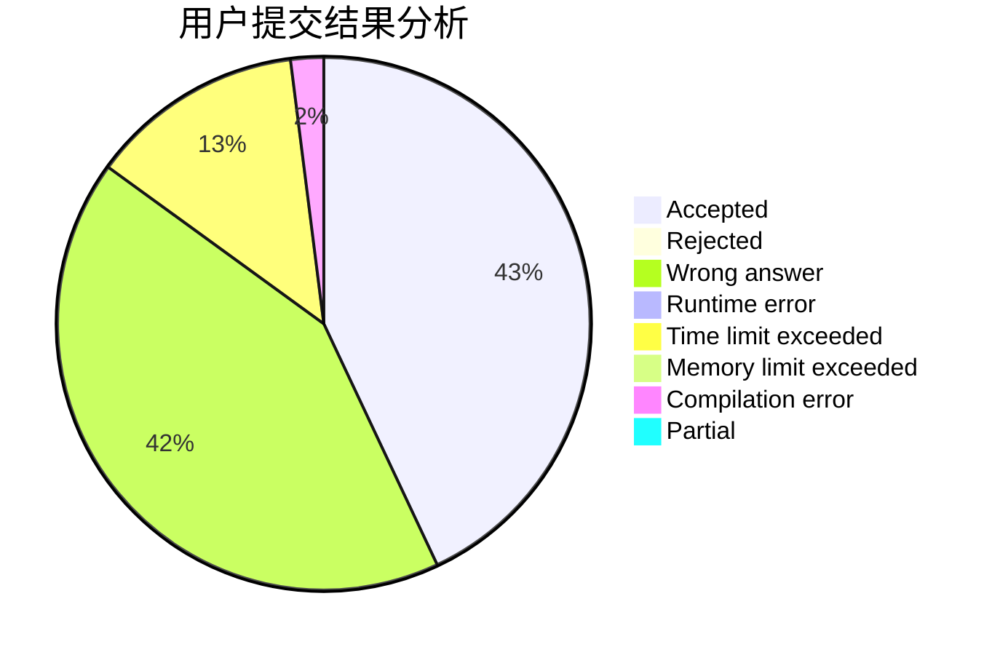
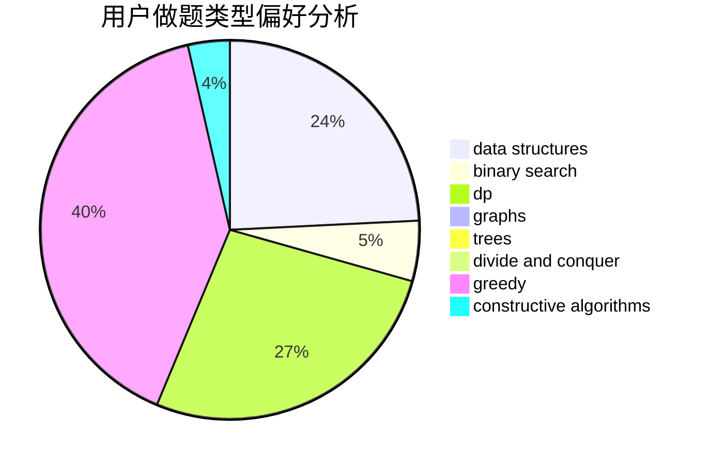
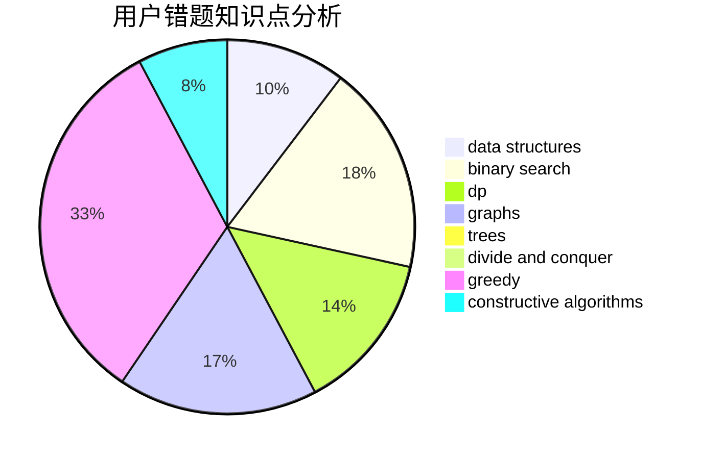

# LeiLeiKunLe

<!-- tabs:start -->

#### **用户提交结果分析**

#### **用户做题类型偏好分析**

#### **用户错题知识点分析**

<!-- tabs:end -->
# 推荐题目
[1326C](https://codeforces.com/contest/1326/problem/C)		combinatorics,
                        greedy,
                        math		  
[1278C](https://codeforces.com/contest/1278/problem/C)		data structures,
                        dp,
                        greedy,
                        implementation		  
[1353E](https://codeforces.com/contest/1353/problem/E)		brute force,
                        dp,
                        greedy		  
[383E](https://codeforces.com/contest/383/problem/E)		combinatorics,
                        divide and conquer,
                        dp		  
[429B](https://codeforces.com/contest/429/problem/B)		dp		  
[1047A](https://codeforces.com/contest/1047/problem/A)		math		  
[1250I](https://codeforces.com/contest/1250/problem/I)		binary search,
                        brute force,
                        greedy,
                        shortest paths		  
[19A](https://codeforces.com/contest/19/problem/A)		implementation		  
[864E](https://codeforces.com/contest/864/problem/E)		dp,
                        sortings		  
[900A](https://codeforces.com/contest/900/problem/A)		geometry,
                        implementation		  
