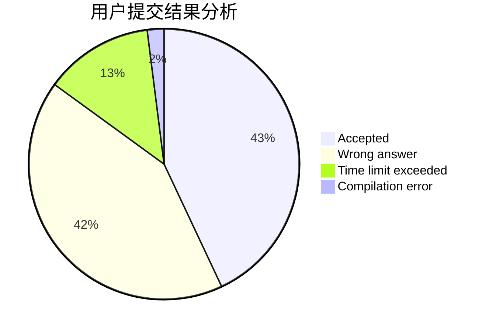
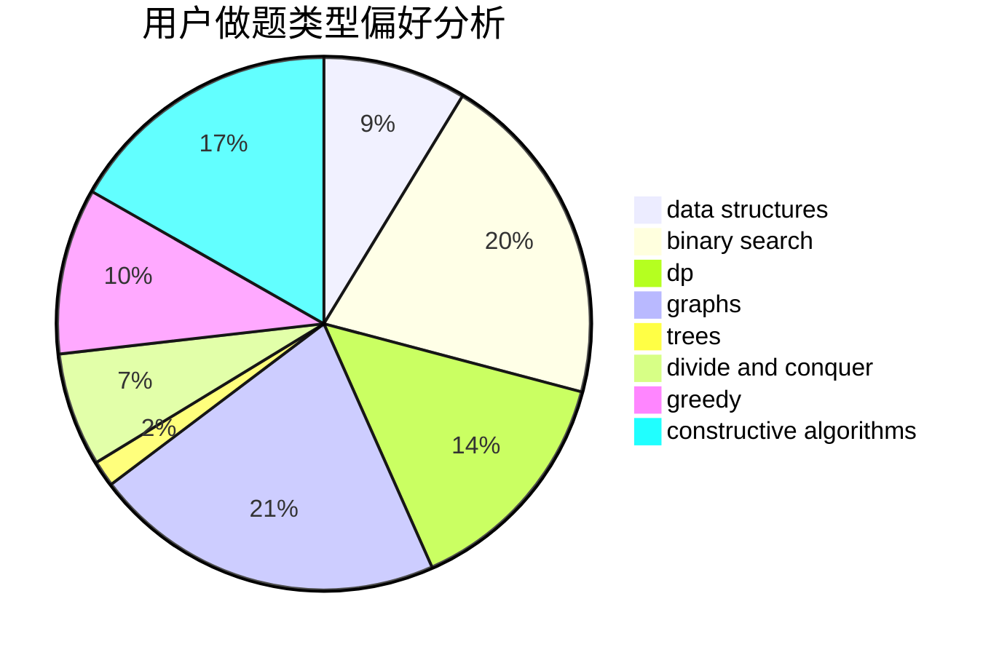
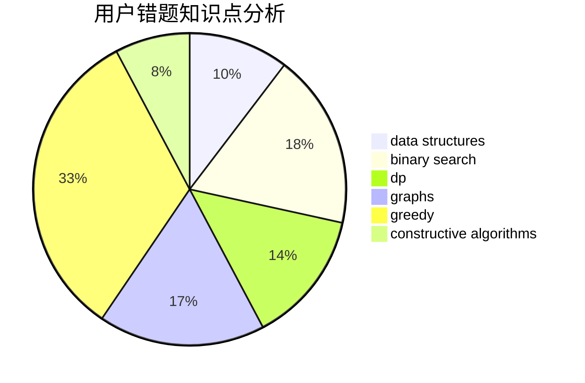

# LeiLeiKunLe
<!-- tabs:start -->
#### **用户提交结果分析**

#### **用户做题类型偏好分析**

#### **用户错题知识点分析**

<!-- tabs:end -->
# 推荐题目
[FashionabLee](http://codeforces.com/problemset/problem/1369/A)		geometry,
                        math		  
[Minimum Difference](http://codeforces.com/problemset/problem/1476/G)		data structures,
                        hashing,
                        sortings,
                        two pointers		  
[cAPS lOCK](http://codeforces.com/problemset/problem/131/A)		implementation,
                        strings		  
[Insomnia cure](http://codeforces.com/problemset/problem/148/A)		constructive algorithms,
                        implementation,
                        math		  
[Classroom Watch](http://codeforces.com/problemset/problem/875/A)		brute force,
                        math		  
[Four Segments](http://codeforces.com/problemset/problem/846/C)		brute force,
                        data structures,
                        dp		  
[Dima and Hares](http://codeforces.com/problemset/problem/358/D)		dp,
                        greedy		  
[p-binary](https://codeforces.com/contest/1246/problem/A)		bitmasks,
                        brute force,
                        math		  
[The minimal unique substring](https://codeforces.com/contest/1159/problem/D)		constructive algorithms,
                        math,
                        strings		  
[A polyline](http://codeforces.com/problemset/problem/171/H)		*special problem,
                        implementation		  
<!-- tabs:start -->
#### **data structures**
[Minimum Difference](http://codeforces.com/problemset/problem/1476/G)		data structures,
                        hashing,
                        sortings,
                        two pointers		  
[Four Segments](http://codeforces.com/problemset/problem/846/C)		brute force,
                        data structures,
                        dp		  
[Lunar New Year and Food Ordering](http://codeforces.com/problemset/problem/1106/B)		data structures,
                        implementation		  
[Red-Black Cobweb](http://codeforces.com/problemset/problem/833/D)		data structures,
                        divide and conquer,
                        implementation,
                        trees		  
[Mister B and PR Shifts](http://codeforces.com/problemset/problem/819/B)		data structures,
                        implementation,
                        math		  
[Vanya and Triangles](http://codeforces.com/problemset/problem/552/D)		brute force,
                        combinatorics,
                        data structures,
                        geometry,
                        math,
                        sortings		  
[Mystic Carvings](http://codeforces.com/problemset/problem/297/E)		data structures		  
[Maximum width](http://codeforces.com/problemset/problem/1492/C)		binary search,
                        data structures,
                        dp,
                        greedy,
                        two pointers		  
[Old Floppy Drive](http://codeforces.com/problemset/problem/1490/G)		binary search,
                        data structures,
                        math		  
[Odd Mineral Resource](http://codeforces.com/problemset/problem/1479/D)		binary search,
                        bitmasks,
                        brute force,
                        data structures,
                        probabilities,
                        trees		  
#### **binary search**
[Road to Cinema](https://codeforces.com/contest/737/problem/A)		binary search,
                        greedy,
                        sortings		  
[Physics Practical](http://codeforces.com/problemset/problem/253/B)		binary search,
                        dp,
                        sortings,
                        two pointers		  
[Increasing by Modulo](https://codeforces.com/contest/1169/problem/C)		binary search,
                        greedy		  
[Wooden Raft](https://codeforces.com/contest/1240/problem/E)		binary search,
                        math,
                        number theory		  
[Perform Easily](https://codeforces.com/contest/1434/problem/A)		binary search,
                        brute force,
                        dp,
                        implementation,
                        sortings,
                        two pointers		  
[Maximum width](http://codeforces.com/problemset/problem/1492/C)		binary search,
                        data structures,
                        dp,
                        greedy,
                        two pointers		  
[Pairs](http://codeforces.com/problemset/problem/1463/D)		binary search,
                        constructive algorithms,
                        greedy,
                        two pointers		  
[Old Floppy Drive](http://codeforces.com/problemset/problem/1490/G)		binary search,
                        data structures,
                        math		  
[Odd Mineral Resource](http://codeforces.com/problemset/problem/1479/D)		binary search,
                        bitmasks,
                        brute force,
                        data structures,
                        probabilities,
                        trees		  
[Complicated Computations](http://codeforces.com/problemset/problem/1436/E)		binary search,
                        data structures,
                        two pointers		  
#### **dp**
[Four Segments](http://codeforces.com/problemset/problem/846/C)		brute force,
                        data structures,
                        dp		  
[Dima and Hares](http://codeforces.com/problemset/problem/358/D)		dp,
                        greedy		  
[Valid Sets](http://codeforces.com/problemset/problem/486/D)		dfs and similar,
                        dp,
                        math,
                        trees		  
[Sleepy Game](http://codeforces.com/problemset/problem/936/B)		dfs and similar,
                        dp,
                        games,
                        graphs		  
[Hills](https://codeforces.com/contest/1013/problem/E)		dp		  
[Replace All](http://codeforces.com/problemset/problem/794/G)		combinatorics,
                        dp,
                        math		  
[Physics Practical](http://codeforces.com/problemset/problem/253/B)		binary search,
                        dp,
                        sortings,
                        two pointers		  
[Up and Down the Tree](http://codeforces.com/problemset/problem/1065/F)		dfs and similar,
                        dp,
                        trees		  
[Jon and Orbs](http://codeforces.com/problemset/problem/768/D)		dp,
                        math,
                        probabilities		  
[Daniel and Spring Cleaning](http://codeforces.com/problemset/problem/1245/F)		bitmasks,
                        brute force,
                        combinatorics,
                        dp		  
#### **graph**
[Constructing the Dungeon](http://codeforces.com/problemset/problem/1346/D)		*special problem,
                        graphs,
                        greedy		  
[Berland Army](http://codeforces.com/problemset/problem/883/B)		constructive algorithms,
                        graphs,
                        greedy		  
[Bribes](http://codeforces.com/problemset/problem/575/B)		dfs and similar,
                        graphs,
                        trees		  
[Sleepy Game](http://codeforces.com/problemset/problem/936/B)		dfs and similar,
                        dp,
                        games,
                        graphs		  
[Underground Lab](http://codeforces.com/problemset/problem/780/E)		constructive algorithms,
                        dfs and similar,
                        graphs		  
[Minimum Ties](http://codeforces.com/problemset/problem/1487/C)		brute force,
                        constructive algorithms,
                        dfs and similar,
                        graphs,
                        greedy,
                        implementation,
                        math		  
[Chef Monocarp](http://codeforces.com/problemset/problem/1437/C)		dp,
                        flows,
                        graph matchings,
                        greedy,
                        math,
                        sortings		  
[Strange Housing](http://codeforces.com/problemset/problem/1470/D)		constructive algorithms,
                        dfs and similar,
                        graph matchings,
                        graphs,
                        greedy		  
[Longest Simple Cycle](http://codeforces.com/problemset/problem/1476/C)		dp,
                        graphs,
                        greedy		  
[Shortest and Longest LIS](http://codeforces.com/problemset/problem/1304/D)		constructive algorithms,
                        graphs,
                        greedy,
                        two pointers		  
#### **trees**
[Red-Black Cobweb](http://codeforces.com/problemset/problem/833/D)		data structures,
                        divide and conquer,
                        implementation,
                        trees		  
[Valid Sets](http://codeforces.com/problemset/problem/486/D)		dfs and similar,
                        dp,
                        math,
                        trees		  
[Bribes](http://codeforces.com/problemset/problem/575/B)		dfs and similar,
                        graphs,
                        trees		  
[Up and Down the Tree](http://codeforces.com/problemset/problem/1065/F)		dfs and similar,
                        dp,
                        trees		  
[Spiders Evil Plan](http://codeforces.com/problemset/problem/526/G)		greedy,
                        trees		  
[Odd Mineral Resource](http://codeforces.com/problemset/problem/1479/D)		binary search,
                        bitmasks,
                        brute force,
                        data structures,
                        probabilities,
                        trees		  
[Yet Another Card Deck](http://codeforces.com/problemset/problem/1511/C)		brute force,
                        data structures,
                        implementation,
                        trees		  
[Diameter Cuts](http://codeforces.com/problemset/problem/1499/F)		combinatorics,
                        dfs and similar,
                        dp,
                        trees		  
[Fib-tree](http://codeforces.com/problemset/problem/1491/E)		brute force,
                        dfs and similar,
                        divide and conquer,
                        number theory,
                        trees		  
[13th Labour of Heracles](http://codeforces.com/problemset/problem/1466/D)		data structures,
                        greedy,
                        sortings,
                        trees		  
#### **divide and conquer**
[Red-Black Cobweb](http://codeforces.com/problemset/problem/833/D)		data structures,
                        divide and conquer,
                        implementation,
                        trees		  
[Divide and Summarize](http://codeforces.com/problemset/problem/1461/D)		binary search,
                        brute force,
                        data structures,
                        divide and conquer,
                        implementation,
                        sortings		  
[Song of the Sirens](http://codeforces.com/problemset/problem/1466/G)		combinatorics,
                        divide and conquer,
                        hashing,
                        math,
                        string suffix structures,
                        strings		  
[Permutation Transformation](http://codeforces.com/problemset/problem/1490/D)		dfs and similar,
                        divide and conquer,
                        implementation		  
[Skyline Photo](https://codeforces.com/contest/1483/problem/C)		data structures,
                        divide and conquer,
                        dp		  
[Fib-tree](http://codeforces.com/problemset/problem/1491/E)		brute force,
                        dfs and similar,
                        divide and conquer,
                        number theory,
                        trees		  
[Sum of Prefix Sums](http://codeforces.com/problemset/problem/1303/G)		data structures,
                        divide and conquer,
                        geometry,
                        trees		  
[Dogeforces](http://codeforces.com/problemset/problem/1494/D)		constructive algorithms,
                        data structures,
                        dfs and similar,
                        divide and conquer,
                        dsu,
                        greedy,
                        sortings,
                        trees		  
[Logistical Questions](http://codeforces.com/problemset/problem/566/C)		dfs and similar,
                        divide and conquer,
                        trees		  
[Fruit Sequences](http://codeforces.com/problemset/problem/1428/F)		binary search,
                        data structures,
                        divide and conquer,
                        dp,
                        two pointers		  
#### **greedy**
[Dima and Hares](http://codeforces.com/problemset/problem/358/D)		dp,
                        greedy		  
[Generate Login](http://codeforces.com/problemset/problem/909/A)		brute force,
                        greedy,
                        sortings		  
[Constructing the Dungeon](http://codeforces.com/problemset/problem/1346/D)		*special problem,
                        graphs,
                        greedy		  
[Berland Army](http://codeforces.com/problemset/problem/883/B)		constructive algorithms,
                        graphs,
                        greedy		  
[Space Formula](http://codeforces.com/problemset/problem/1046/C)		greedy		  
[Флеш-карты](http://codeforces.com/problemset/problem/609/A)		greedy,
                        implementation,
                        sortings		  
[Road to Cinema](https://codeforces.com/contest/737/problem/A)		binary search,
                        greedy,
                        sortings		  
[New Year Ratings Change](http://codeforces.com/problemset/problem/379/C)		greedy,
                        sortings		  
[Shortest path of the king](http://codeforces.com/problemset/problem/3/A)		greedy,
                        shortest paths		  
[Fox and Box Accumulation](http://codeforces.com/problemset/problem/388/A)		greedy,
                        sortings		  
#### **constructive algorithms**
[Insomnia cure](http://codeforces.com/problemset/problem/148/A)		constructive algorithms,
                        implementation,
                        math		  
[The minimal unique substring](https://codeforces.com/contest/1159/problem/D)		constructive algorithms,
                        math,
                        strings		  
[Berland Army](http://codeforces.com/problemset/problem/883/B)		constructive algorithms,
                        graphs,
                        greedy		  
[Underground Lab](http://codeforces.com/problemset/problem/780/E)		constructive algorithms,
                        dfs and similar,
                        graphs		  
[Safe cracking](http://codeforces.com/problemset/problem/42/C)		brute force,
                        constructive algorithms		  
[Long Beautiful Integer](https://codeforces.com/contest/1269/problem/C)		constructive algorithms,
                        greedy,
                        implementation,
                        strings		  
[Neko Performs Cat Furrier Transform](http://codeforces.com/problemset/problem/1152/B)		bitmasks,
                        constructive algorithms,
                        dfs and similar,
                        math		  
[Ping-pong](http://codeforces.com/problemset/problem/1455/C)		constructive algorithms,
                        games,
                        math		  
[Anti-knapsack](http://codeforces.com/problemset/problem/1493/A)		constructive algorithms,
                        greedy		  
[Pairs](http://codeforces.com/problemset/problem/1463/D)		binary search,
                        constructive algorithms,
                        greedy,
                        two pointers		  
#### **sortings**
[Minimum Difference](http://codeforces.com/problemset/problem/1476/G)		data structures,
                        hashing,
                        sortings,
                        two pointers		  
[Generate Login](http://codeforces.com/problemset/problem/909/A)		brute force,
                        greedy,
                        sortings		  
[Флеш-карты](http://codeforces.com/problemset/problem/609/A)		greedy,
                        implementation,
                        sortings		  
[Road to Cinema](https://codeforces.com/contest/737/problem/A)		binary search,
                        greedy,
                        sortings		  
[Vanya and Triangles](http://codeforces.com/problemset/problem/552/D)		brute force,
                        combinatorics,
                        data structures,
                        geometry,
                        math,
                        sortings		  
[New Year Ratings Change](http://codeforces.com/problemset/problem/379/C)		greedy,
                        sortings		  
[Physics Practical](http://codeforces.com/problemset/problem/253/B)		binary search,
                        dp,
                        sortings,
                        two pointers		  
[Fox and Box Accumulation](http://codeforces.com/problemset/problem/388/A)		greedy,
                        sortings		  
[Yet Another Division Into Teams](http://codeforces.com/problemset/problem/1256/E)		dp,
                        greedy,
                        sortings		  
[Perform Easily](https://codeforces.com/contest/1434/problem/A)		binary search,
                        brute force,
                        dp,
                        implementation,
                        sortings,
                        two pointers		  
<!-- tabs:end -->
