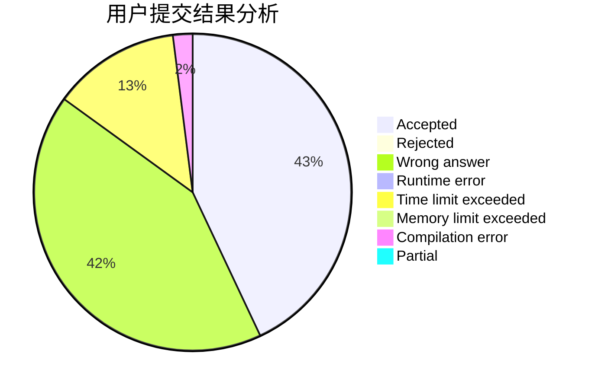
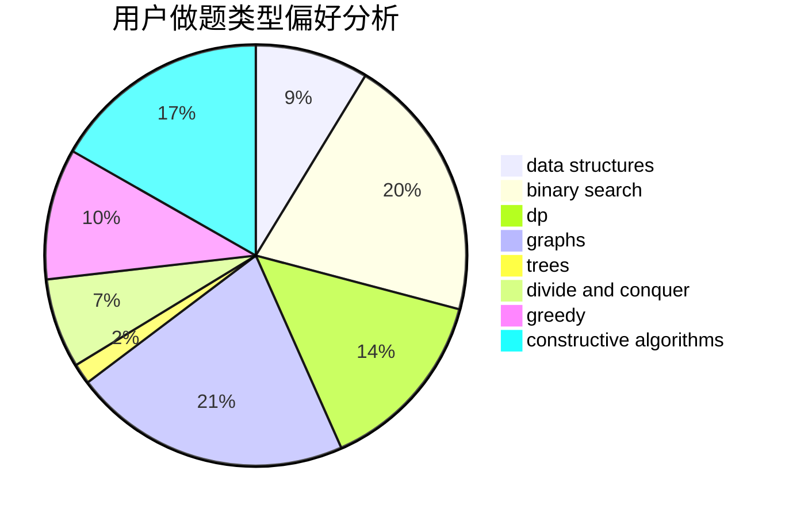
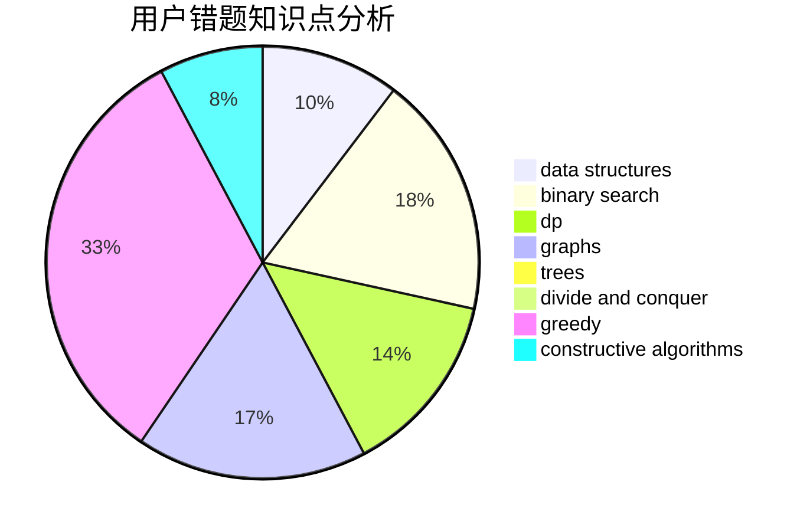

# LeiLeiKunLe

<!-- tabs:start -->

#### **用户提交结果分析**

#### **用户做题类型偏好分析**

#### **用户错题知识点分析**

<!-- tabs:end -->
# 推荐题目
[131A](https://codeforces.com/contest/131/problem/A)		implementation,
                        strings		  
[1269C](https://codeforces.com/contest/1269/problem/C)		dsu,graphs,sortings,trees		  
[1346D](https://codeforces.com/contest/1346/problem/D)		*special problem,
                        graphs,
                        greedy		  
[358D](https://codeforces.com/contest/358/problem/D)		dp,
                        greedy		  
[3A](https://codeforces.com/contest/3/problem/A)		greedy,
                        shortest paths		  
[1046C](https://codeforces.com/contest/1046/problem/C)		greedy		  
[1246A](https://codeforces.com/contest/1246/problem/A)		dsu,graphs,sortings,trees		  
[171H](https://codeforces.com/contest/171/problem/H)		*special problem,
                        implementation		  
[846C](https://codeforces.com/contest/846/problem/C)		brute force,
                        data structures,
                        dp		  
[883B](https://codeforces.com/contest/883/problem/B)		constructive algorithms,
                        graphs,
                        greedy		  
