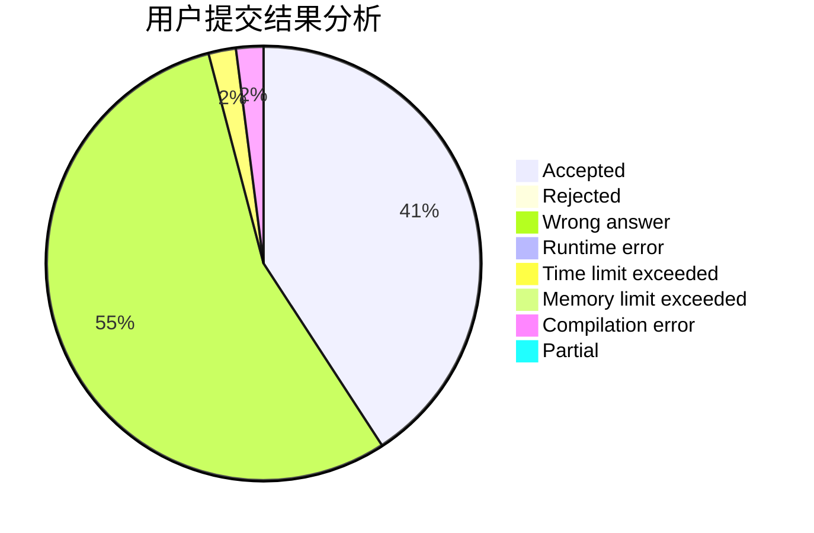
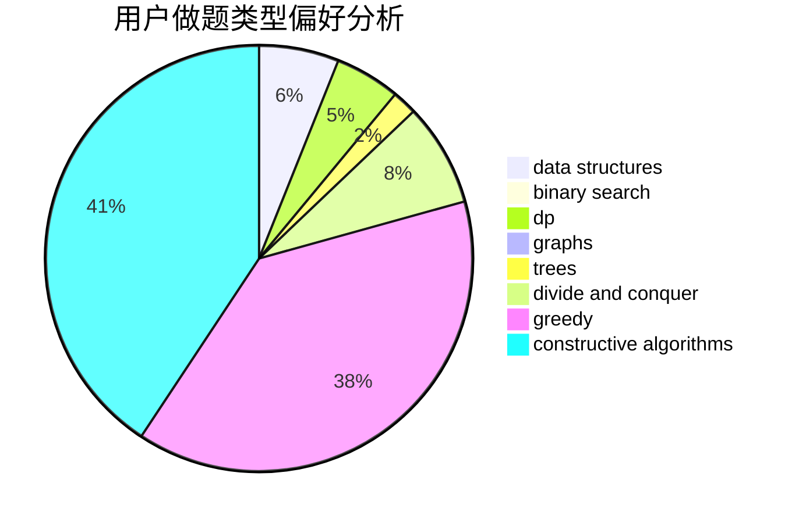
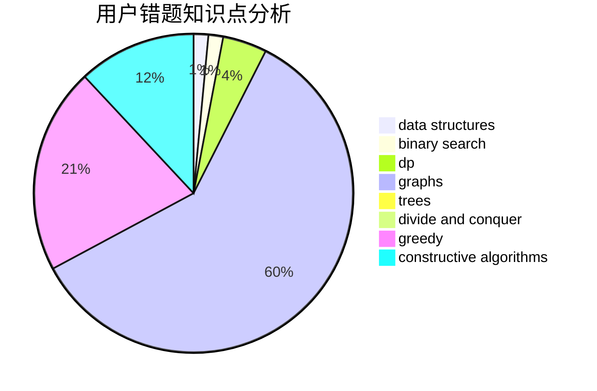

# LemonMZ

<!-- tabs:start -->

#### **用户提交结果分析**

#### **用户做题类型偏好分析**

#### **用户错题知识点分析**

<!-- tabs:end -->
# 推荐题目
[1178C](https://codeforces.com/contest/1178/problem/C)		combinatorics,
                        greedy,
                        math		  
[1092E](https://codeforces.com/contest/1092/problem/E)		constructive algorithms,
                        dfs and similar,
                        greedy,
                        trees		  
[868B](https://codeforces.com/contest/868/problem/B)		implementation		  
[922D](https://codeforces.com/contest/922/problem/D)		greedy,
                        sortings		  
[908C](https://codeforces.com/contest/908/problem/C)		brute force,
                        geometry,
                        implementation,
                        math		  
[1332D](https://codeforces.com/contest/1332/problem/D)		bitmasks,
                        constructive algorithms,
                        math		  
[957B](https://codeforces.com/contest/957/problem/B)		dsu,graphs,sortings,trees		  
[960F](https://codeforces.com/contest/960/problem/F)		data structures,
                        dp,
                        graphs		  
[323B](https://codeforces.com/contest/323/problem/B)		constructive algorithms,
                        graphs		  
[845C](https://codeforces.com/contest/845/problem/C)		data structures,
                        greedy,
                        sortings		  
