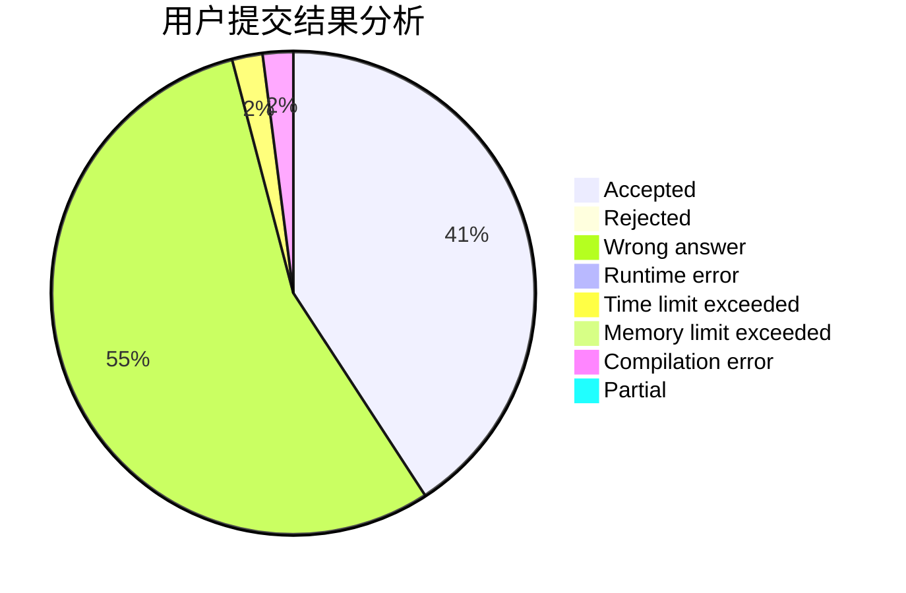
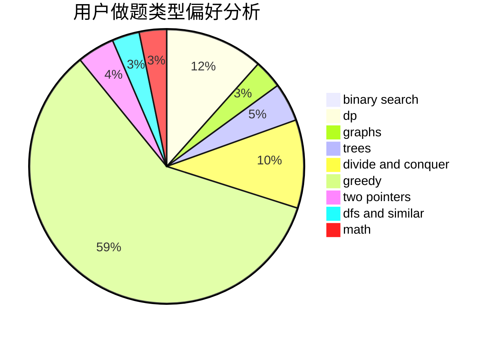

# LemonMZ

<!-- tabs:start -->

#### **用户提交结果分析**

#### **用户做题类型偏好分析**

<!-- tabs:end -->
# 推荐题目
[1178C](https://codeforces.com/contest/1178/problem/C)
[1092E](https://codeforces.com/contest/1092/problem/E)
[868B](https://codeforces.com/contest/868/problem/B)
[922D](https://codeforces.com/contest/922/problem/D)
[908C](https://codeforces.com/contest/908/problem/C)
[1332D](https://codeforces.com/contest/1332/problem/D)
[957B](https://codeforces.com/contest/957/problem/B)
[960F](https://codeforces.com/contest/960/problem/F)
[323B](https://codeforces.com/contest/323/problem/B)
[845C](https://codeforces.com/contest/845/problem/C)
