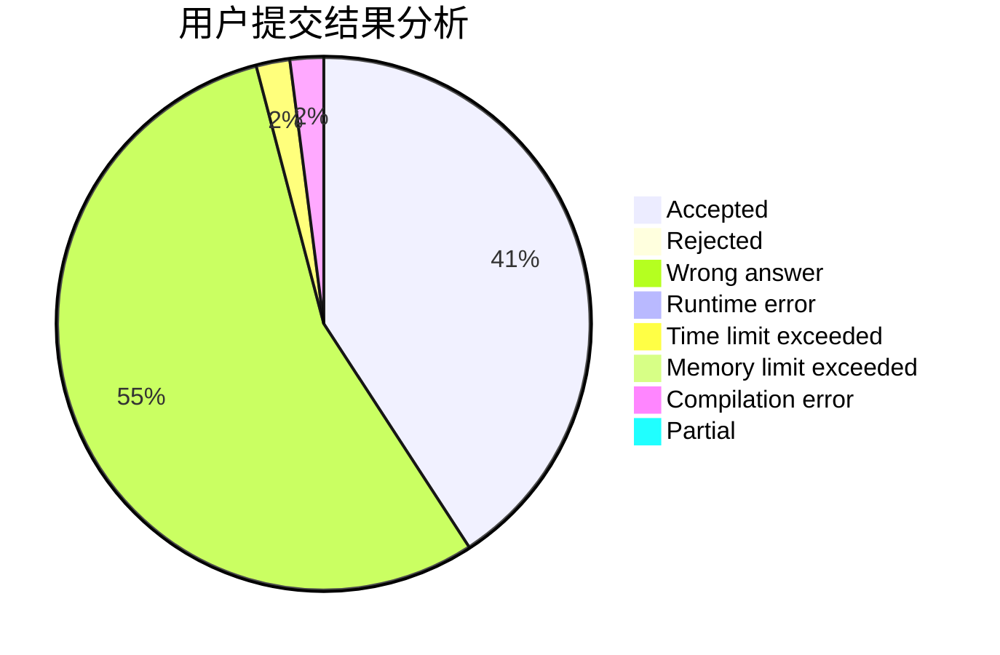
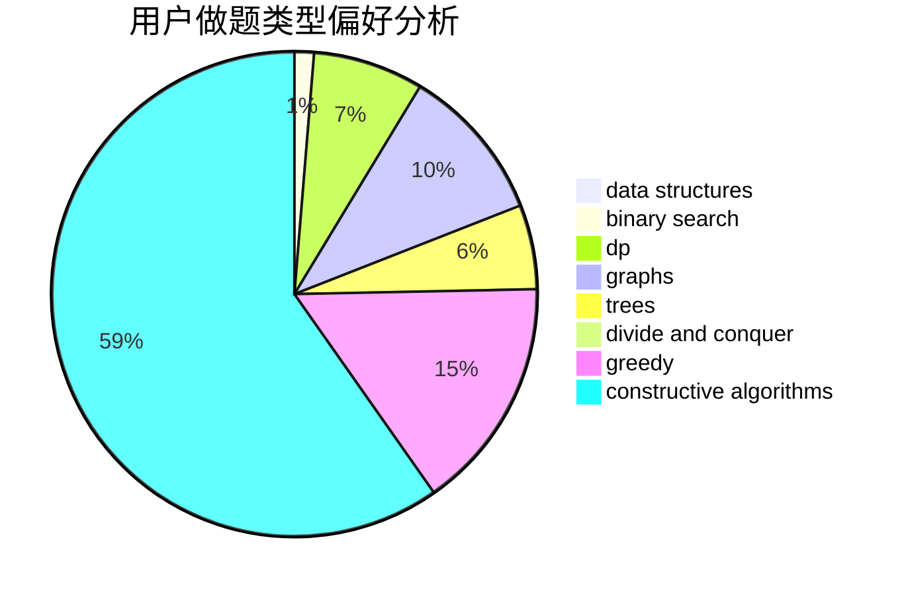
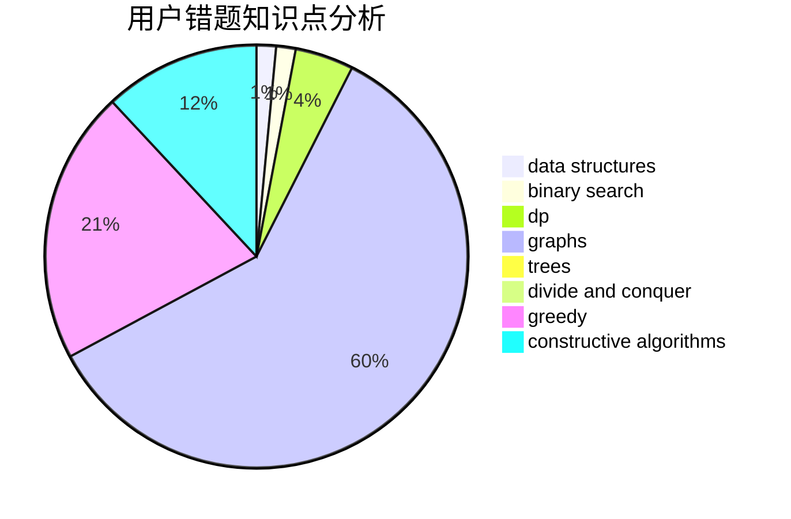

# LemonMZ

<!-- tabs:start -->

#### **用户提交结果分析**

#### **用户做题类型偏好分析**

#### **用户错题知识点分析**

<!-- tabs:end -->
# 推荐题目
[1175C](https://codeforces.com/contest/1175/problem/C)		binary search,
                        brute force,
                        greedy		  
[1092B](https://codeforces.com/contest/1092/problem/B)		sortings		  
[848E](https://codeforces.com/contest/848/problem/E)		combinatorics,
                        divide and conquer,
                        dp,
                        fft,
                        math		  
[908C](https://codeforces.com/contest/908/problem/C)		brute force,
                        geometry,
                        implementation,
                        math		  
[888E](https://codeforces.com/contest/888/problem/E)		bitmasks,
                        divide and conquer,
                        meet-in-the-middle		  
[1326B](https://codeforces.com/contest/1326/problem/B)		implementation,
                        math		  
[935C](https://codeforces.com/contest/935/problem/C)		geometry		  
[939C](https://codeforces.com/contest/939/problem/C)		binary search,
                        two pointers		  
[303E](https://codeforces.com/contest/303/problem/E)		dp,
                        math,
                        probabilities		  
[825G](https://codeforces.com/contest/825/problem/G)		dfs and similar,
                        graphs,
                        trees		  
