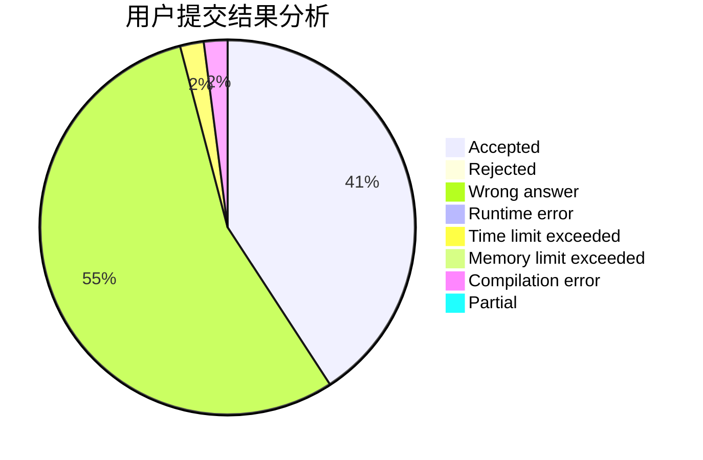
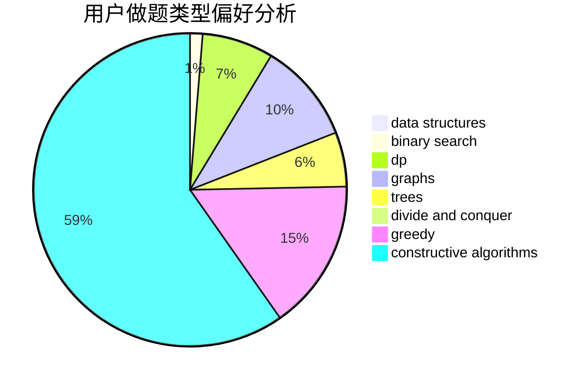
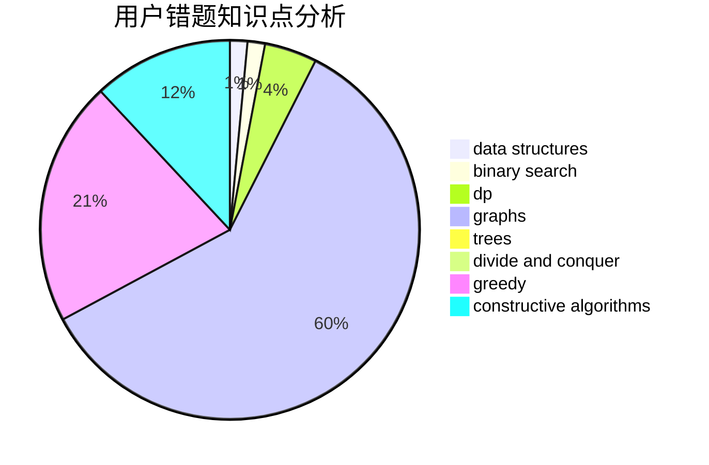

# LemonMZ
<!-- tabs:start -->
#### **用户提交结果分析**

#### **用户做题类型偏好分析**

#### **用户错题知识点分析**

<!-- tabs:end -->
# 推荐题目
[Electrification](http://codeforces.com/problemset/problem/1175/C)		binary search,
                        brute force,
                        greedy		  
[Teams Forming](http://codeforces.com/problemset/problem/1092/B)		sortings		  
[Days of Floral Colours](http://codeforces.com/problemset/problem/848/E)		combinatorics,
                        divide and conquer,
                        dp,
                        fft,
                        math		  
[Plus and Square Root](http://codeforces.com/problemset/problem/715/A)		constructive algorithms,
                        math		  
[Tree Queries](http://codeforces.com/problemset/problem/825/G)		dfs and similar,
                        graphs,
                        trees		  
[Convenient For Everybody](http://codeforces.com/problemset/problem/939/C)		binary search,
                        two pointers		  
[Maximum Subsequence](http://codeforces.com/problemset/problem/888/E)		bitmasks,
                        divide and conquer,
                        meet-in-the-middle		  
[New Year and Curling](http://codeforces.com/problemset/problem/908/C)		brute force,
                        geometry,
                        implementation,
                        math		  
[Bicycle Race](http://codeforces.com/problemset/problem/659/D)		geometry,
                        implementation,
                        math		  
[Game with Telephone Numbers](http://codeforces.com/problemset/problem/1155/B)		games,
                        greedy,
                        implementation		  
<!-- tabs:start -->
#### **data structures**
[Electrification](http://codeforces.com/problemset/problem/746/F)		data structures,
                        greedy,
                        two pointers		  
[Teams Forming](http://codeforces.com/problemset/problem/729/E)		constructive algorithms,
                        data structures,
                        graphs,
                        greedy,
                        sortings		  
[Days of Floral Colours](http://codeforces.com/problemset/problem/1486/D)		binary search,
                        data structures,
                        dp		  
[Plus and Square Root](http://codeforces.com/problemset/problem/1492/C)		binary search,
                        data structures,
                        dp,
                        greedy,
                        two pointers		  
[Tree Queries](http://codeforces.com/problemset/problem/1490/G)		binary search,
                        data structures,
                        math		  
[Convenient For Everybody](http://codeforces.com/problemset/problem/1479/D)		binary search,
                        bitmasks,
                        brute force,
                        data structures,
                        probabilities,
                        trees		  
[Maximum Subsequence](http://codeforces.com/problemset/problem/1497/A)		brute force,
                        data structures,
                        greedy,
                        sortings		  
[New Year and Curling](http://codeforces.com/problemset/problem/1491/C)		brute force,
                        data structures,
                        dp,
                        greedy,
                        implementation		  
[Bicycle Race](http://codeforces.com/problemset/problem/1492/B)		data structures,
                        greedy,
                        math		  
[Game with Telephone Numbers](http://codeforces.com/problemset/problem/1436/E)		binary search,
                        data structures,
                        two pointers		  
#### **binary search**
[Electrification](http://codeforces.com/problemset/problem/1175/C)		binary search,
                        brute force,
                        greedy		  
[Teams Forming](http://codeforces.com/problemset/problem/939/C)		binary search,
                        two pointers		  
[Days of Floral Colours](http://codeforces.com/problemset/problem/1165/F1)		binary search,
                        greedy		  
[Plus and Square Root](https://codeforces.com/contest/1362/problem/F)		binary search,
                        bitmasks,
                        constructive algorithms,
                        dfs and similar,
                        dsu,
                        graphs		  
[Tree Queries](http://codeforces.com/problemset/problem/911/B)		binary search,
                        brute force,
                        implementation		  
[Convenient For Everybody](http://codeforces.com/problemset/problem/1486/D)		binary search,
                        data structures,
                        dp		  
[Maximum Subsequence](http://codeforces.com/problemset/problem/1492/C)		binary search,
                        data structures,
                        dp,
                        greedy,
                        two pointers		  
[New Year and Curling](http://codeforces.com/problemset/problem/1463/D)		binary search,
                        constructive algorithms,
                        greedy,
                        two pointers		  
[Bicycle Race](http://codeforces.com/problemset/problem/1490/G)		binary search,
                        data structures,
                        math		  
[Game with Telephone Numbers](http://codeforces.com/problemset/problem/1479/D)		binary search,
                        bitmasks,
                        brute force,
                        data structures,
                        probabilities,
                        trees		  
#### **dp**
[Electrification](http://codeforces.com/problemset/problem/848/E)		combinatorics,
                        divide and conquer,
                        dp,
                        fft,
                        math		  
[Teams Forming](http://codeforces.com/problemset/problem/1253/C)		dp,
                        greedy,
                        math,
                        sortings		  
[Days of Floral Colours](https://codeforces.com/contest/1341/problem/E)		dfs and similar,
                        dp,
                        graphs,
                        shortest paths		  
[Plus and Square Root](http://codeforces.com/problemset/problem/303/E)		dp,
                        math,
                        probabilities		  
[Tree Queries](https://codeforces.com/contest/1443/problem/D)		constructive algorithms,
                        dp,
                        greedy		  
[Convenient For Everybody](http://codeforces.com/problemset/problem/1486/D)		binary search,
                        data structures,
                        dp		  
[Maximum Subsequence](http://codeforces.com/problemset/problem/1492/C)		binary search,
                        data structures,
                        dp,
                        greedy,
                        two pointers		  
[New Year and Curling](https://codeforces.com/contest/1457/problem/C)		brute force,
                        dp,
                        implementation		  
[Bicycle Race](http://codeforces.com/problemset/problem/1491/C)		brute force,
                        data structures,
                        dp,
                        greedy,
                        implementation		  
[Game with Telephone Numbers](http://codeforces.com/problemset/problem/1437/C)		dp,
                        flows,
                        graph matchings,
                        greedy,
                        math,
                        sortings		  
#### **graph**
[Electrification](http://codeforces.com/problemset/problem/825/G)		dfs and similar,
                        graphs,
                        trees		  
[Teams Forming](https://codeforces.com/contest/1341/problem/E)		dfs and similar,
                        dp,
                        graphs,
                        shortest paths		  
[Days of Floral Colours](https://codeforces.com/contest/1362/problem/F)		binary search,
                        bitmasks,
                        constructive algorithms,
                        dfs and similar,
                        dsu,
                        graphs		  
[Plus and Square Root](http://codeforces.com/problemset/problem/729/E)		constructive algorithms,
                        data structures,
                        graphs,
                        greedy,
                        sortings		  
[Tree Queries](http://codeforces.com/problemset/problem/1487/C)		brute force,
                        constructive algorithms,
                        dfs and similar,
                        graphs,
                        greedy,
                        implementation,
                        math		  
[Convenient For Everybody](http://codeforces.com/problemset/problem/1437/C)		dp,
                        flows,
                        graph matchings,
                        greedy,
                        math,
                        sortings		  
[Maximum Subsequence](http://codeforces.com/problemset/problem/1470/D)		constructive algorithms,
                        dfs and similar,
                        graph matchings,
                        graphs,
                        greedy		  
[New Year and Curling](http://codeforces.com/problemset/problem/1476/C)		dp,
                        graphs,
                        greedy		  
[Bicycle Race](http://codeforces.com/problemset/problem/1304/D)		constructive algorithms,
                        graphs,
                        greedy,
                        two pointers		  
[Game with Telephone Numbers](http://codeforces.com/problemset/problem/1475/C)		combinatorics,
                        graphs,
                        math		  
#### **trees**
[Electrification](http://codeforces.com/problemset/problem/825/G)		dfs and similar,
                        graphs,
                        trees		  
[Teams Forming](http://codeforces.com/problemset/problem/1479/D)		binary search,
                        bitmasks,
                        brute force,
                        data structures,
                        probabilities,
                        trees		  
[Days of Floral Colours](http://codeforces.com/problemset/problem/1511/C)		brute force,
                        data structures,
                        implementation,
                        trees		  
[Plus and Square Root](http://codeforces.com/problemset/problem/1499/F)		combinatorics,
                        dfs and similar,
                        dp,
                        trees		  
[Tree Queries](http://codeforces.com/problemset/problem/1491/E)		brute force,
                        dfs and similar,
                        divide and conquer,
                        number theory,
                        trees		  
[Convenient For Everybody](http://codeforces.com/problemset/problem/1466/D)		data structures,
                        greedy,
                        sortings,
                        trees		  
[Maximum Subsequence](http://codeforces.com/problemset/problem/1495/D)		combinatorics,
                        dfs and similar,
                        graphs,
                        math,
                        shortest paths,
                        trees		  
[New Year and Curling](http://codeforces.com/problemset/problem/1303/G)		data structures,
                        divide and conquer,
                        geometry,
                        trees		  
[Bicycle Race](http://codeforces.com/problemset/problem/1454/E)		combinatorics,
                        dfs and similar,
                        graphs,
                        trees		  
[Game with Telephone Numbers](http://codeforces.com/problemset/problem/1494/D)		constructive algorithms,
                        data structures,
                        dfs and similar,
                        divide and conquer,
                        dsu,
                        greedy,
                        sortings,
                        trees		  
#### **divide and conquer**
[Electrification](http://codeforces.com/problemset/problem/848/E)		combinatorics,
                        divide and conquer,
                        dp,
                        fft,
                        math		  
[Teams Forming](http://codeforces.com/problemset/problem/888/E)		bitmasks,
                        divide and conquer,
                        meet-in-the-middle		  
[Days of Floral Colours](http://codeforces.com/problemset/problem/1461/D)		binary search,
                        brute force,
                        data structures,
                        divide and conquer,
                        implementation,
                        sortings		  
[Plus and Square Root](http://codeforces.com/problemset/problem/1466/G)		combinatorics,
                        divide and conquer,
                        hashing,
                        math,
                        string suffix structures,
                        strings		  
[Tree Queries](http://codeforces.com/problemset/problem/1490/D)		dfs and similar,
                        divide and conquer,
                        implementation		  
[Convenient For Everybody](https://codeforces.com/contest/1483/problem/C)		data structures,
                        divide and conquer,
                        dp		  
[Maximum Subsequence](http://codeforces.com/problemset/problem/1491/E)		brute force,
                        dfs and similar,
                        divide and conquer,
                        number theory,
                        trees		  
[New Year and Curling](http://codeforces.com/problemset/problem/1303/G)		data structures,
                        divide and conquer,
                        geometry,
                        trees		  
[Bicycle Race](http://codeforces.com/problemset/problem/1494/D)		constructive algorithms,
                        data structures,
                        dfs and similar,
                        divide and conquer,
                        dsu,
                        greedy,
                        sortings,
                        trees		  
[Game with Telephone Numbers](http://codeforces.com/problemset/problem/1482/E)		data structures,
                        divide and conquer,
                        dp		  
#### **greedy**
[Electrification](http://codeforces.com/problemset/problem/1175/C)		binary search,
                        brute force,
                        greedy		  
[Teams Forming](http://codeforces.com/problemset/problem/1155/B)		games,
                        greedy,
                        implementation		  
[Days of Floral Colours](http://codeforces.com/problemset/problem/1165/F1)		binary search,
                        greedy		  
[Plus and Square Root](http://codeforces.com/problemset/problem/746/F)		data structures,
                        greedy,
                        two pointers		  
[Tree Queries](http://codeforces.com/problemset/problem/1253/C)		dp,
                        greedy,
                        math,
                        sortings		  
[Convenient For Everybody](http://codeforces.com/problemset/problem/1408/B)		constructive algorithms,
                        greedy,
                        math		  
[Maximum Subsequence](http://codeforces.com/problemset/problem/1266/C)		constructive algorithms,
                        greedy,
                        math,
                        number theory		  
[New Year and Curling](http://codeforces.com/problemset/problem/729/E)		constructive algorithms,
                        data structures,
                        graphs,
                        greedy,
                        sortings		  
[Bicycle Race](https://codeforces.com/contest/1443/problem/D)		constructive algorithms,
                        dp,
                        greedy		  
[Game with Telephone Numbers](http://codeforces.com/problemset/problem/1342/A)		greedy,
                        math		  
#### **constructive algorithms**
[Electrification](http://codeforces.com/problemset/problem/715/A)		constructive algorithms,
                        math		  
[Teams Forming](http://codeforces.com/problemset/problem/814/B)		constructive algorithms		  
[Days of Floral Colours](https://codeforces.com/contest/1362/problem/F)		binary search,
                        bitmasks,
                        constructive algorithms,
                        dfs and similar,
                        dsu,
                        graphs		  
[Plus and Square Root](http://codeforces.com/problemset/problem/1270/C)		bitmasks,
                        constructive algorithms,
                        math		  
[Tree Queries](http://codeforces.com/problemset/problem/1408/B)		constructive algorithms,
                        greedy,
                        math		  
[Convenient For Everybody](http://codeforces.com/problemset/problem/1266/C)		constructive algorithms,
                        greedy,
                        math,
                        number theory		  
[Maximum Subsequence](http://codeforces.com/problemset/problem/729/E)		constructive algorithms,
                        data structures,
                        graphs,
                        greedy,
                        sortings		  
[New Year and Curling](https://codeforces.com/contest/1443/problem/D)		constructive algorithms,
                        dp,
                        greedy		  
[Bicycle Race](http://codeforces.com/problemset/problem/1493/A)		constructive algorithms,
                        greedy		  
[Game with Telephone Numbers](http://codeforces.com/problemset/problem/1463/D)		binary search,
                        constructive algorithms,
                        greedy,
                        two pointers		  
#### **sortings**
[Electrification](http://codeforces.com/problemset/problem/1092/B)		sortings		  
[Teams Forming](http://codeforces.com/problemset/problem/1253/C)		dp,
                        greedy,
                        math,
                        sortings		  
[Days of Floral Colours](http://codeforces.com/problemset/problem/729/E)		constructive algorithms,
                        data structures,
                        graphs,
                        greedy,
                        sortings		  
[Plus and Square Root](https://codeforces.com/contest/1496/problem/C)		geometry,
                        greedy,
                        math,
                        sortings		  
[Tree Queries](http://codeforces.com/problemset/problem/1495/A)		geometry,
                        greedy,
                        math,
                        sortings		  
[Convenient For Everybody](http://codeforces.com/problemset/problem/1497/A)		brute force,
                        data structures,
                        greedy,
                        sortings		  
[Maximum Subsequence](http://codeforces.com/problemset/problem/1427/A)		math,
                        sortings		  
[New Year and Curling](http://codeforces.com/problemset/problem/1461/D)		binary search,
                        brute force,
                        data structures,
                        divide and conquer,
                        implementation,
                        sortings		  
[Bicycle Race](http://codeforces.com/problemset/problem/1437/C)		dp,
                        flows,
                        graph matchings,
                        greedy,
                        math,
                        sortings		  
[Game with Telephone Numbers](http://codeforces.com/problemset/problem/1473/A)		greedy,
                        implementation,
                        math,
                        sortings		  
<!-- tabs:end -->
