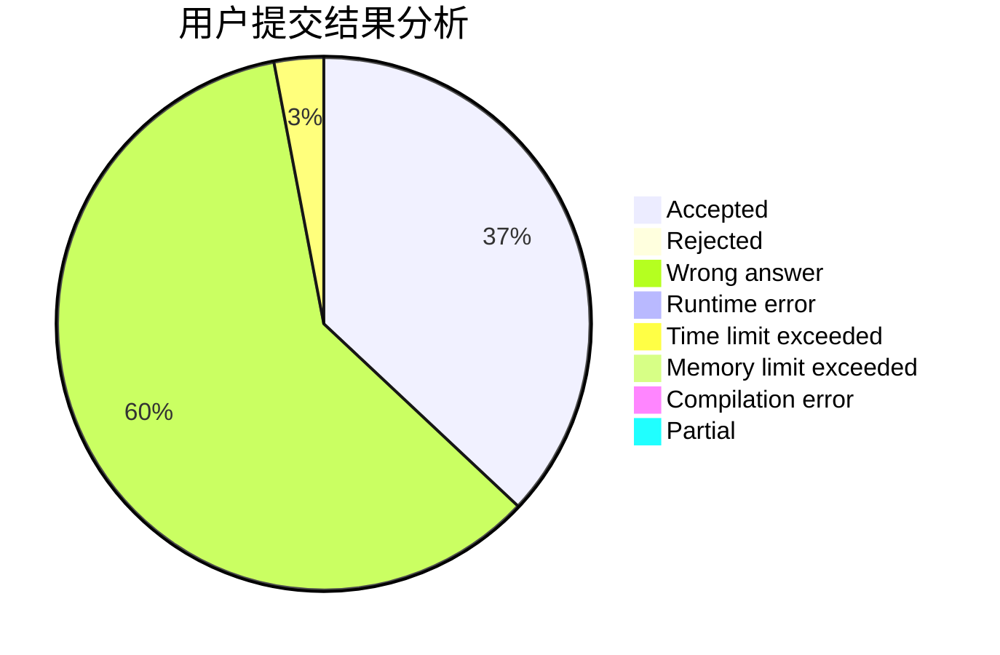
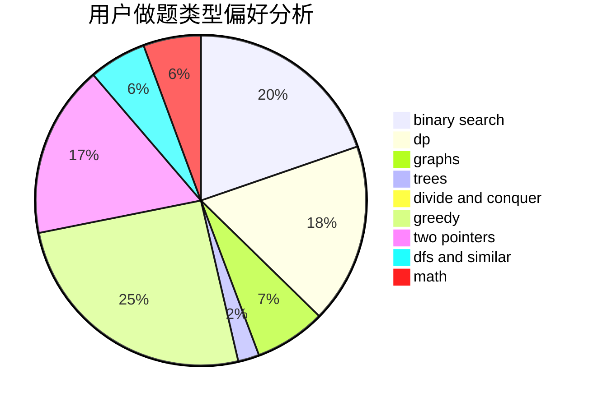

# LengYun

<!-- tabs:start -->

#### **用户提交结果分析**

#### **用户做题类型偏好分析**

<!-- tabs:end -->
# 推荐题目
[13352](https://codeforces.com/contest/1335/problem/2)
[869E](https://codeforces.com/contest/869/problem/E)
[254A](https://codeforces.com/contest/254/problem/A)
[696B](https://codeforces.com/contest/696/problem/B)
[1007A](https://codeforces.com/contest/1007/problem/A)
[1236B](https://codeforces.com/contest/1236/problem/B)
[506A](https://codeforces.com/contest/506/problem/A)
[34D](https://codeforces.com/contest/34/problem/D)
[901C](https://codeforces.com/contest/901/problem/C)
[689B](https://codeforces.com/contest/689/problem/B)
