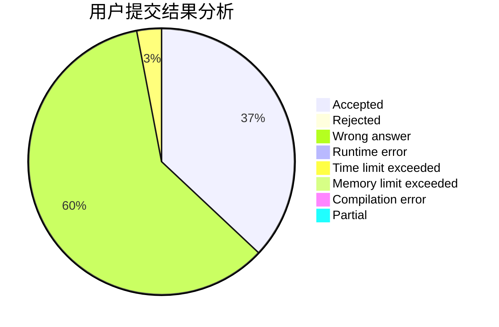
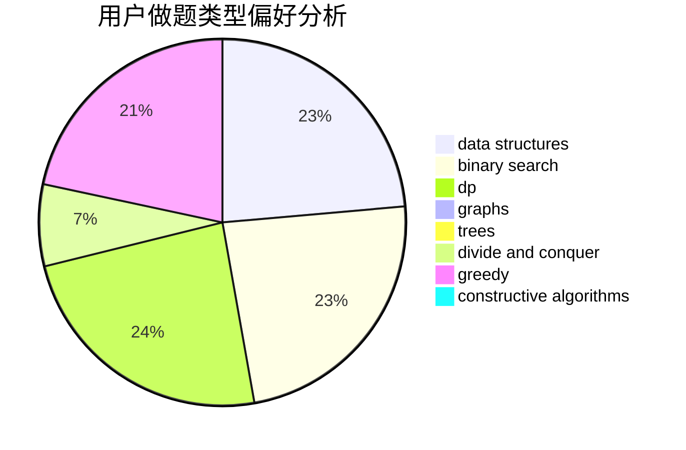
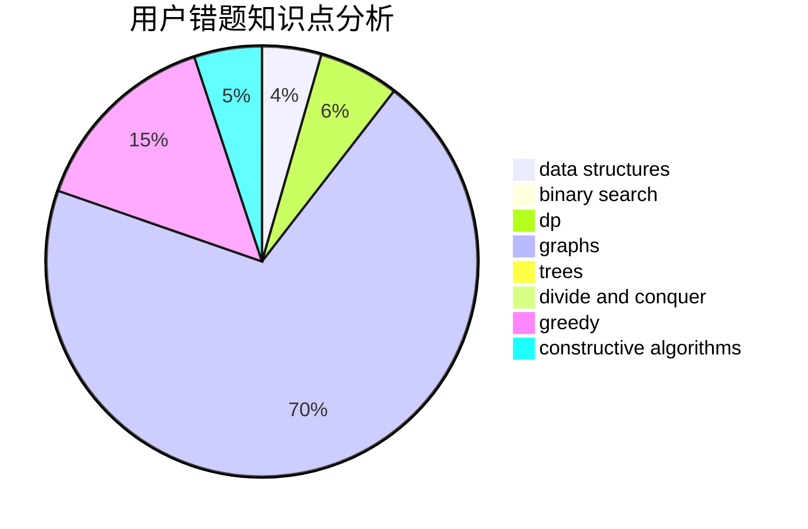

# LengYun
<!-- tabs:start -->
#### **用户提交结果分析**

#### **用户做题类型偏好分析**

#### **用户错题知识点分析**

<!-- tabs:end -->
# 推荐题目
[Rainbow Balls](http://codeforces.com/problemset/problem/850/F)		math		  
[Table](http://codeforces.com/problemset/problem/232/B)		bitmasks,
                        combinatorics,
                        dp,
                        math		  
[Make k Equal](http://codeforces.com/problemset/problem/1328/F)		greedy		  
[Magic Powder - 1](http://codeforces.com/problemset/problem/670/D1)		binary search,
                        brute force,
                        implementation		  
[Optimal Subsequences (Hard Version)](http://codeforces.com/problemset/problem/1227/D2)		data structures,
                        greedy		  
[A Determined Cleanup](http://codeforces.com/problemset/problem/933/B)		math		  
[Coat of Anticubism](http://codeforces.com/problemset/problem/667/B)		constructive algorithms,
                        geometry		  
[Infinite Sequence](http://codeforces.com/problemset/problem/622/A)		implementation,
                        math		  
[Have You Ever Heard About the Word?](http://codeforces.com/problemset/problem/319/D)		greedy,
                        hashing,
                        string suffix structures,
                        strings		  
[Santa Claus and Robot](http://codeforces.com/problemset/problem/748/C)		constructive algorithms,
                        math		  
<!-- tabs:start -->
#### **data structures**
[Rainbow Balls](http://codeforces.com/problemset/problem/1227/D2)		data structures,
                        greedy		  
[Table](http://codeforces.com/problemset/problem/484/E)		binary search,
                        constructive algorithms,
                        data structures		  
[Make k Equal](http://codeforces.com/problemset/problem/577/B)		combinatorics,
                        data structures,
                        dp,
                        two pointers		  
[Magic Powder - 1](http://codeforces.com/problemset/problem/208/E)		binary search,
                        data structures,
                        dfs and similar,
                        trees		  
[Optimal Subsequences (Hard Version)](http://codeforces.com/problemset/problem/954/G)		binary search,
                        data structures,
                        greedy,
                        two pointers		  
[A Determined Cleanup](http://codeforces.com/problemset/problem/487/E)		data structures,
                        dfs and similar,
                        graphs,
                        trees		  
[Coat of Anticubism](http://codeforces.com/problemset/problem/1492/C)		binary search,
                        data structures,
                        dp,
                        greedy,
                        two pointers		  
[Infinite Sequence](http://codeforces.com/problemset/problem/1490/G)		binary search,
                        data structures,
                        math		  
[Have You Ever Heard About the Word?](http://codeforces.com/problemset/problem/1479/D)		binary search,
                        bitmasks,
                        brute force,
                        data structures,
                        probabilities,
                        trees		  
[Santa Claus and Robot](http://codeforces.com/problemset/problem/1497/A)		brute force,
                        data structures,
                        greedy,
                        sortings		  
#### **binary search**
[Rainbow Balls](http://codeforces.com/problemset/problem/670/D1)		binary search,
                        brute force,
                        implementation		  
[Table](http://codeforces.com/problemset/problem/484/E)		binary search,
                        constructive algorithms,
                        data structures		  
[Make k Equal](http://codeforces.com/problemset/problem/883/I)		binary search,
                        dp		  
[Magic Powder - 1](http://codeforces.com/problemset/problem/555/D)		binary search,
                        implementation,
                        math		  
[Optimal Subsequences (Hard Version)](http://codeforces.com/problemset/problem/444/E)		binary search,
                        dsu,
                        trees		  
[A Determined Cleanup](http://codeforces.com/problemset/problem/730/C)		binary search,
                        dfs and similar		  
[Coat of Anticubism](http://codeforces.com/problemset/problem/208/E)		binary search,
                        data structures,
                        dfs and similar,
                        trees		  
[Infinite Sequence](https://codeforces.com/contest/1247/problem/E)		binary search,
                        dp		  
[Have You Ever Heard About the Word?](http://codeforces.com/problemset/problem/1066/D)		binary search,
                        implementation		  
[Santa Claus and Robot](http://codeforces.com/problemset/problem/954/G)		binary search,
                        data structures,
                        greedy,
                        two pointers		  
#### **dp**
[Rainbow Balls](http://codeforces.com/problemset/problem/232/B)		bitmasks,
                        combinatorics,
                        dp,
                        math		  
[Table](http://codeforces.com/problemset/problem/883/I)		binary search,
                        dp		  
[Make k Equal](http://codeforces.com/problemset/problem/643/F)		dp,
                        math,
                        meet-in-the-middle		  
[Magic Powder - 1](http://codeforces.com/problemset/problem/455/A)		dp		  
[Optimal Subsequences (Hard Version)](http://codeforces.com/problemset/problem/577/B)		combinatorics,
                        data structures,
                        dp,
                        two pointers		  
[A Determined Cleanup](https://codeforces.com/contest/1293/problem/E)		combinatorics,
                        dfs and similar,
                        dp,
                        greedy,
                        trees		  
[Coat of Anticubism](http://codeforces.com/problemset/problem/468/E)		dp,
                        graph matchings,
                        math,
                        meet-in-the-middle		  
[Infinite Sequence](https://codeforces.com/contest/1247/problem/E)		binary search,
                        dp		  
[Have You Ever Heard About the Word?](http://codeforces.com/problemset/problem/1276/D)		dp,
                        trees		  
[Santa Claus and Robot](http://codeforces.com/problemset/problem/1492/C)		binary search,
                        data structures,
                        dp,
                        greedy,
                        two pointers		  
#### **graph**
[Rainbow Balls](http://codeforces.com/problemset/problem/468/E)		dp,
                        graph matchings,
                        math,
                        meet-in-the-middle		  
[Table](http://codeforces.com/problemset/problem/954/D)		dfs and similar,
                        graphs,
                        shortest paths		  
[Make k Equal](http://codeforces.com/problemset/problem/487/E)		data structures,
                        dfs and similar,
                        graphs,
                        trees		  
[Magic Powder - 1](http://codeforces.com/problemset/problem/1307/G)		flows,
                        graphs,
                        shortest paths		  
[Optimal Subsequences (Hard Version)](http://codeforces.com/problemset/problem/1487/C)		brute force,
                        constructive algorithms,
                        dfs and similar,
                        graphs,
                        greedy,
                        implementation,
                        math		  
[A Determined Cleanup](http://codeforces.com/problemset/problem/1437/C)		dp,
                        flows,
                        graph matchings,
                        greedy,
                        math,
                        sortings		  
[Coat of Anticubism](http://codeforces.com/problemset/problem/1470/D)		constructive algorithms,
                        dfs and similar,
                        graph matchings,
                        graphs,
                        greedy		  
[Infinite Sequence](http://codeforces.com/problemset/problem/1476/C)		dp,
                        graphs,
                        greedy		  
[Have You Ever Heard About the Word?](http://codeforces.com/problemset/problem/1304/D)		constructive algorithms,
                        graphs,
                        greedy,
                        two pointers		  
[Santa Claus and Robot](http://codeforces.com/problemset/problem/1475/C)		combinatorics,
                        graphs,
                        math		  
#### **trees**
[Rainbow Balls](http://codeforces.com/problemset/problem/444/E)		binary search,
                        dsu,
                        trees		  
[Table](https://codeforces.com/contest/1293/problem/E)		combinatorics,
                        dfs and similar,
                        dp,
                        greedy,
                        trees		  
[Make k Equal](http://codeforces.com/problemset/problem/208/E)		binary search,
                        data structures,
                        dfs and similar,
                        trees		  
[Magic Powder - 1](http://codeforces.com/problemset/problem/1276/D)		dp,
                        trees		  
[Optimal Subsequences (Hard Version)](http://codeforces.com/problemset/problem/487/E)		data structures,
                        dfs and similar,
                        graphs,
                        trees		  
[A Determined Cleanup](http://codeforces.com/problemset/problem/1479/D)		binary search,
                        bitmasks,
                        brute force,
                        data structures,
                        probabilities,
                        trees		  
[Coat of Anticubism](http://codeforces.com/problemset/problem/1511/C)		brute force,
                        data structures,
                        implementation,
                        trees		  
[Infinite Sequence](http://codeforces.com/problemset/problem/1499/F)		combinatorics,
                        dfs and similar,
                        dp,
                        trees		  
[Have You Ever Heard About the Word?](http://codeforces.com/problemset/problem/1491/E)		brute force,
                        dfs and similar,
                        divide and conquer,
                        number theory,
                        trees		  
[Santa Claus and Robot](http://codeforces.com/problemset/problem/1466/D)		data structures,
                        greedy,
                        sortings,
                        trees		  
#### **divide and conquer**
[Rainbow Balls](http://codeforces.com/problemset/problem/1461/D)		binary search,
                        brute force,
                        data structures,
                        divide and conquer,
                        implementation,
                        sortings		  
[Table](http://codeforces.com/problemset/problem/1466/G)		combinatorics,
                        divide and conquer,
                        hashing,
                        math,
                        string suffix structures,
                        strings		  
[Make k Equal](http://codeforces.com/problemset/problem/1490/D)		dfs and similar,
                        divide and conquer,
                        implementation		  
[Magic Powder - 1](https://codeforces.com/contest/1483/problem/C)		data structures,
                        divide and conquer,
                        dp		  
[Optimal Subsequences (Hard Version)](http://codeforces.com/problemset/problem/1491/E)		brute force,
                        dfs and similar,
                        divide and conquer,
                        number theory,
                        trees		  
[A Determined Cleanup](http://codeforces.com/problemset/problem/1303/G)		data structures,
                        divide and conquer,
                        geometry,
                        trees		  
[Coat of Anticubism](http://codeforces.com/problemset/problem/1494/D)		constructive algorithms,
                        data structures,
                        dfs and similar,
                        divide and conquer,
                        dsu,
                        greedy,
                        sortings,
                        trees		  
[Infinite Sequence](http://codeforces.com/problemset/problem/1482/E)		data structures,
                        divide and conquer,
                        dp		  
[Have You Ever Heard About the Word?](http://codeforces.com/problemset/problem/566/C)		dfs and similar,
                        divide and conquer,
                        trees		  
[Santa Claus and Robot](http://codeforces.com/problemset/problem/1428/F)		binary search,
                        data structures,
                        divide and conquer,
                        dp,
                        two pointers		  
#### **greedy**
[Rainbow Balls](http://codeforces.com/problemset/problem/1328/F)		greedy		  
[Table](http://codeforces.com/problemset/problem/1227/D2)		data structures,
                        greedy		  
[Make k Equal](http://codeforces.com/problemset/problem/319/D)		greedy,
                        hashing,
                        string suffix structures,
                        strings		  
[Magic Powder - 1](http://codeforces.com/problemset/problem/588/A)		greedy		  
[Optimal Subsequences (Hard Version)](https://codeforces.com/contest/1293/problem/E)		combinatorics,
                        dfs and similar,
                        dp,
                        greedy,
                        trees		  
[A Determined Cleanup](http://codeforces.com/problemset/problem/16/B)		greedy,
                        implementation,
                        sortings		  
[Coat of Anticubism](http://codeforces.com/problemset/problem/954/G)		binary search,
                        data structures,
                        greedy,
                        two pointers		  
[Infinite Sequence](http://codeforces.com/problemset/problem/1492/C)		binary search,
                        data structures,
                        dp,
                        greedy,
                        two pointers		  
[Have You Ever Heard About the Word?](https://codeforces.com/contest/1496/problem/C)		geometry,
                        greedy,
                        math,
                        sortings		  
[Santa Claus and Robot](http://codeforces.com/problemset/problem/1493/A)		constructive algorithms,
                        greedy		  
#### **constructive algorithms**
[Rainbow Balls](http://codeforces.com/problemset/problem/667/B)		constructive algorithms,
                        geometry		  
[Table](http://codeforces.com/problemset/problem/748/C)		constructive algorithms,
                        math		  
[Make k Equal](http://codeforces.com/problemset/problem/484/E)		binary search,
                        constructive algorithms,
                        data structures		  
[Magic Powder - 1](http://codeforces.com/problemset/problem/1256/F)		constructive algorithms,
                        sortings,
                        strings		  
[Optimal Subsequences (Hard Version)](http://codeforces.com/problemset/problem/1427/E)		bitmasks,
                        constructive algorithms,
                        math,
                        matrices,
                        number theory		  
[A Determined Cleanup](http://codeforces.com/problemset/problem/1493/A)		constructive algorithms,
                        greedy		  
[Coat of Anticubism](http://codeforces.com/problemset/problem/1463/D)		binary search,
                        constructive algorithms,
                        greedy,
                        two pointers		  
[Infinite Sequence](https://codeforces.com/contest/1456/problem/B)		bitmasks,
                        brute force,
                        constructive algorithms		  
[Have You Ever Heard About the Word?](http://codeforces.com/problemset/problem/1492/D)		bitmasks,
                        constructive algorithms,
                        greedy,
                        math		  
[Santa Claus and Robot](https://codeforces.com/contest/1504/problem/D)		constructive algorithms,
                        games,
                        interactive		  
#### **sortings**
[Rainbow Balls](http://codeforces.com/problemset/problem/1256/F)		constructive algorithms,
                        sortings,
                        strings		  
[Table](http://codeforces.com/problemset/problem/16/B)		greedy,
                        implementation,
                        sortings		  
[Make k Equal](https://codeforces.com/contest/1496/problem/C)		geometry,
                        greedy,
                        math,
                        sortings		  
[Magic Powder - 1](http://codeforces.com/problemset/problem/1495/A)		geometry,
                        greedy,
                        math,
                        sortings		  
[Optimal Subsequences (Hard Version)](http://codeforces.com/problemset/problem/1497/A)		brute force,
                        data structures,
                        greedy,
                        sortings		  
[A Determined Cleanup](http://codeforces.com/problemset/problem/1427/A)		math,
                        sortings		  
[Coat of Anticubism](http://codeforces.com/problemset/problem/1461/D)		binary search,
                        brute force,
                        data structures,
                        divide and conquer,
                        implementation,
                        sortings		  
[Infinite Sequence](http://codeforces.com/problemset/problem/1437/C)		dp,
                        flows,
                        graph matchings,
                        greedy,
                        math,
                        sortings		  
[Have You Ever Heard About the Word?](http://codeforces.com/problemset/problem/1473/A)		greedy,
                        implementation,
                        math,
                        sortings		  
[Santa Claus and Robot](http://codeforces.com/problemset/problem/1486/B)		binary search,
                        geometry,
                        shortest paths,
                        sortings		  
<!-- tabs:end -->
