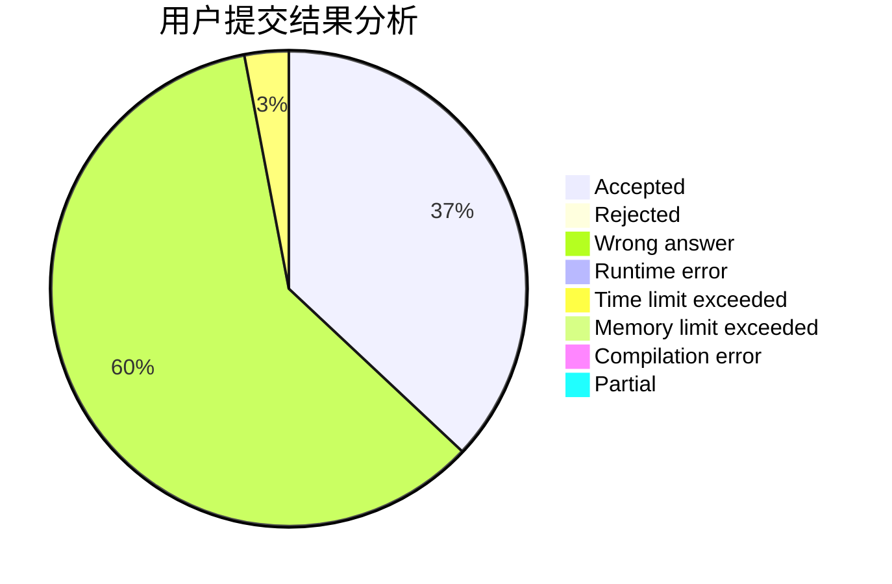
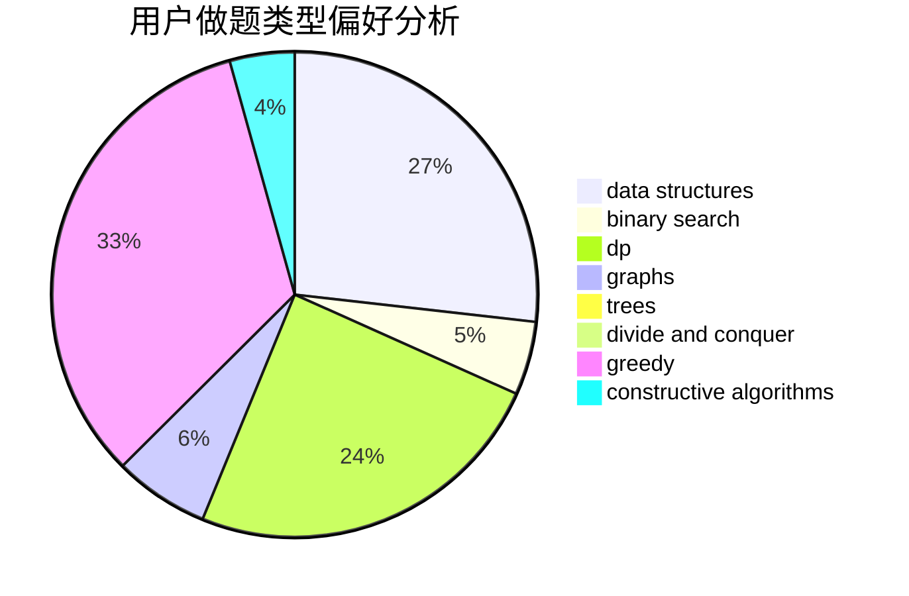
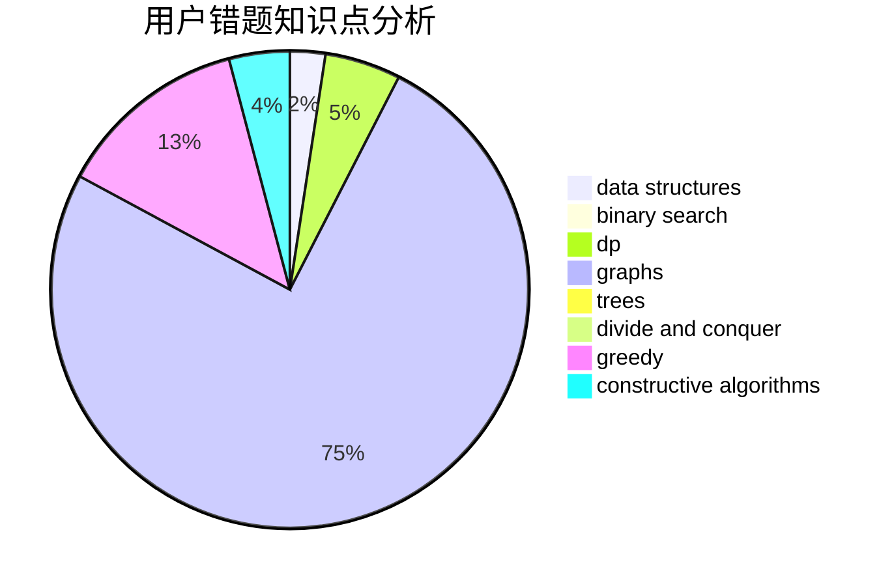

# LengYun

<!-- tabs:start -->

#### **用户提交结果分析**

#### **用户做题类型偏好分析**

#### **用户错题知识点分析**

<!-- tabs:end -->
# 推荐题目
[13352](https://codeforces.com/contest/1335/problem/2)		dsu,graphs,sortings,trees		  
[869E](https://codeforces.com/contest/869/problem/E)		data structures,
                        hashing		  
[254A](https://codeforces.com/contest/254/problem/A)		constructive algorithms,
                        sortings		  
[696B](https://codeforces.com/contest/696/problem/B)		dfs and similar,
                        math,
                        probabilities,
                        trees		  
[1007A](https://codeforces.com/contest/1007/problem/A)		combinatorics,
                        data structures,
                        math,
                        sortings,
                        two pointers		  
[1236B](https://codeforces.com/contest/1236/problem/B)		combinatorics,
                        math		  
[506A](https://codeforces.com/contest/506/problem/A)		dsu,graphs,sortings,trees		  
[34D](https://codeforces.com/contest/34/problem/D)		dfs and similar,
                        graphs		  
[901C](https://codeforces.com/contest/901/problem/C)		binary search,
                        data structures,
                        dfs and similar,
                        dsu,
                        graphs,
                        two pointers		  
[689B](https://codeforces.com/contest/689/problem/B)		dfs and similar,
                        graphs,
                        greedy,
                        shortest paths		  
