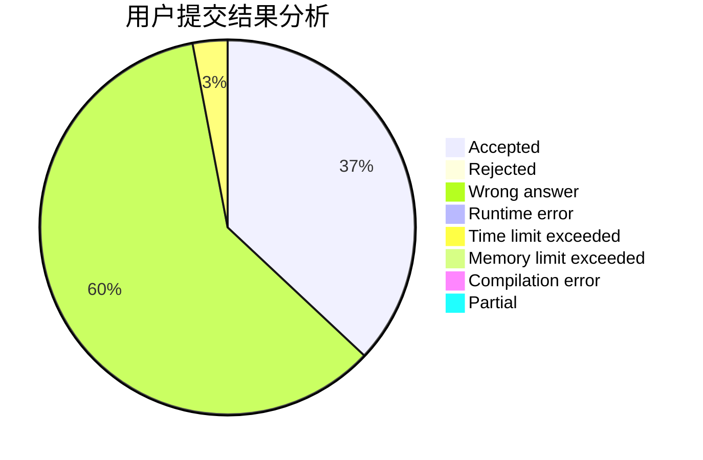
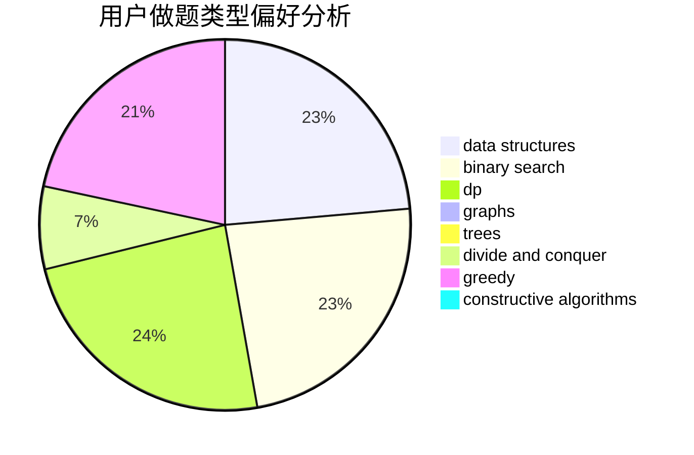
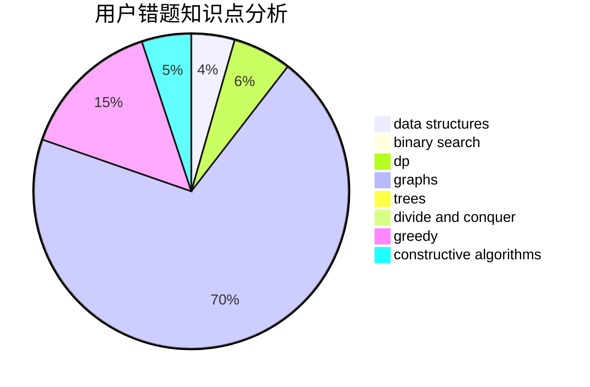

# LengYun

<!-- tabs:start -->

#### **用户提交结果分析**

#### **用户做题类型偏好分析**

#### **用户错题知识点分析**

<!-- tabs:end -->
# 推荐题目
[1328F](https://codeforces.com/contest/1328/problem/F)		greedy		  
[850F](https://codeforces.com/contest/850/problem/F)		math		  
[232B](https://codeforces.com/contest/232/problem/B)		bitmasks,
                        combinatorics,
                        dp,
                        math		  
[670D1](https://codeforces.com/contest/670D/problem/1)		binary search,
                        brute force,
                        implementation		  
[1006D](https://codeforces.com/contest/1006/problem/D)		implementation		  
[1227D2](https://codeforces.com/contest/1227D/problem/2)		data structures,
                        greedy		  
[484E](https://codeforces.com/contest/484/problem/E)		binary search,
                        constructive algorithms,
                        data structures		  
[319D](https://codeforces.com/contest/319/problem/D)		greedy,
                        hashing,
                        string suffix structures,
                        strings		  
[883I](https://codeforces.com/contest/883/problem/I)		binary search,
                        dp		  
[667B](https://codeforces.com/contest/667/problem/B)		constructive algorithms,
                        geometry		  
