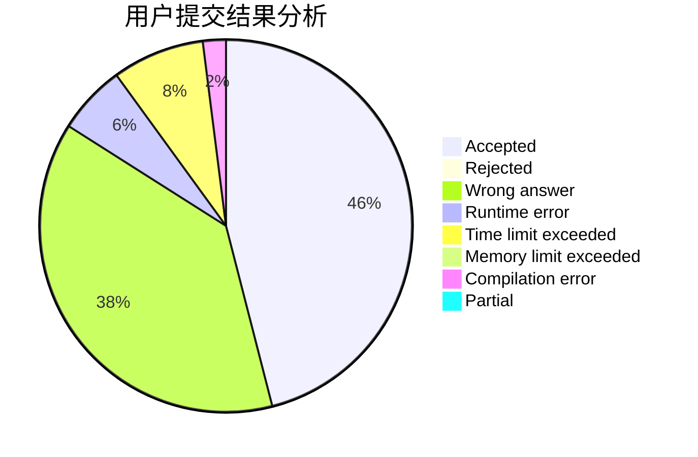
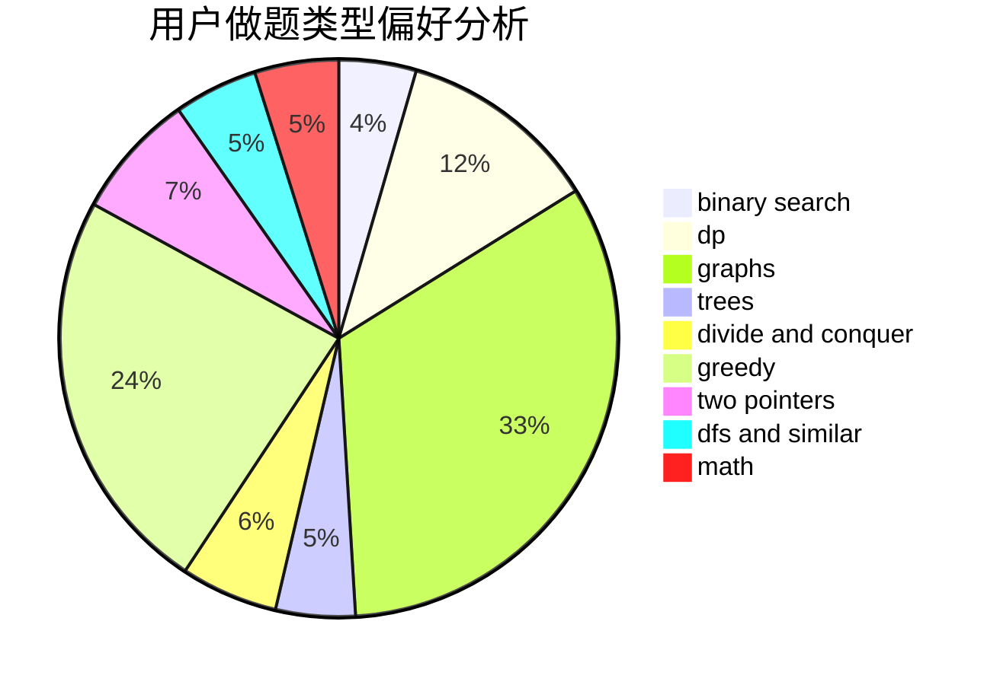

# Lengjunyi

<!-- tabs:start -->

#### **用户提交结果分析**

#### **用户做题类型偏好分析**

<!-- tabs:end -->
# 推荐题目
[1495C](https://codeforces.com/contest/1495/problem/C)
[506C](https://codeforces.com/contest/506/problem/C)
[708D](https://codeforces.com/contest/708/problem/D)
[1342D](https://codeforces.com/contest/1342/problem/D)
[1156C](https://codeforces.com/contest/1156/problem/C)
[833D](https://codeforces.com/contest/833/problem/D)
[821D](https://codeforces.com/contest/821/problem/D)
[360D](https://codeforces.com/contest/360/problem/D)
[708A](https://codeforces.com/contest/708/problem/A)
[1054C](https://codeforces.com/contest/1054/problem/C)
