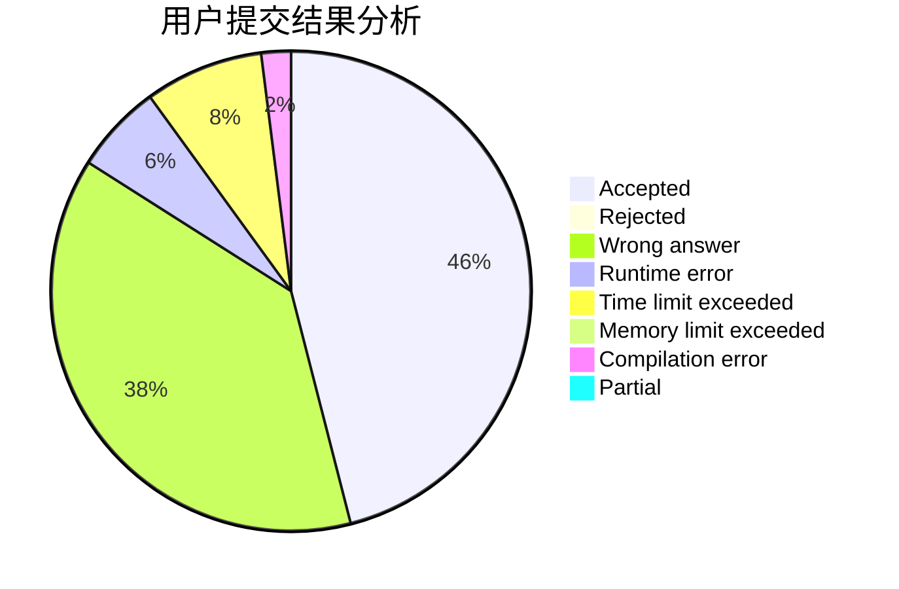
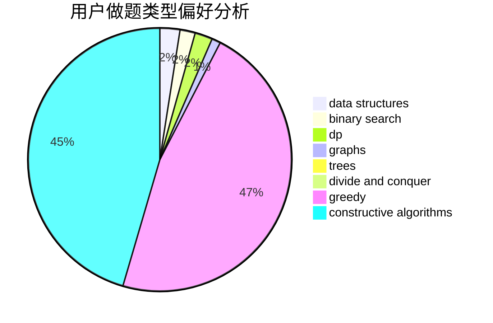

# Lengjunyi

<!-- tabs:start -->

#### **用户提交结果分析**

#### **用户做题类型偏好分析**

#### **用户错题知识点分析**

<!-- tabs:end -->
# 推荐题目
[1487F](https://codeforces.com/contest/1487/problem/F)		dp,
                        greedy,
                        shortest paths		  
[485D](https://codeforces.com/contest/485/problem/D)		dsu,graphs,sortings,trees		  
[686D](https://codeforces.com/contest/686/problem/D)		dsu,graphs,sortings,trees		  
[1335D](https://codeforces.com/contest/1335/problem/D)		constructive algorithms,
                        implementation		  
[1154C](https://codeforces.com/contest/1154/problem/C)		implementation,
                        math		  
[815A](https://codeforces.com/contest/815/problem/A)		brute force,
                        greedy,
                        implementation		  
[805C](https://codeforces.com/contest/805/problem/C)		dsu,graphs,sortings,trees		  
[334B](https://codeforces.com/contest/334/problem/B)		sortings		  
[686A](https://codeforces.com/contest/686/problem/A)		constructive algorithms,
                        implementation		  
[1053E](https://codeforces.com/contest/1053/problem/E)		constructive algorithms,
                        trees		  
