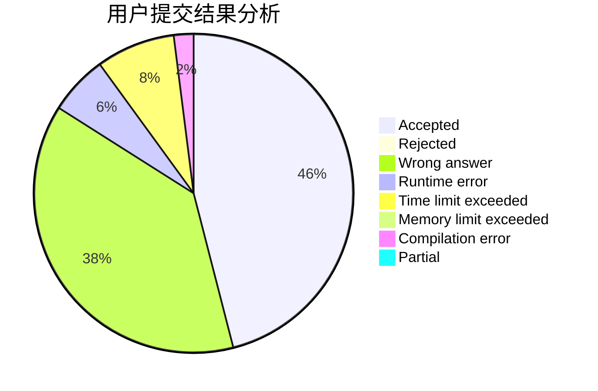
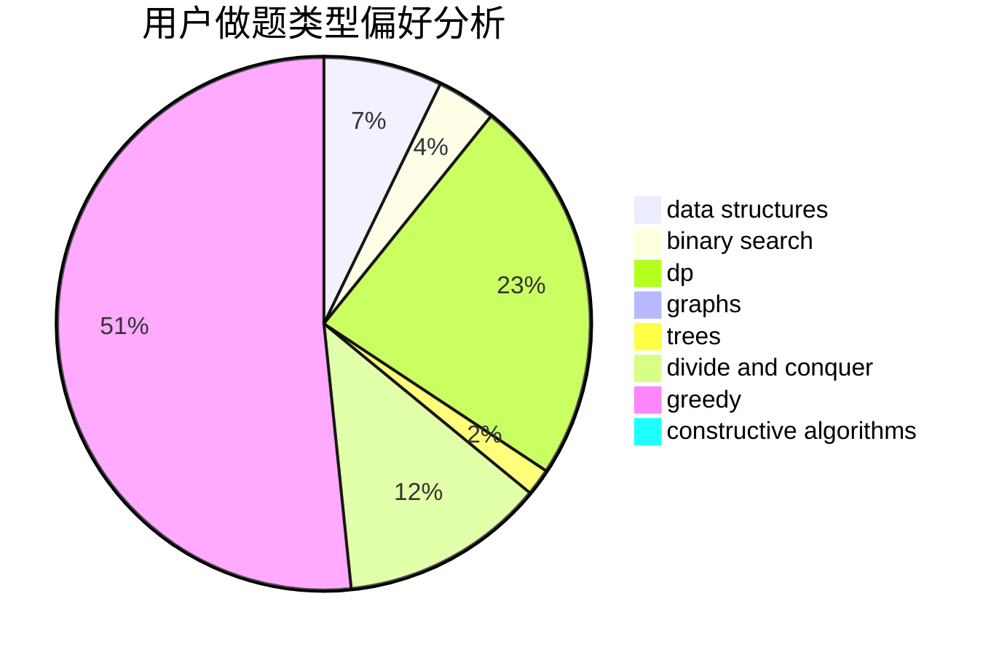

# Lengjunyi

<!-- tabs:start -->

#### **用户提交结果分析**

#### **用户做题类型偏好分析**

#### **用户错题知识点分析**

<!-- tabs:end -->
# 推荐题目
[1495C](https://codeforces.com/contest/1495/problem/C)		constructive algorithms,
                        graphs		  
[506C](https://codeforces.com/contest/506/problem/C)		dsu,graphs,sortings,trees		  
[708D](https://codeforces.com/contest/708/problem/D)		flows		  
[1342D](https://codeforces.com/contest/1342/problem/D)		binary search,
                        constructive algorithms,
                        data structures,
                        greedy,
                        sortings,
                        two pointers		  
[1156C](https://codeforces.com/contest/1156/problem/C)		binary search,
                        greedy,
                        sortings,
                        ternary search,
                        two pointers		  
[833D](https://codeforces.com/contest/833/problem/D)		data structures,
                        divide and conquer,
                        implementation,
                        trees		  
[821D](https://codeforces.com/contest/821/problem/D)		dfs and similar,
                        graphs,
                        shortest paths		  
[360D](https://codeforces.com/contest/360/problem/D)		number theory		  
[708A](https://codeforces.com/contest/708/problem/A)		constructive algorithms,
                        greedy,
                        implementation,
                        strings		  
[1054C](https://codeforces.com/contest/1054/problem/C)		constructive algorithms,
                        implementation		  
