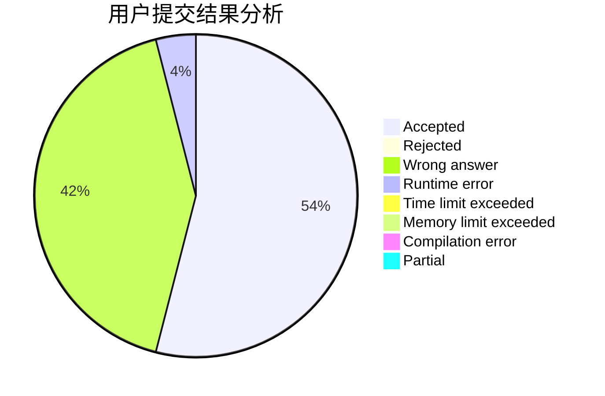
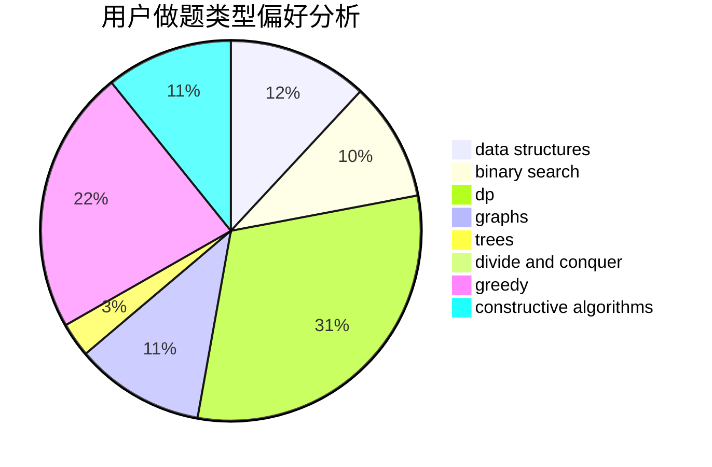
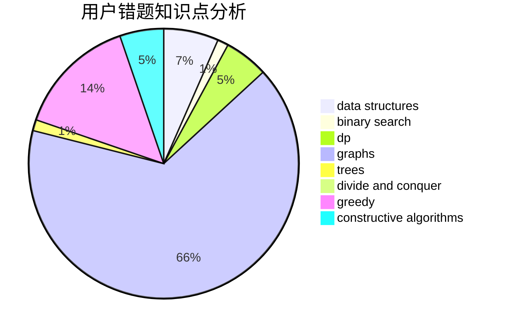

# LeoStrange

<!-- tabs:start -->

#### **用户提交结果分析**

#### **用户做题类型偏好分析**

#### **用户错题知识点分析**

<!-- tabs:end -->
# 推荐题目
[1497E1](https://codeforces.com/contest/1497E/problem/1)		data structures,
                        dp,
                        greedy,
                        math,
                        number theory,
                        two pointers		  
[1345C](https://codeforces.com/contest/1345/problem/C)		dsu,graphs,sortings,trees		  
[863C](https://codeforces.com/contest/863/problem/C)		graphs,
                        implementation		  
[743E](https://codeforces.com/contest/743/problem/E)		binary search,
                        bitmasks,
                        brute force,
                        dp		  
[776C](https://codeforces.com/contest/776/problem/C)		binary search,
                        brute force,
                        data structures,
                        implementation,
                        math		  
[55D](https://codeforces.com/contest/55/problem/D)		dp,
                        number theory		  
[1067E](https://codeforces.com/contest/1067/problem/E)		dp,
                        graph matchings,
                        math,
                        trees		  
[1101F](https://codeforces.com/contest/1101/problem/F)		binary search,
                        dp		  
[27D](https://codeforces.com/contest/27/problem/D)		2-sat,
                        dfs and similar,
                        dsu,
                        graphs		  
[445B](https://codeforces.com/contest/445/problem/B)		dfs and similar,
                        dsu,
                        greedy		  
