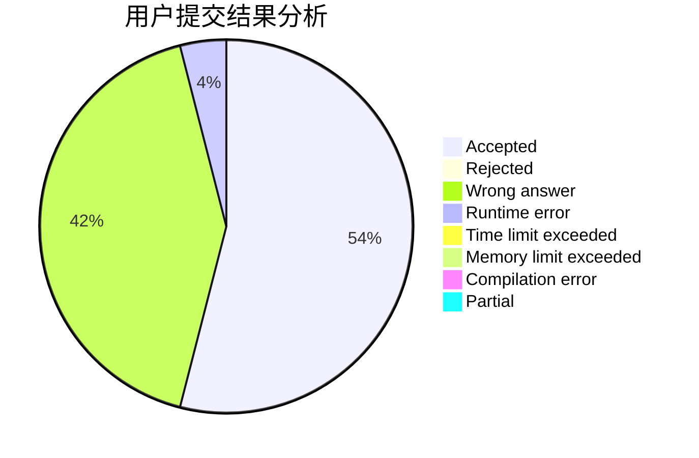
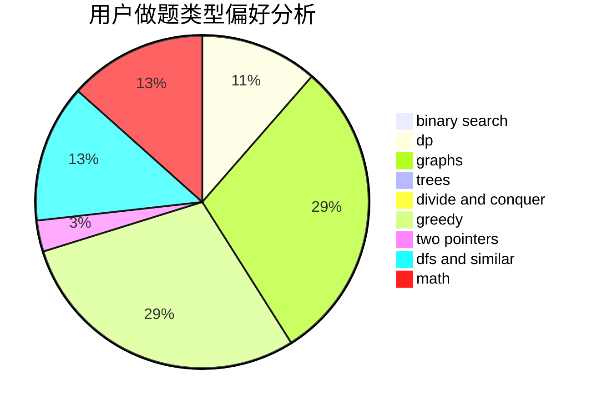

# LeoStrange

<!-- tabs:start -->

#### **用户提交结果分析**

#### **用户做题类型偏好分析**

<!-- tabs:end -->
# 推荐题目
[1506C](https://codeforces.com/contest/1506/problem/C)
[1352E](https://codeforces.com/contest/1352/problem/E)
[883E](https://codeforces.com/contest/883/problem/E)
[764A](https://codeforces.com/contest/764/problem/A)
[794B](https://codeforces.com/contest/794/problem/B)
[584B](https://codeforces.com/contest/584/problem/B)
[1068C](https://codeforces.com/contest/1068/problem/C)
[1102B](https://codeforces.com/contest/1102/problem/B)
[295C](https://codeforces.com/contest/295/problem/C)
[465D](https://codeforces.com/contest/465/problem/D)
