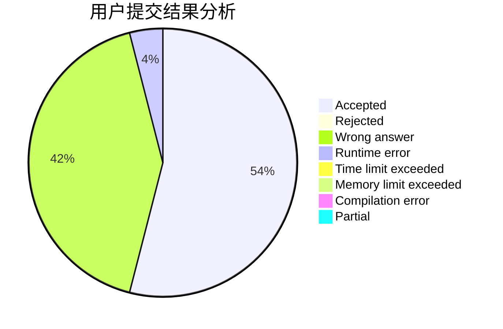
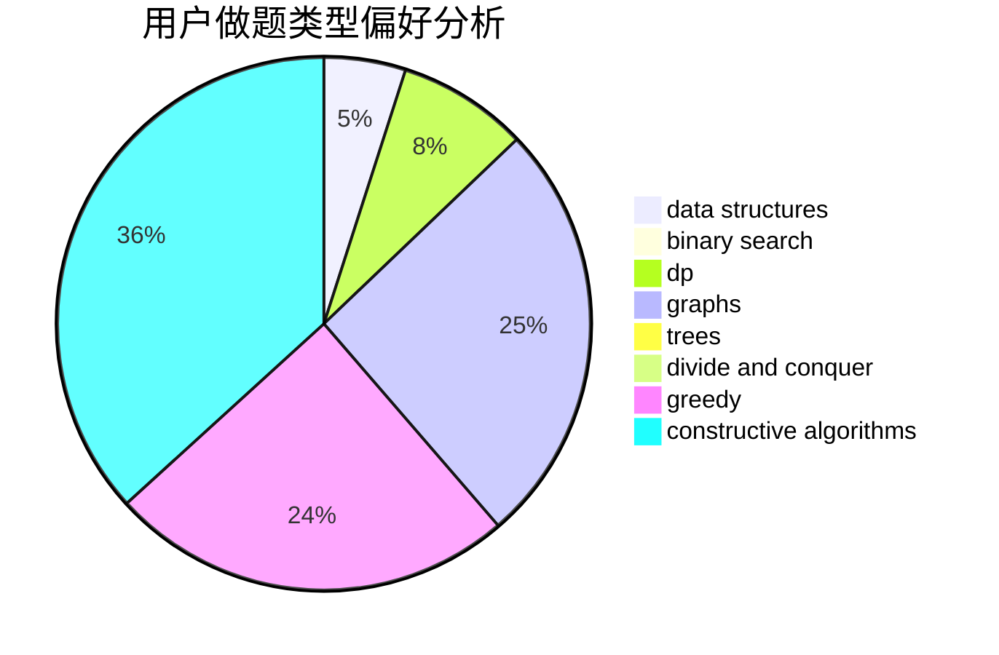
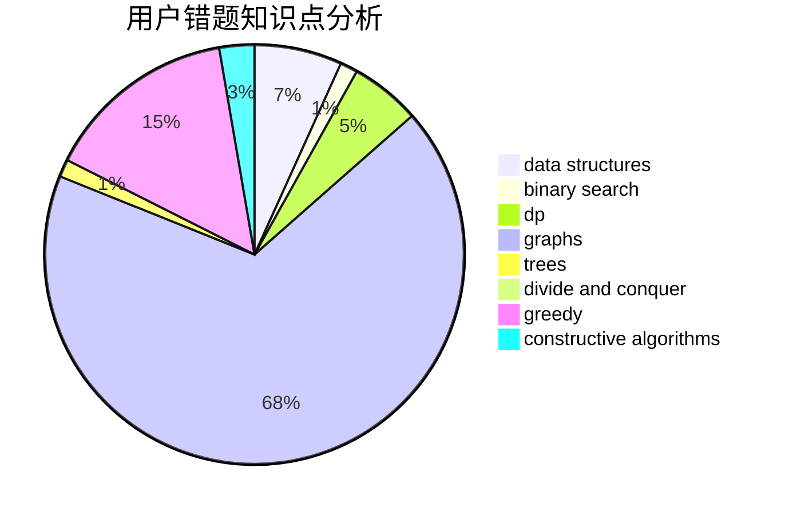

# LeoStrange

<!-- tabs:start -->

#### **用户提交结果分析**

#### **用户做题类型偏好分析**

#### **用户错题知识点分析**

<!-- tabs:end -->
# 推荐题目
[1506C](https://codeforces.com/contest/1506/problem/C)		brute force,
                        implementation,
                        strings		  
[1352E](https://codeforces.com/contest/1352/problem/E)		brute force,
                        implementation,
                        two pointers		  
[883E](https://codeforces.com/contest/883/problem/E)		implementation,
                        strings		  
[764A](https://codeforces.com/contest/764/problem/A)		brute force,
                        implementation,
                        math		  
[794B](https://codeforces.com/contest/794/problem/B)		geometry,
                        math		  
[584B](https://codeforces.com/contest/584/problem/B)		combinatorics		  
[1068C](https://codeforces.com/contest/1068/problem/C)		constructive algorithms,
                        graphs		  
[1102B](https://codeforces.com/contest/1102/problem/B)		greedy,
                        sortings		  
[295C](https://codeforces.com/contest/295/problem/C)		combinatorics,
                        dp,
                        graphs,
                        shortest paths		  
[465D](https://codeforces.com/contest/465/problem/D)		dsu,graphs,sortings,trees		  
