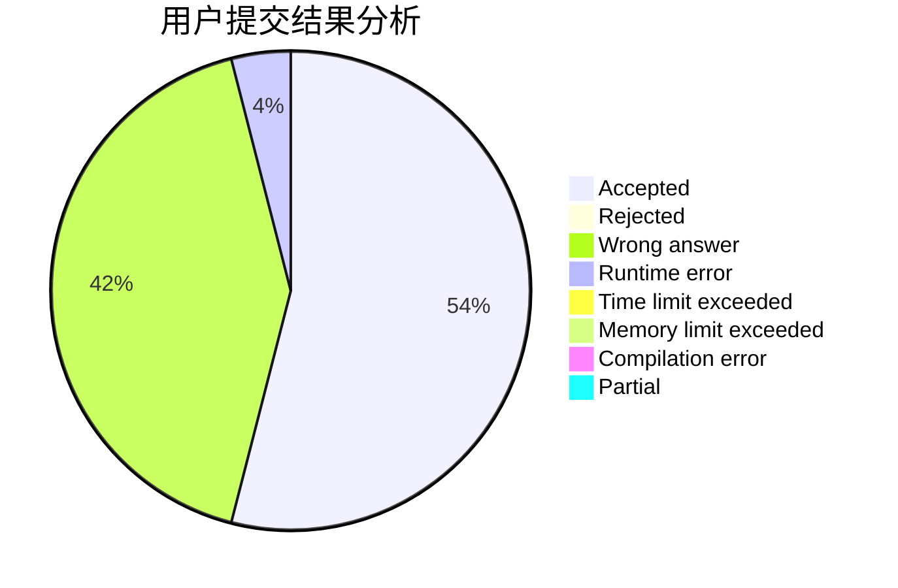
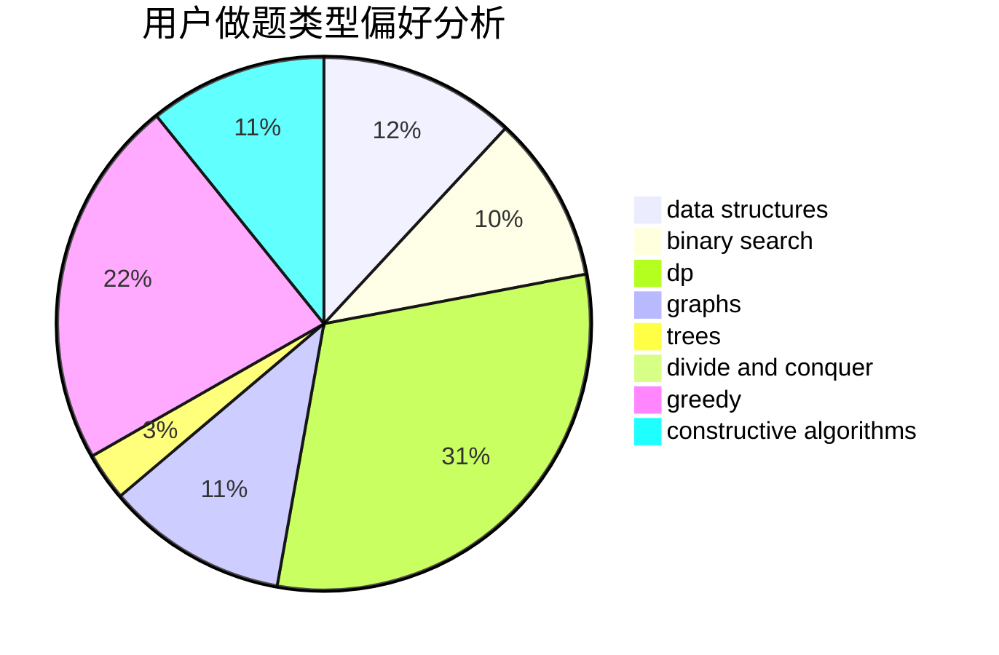
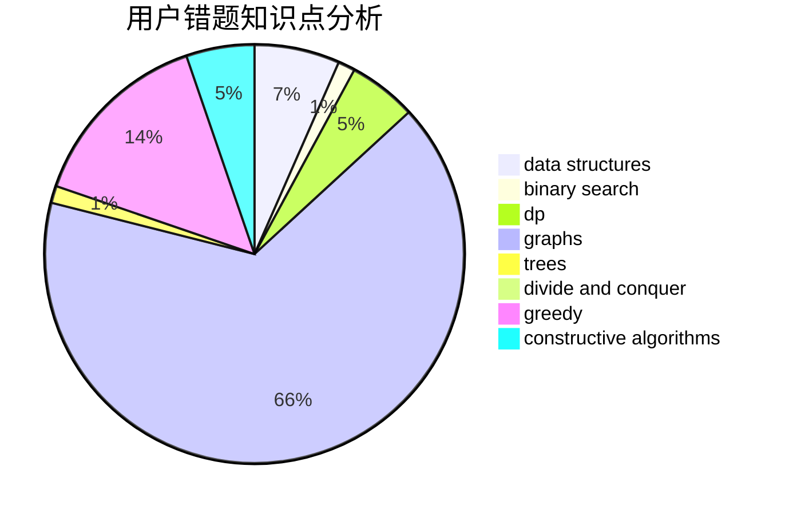

# LeoStrange
<!-- tabs:start -->
#### **用户提交结果分析**

#### **用户做题类型偏好分析**

#### **用户错题知识点分析**

<!-- tabs:end -->
# 推荐题目
[Square-free division (easy version)](http://codeforces.com/problemset/problem/1497/E1)		data structures,
                        dp,
                        greedy,
                        math,
                        number theory,
                        two pointers		  
[Beautiful numbers](http://codeforces.com/problemset/problem/55/D)		dp,
                        number theory		  
[Random Forest Rank](http://codeforces.com/problemset/problem/1067/E)		dp,
                        graph matchings,
                        math,
                        trees		  
[DZY Loves Chemistry](http://codeforces.com/problemset/problem/445/B)		dfs and similar,
                        dsu,
                        greedy		  
[Vladik and cards](http://codeforces.com/problemset/problem/743/E)		binary search,
                        bitmasks,
                        brute force,
                        dp		  
[Jeff and Furik](http://codeforces.com/problemset/problem/351/B)		combinatorics,
                        dp,
                        probabilities		  
[Trucks and Cities](http://codeforces.com/problemset/problem/1101/F)		binary search,
                        dp		  
[PE Lesson](http://codeforces.com/problemset/problem/316/D1)		brute force,
                        dp		  
[Odds and Ends](http://codeforces.com/problemset/problem/849/A)		implementation		  
[Minimizing Difference](http://codeforces.com/problemset/problem/1244/E)		binary search,
                        constructive algorithms,
                        greedy,
                        sortings,
                        ternary search,
                        two pointers		  
<!-- tabs:start -->
#### **data structures**
[Square-free division (easy version)](http://codeforces.com/problemset/problem/1497/E1)		data structures,
                        dp,
                        greedy,
                        math,
                        number theory,
                        two pointers		  
[Beautiful numbers](https://codeforces.com/contest/1434/problem/D)		data structures,
                        trees		  
[Random Forest Rank](http://codeforces.com/problemset/problem/1221/F)		binary search,
                        data structures,
                        sortings		  
[DZY Loves Chemistry](https://codeforces.com/contest/516/problem/C)		data structures		  
[Vladik and cards](https://codeforces.com/contest/90/problem/E)		brute force,
                        data structures,
                        implementation		  
[Jeff and Furik](http://codeforces.com/problemset/problem/321/E)		data structures,
                        divide and conquer,
                        dp		  
[Trucks and Cities](http://codeforces.com/problemset/problem/1051/G)		data structures,
                        dsu,
                        greedy		  
[PE Lesson](http://codeforces.com/problemset/problem/696/D)		data structures,
                        dp,
                        matrices,
                        strings		  
[Odds and Ends](http://codeforces.com/problemset/problem/1101/D)		data structures,
                        dfs and similar,
                        dp,
                        number theory,
                        trees		  
[Minimizing Difference](http://codeforces.com/problemset/problem/1260/F)		data structures,
                        trees		  
#### **binary search**
[Square-free division (easy version)](http://codeforces.com/problemset/problem/743/E)		binary search,
                        bitmasks,
                        brute force,
                        dp		  
[Beautiful numbers](http://codeforces.com/problemset/problem/1101/F)		binary search,
                        dp		  
[Random Forest Rank](http://codeforces.com/problemset/problem/1244/E)		binary search,
                        constructive algorithms,
                        greedy,
                        sortings,
                        ternary search,
                        two pointers		  
[DZY Loves Chemistry](http://codeforces.com/problemset/problem/1221/F)		binary search,
                        data structures,
                        sortings		  
[Vladik and cards](http://codeforces.com/problemset/problem/416/C)		binary search,
                        dp,
                        greedy,
                        implementation		  
[Jeff and Furik](http://codeforces.com/problemset/problem/623/C)		binary search,
                        dp		  
[Trucks and Cities](http://codeforces.com/problemset/problem/701/C)		binary search,
                        strings,
                        two pointers		  
[PE Lesson](http://codeforces.com/problemset/problem/776/C)		binary search,
                        brute force,
                        data structures,
                        implementation,
                        math		  
[Odds and Ends](http://codeforces.com/problemset/problem/1409/E)		binary search,
                        dp,
                        sortings,
                        two pointers		  
[Minimizing Difference](http://codeforces.com/problemset/problem/1492/C)		binary search,
                        data structures,
                        dp,
                        greedy,
                        two pointers		  
#### **dp**
[Square-free division (easy version)](http://codeforces.com/problemset/problem/1497/E1)		data structures,
                        dp,
                        greedy,
                        math,
                        number theory,
                        two pointers		  
[Beautiful numbers](http://codeforces.com/problemset/problem/55/D)		dp,
                        number theory		  
[Random Forest Rank](http://codeforces.com/problemset/problem/1067/E)		dp,
                        graph matchings,
                        math,
                        trees		  
[DZY Loves Chemistry](http://codeforces.com/problemset/problem/743/E)		binary search,
                        bitmasks,
                        brute force,
                        dp		  
[Vladik and cards](http://codeforces.com/problemset/problem/351/B)		combinatorics,
                        dp,
                        probabilities		  
[Jeff and Furik](http://codeforces.com/problemset/problem/1101/F)		binary search,
                        dp		  
[Trucks and Cities](http://codeforces.com/problemset/problem/316/D1)		brute force,
                        dp		  
[PE Lesson](http://codeforces.com/problemset/problem/74/B)		dp,
                        games,
                        greedy		  
[Odds and Ends](http://codeforces.com/problemset/problem/416/C)		binary search,
                        dp,
                        greedy,
                        implementation		  
[Minimizing Difference](http://codeforces.com/problemset/problem/733/C)		constructive algorithms,
                        dp,
                        greedy,
                        two pointers		  
#### **graph**
[Square-free division (easy version)](http://codeforces.com/problemset/problem/1067/E)		dp,
                        graph matchings,
                        math,
                        trees		  
[Beautiful numbers](http://codeforces.com/problemset/problem/360/E)		graphs,
                        greedy,
                        shortest paths		  
[Random Forest Rank](http://codeforces.com/problemset/problem/1148/G)		constructive algorithms,
                        graphs,
                        math,
                        number theory,
                        probabilities		  
[DZY Loves Chemistry](http://codeforces.com/problemset/problem/1081/D)		dsu,
                        graphs,
                        shortest paths,
                        sortings		  
[Vladik and cards](http://codeforces.com/problemset/problem/863/C)		graphs,
                        implementation		  
[Jeff and Furik](http://codeforces.com/problemset/problem/27/D)		2-sat,
                        dfs and similar,
                        dsu,
                        graphs		  
[Trucks and Cities](https://codeforces.com/contest/699/problem/D)		constructive algorithms,
                        dfs and similar,
                        dsu,
                        graphs,
                        trees		  
[PE Lesson](http://codeforces.com/problemset/problem/1213/G)		divide and conquer,
                        dsu,
                        graphs,
                        sortings,
                        trees		  
[Odds and Ends](http://codeforces.com/problemset/problem/228/E)		2-sat,
                        dfs and similar,
                        dsu,
                        graphs		  
[Minimizing Difference](http://codeforces.com/problemset/problem/1487/C)		brute force,
                        constructive algorithms,
                        dfs and similar,
                        graphs,
                        greedy,
                        implementation,
                        math		  
#### **trees**
[Square-free division (easy version)](http://codeforces.com/problemset/problem/1067/E)		dp,
                        graph matchings,
                        math,
                        trees		  
[Beautiful numbers](https://codeforces.com/contest/1434/problem/D)		data structures,
                        trees		  
[Random Forest Rank](http://codeforces.com/problemset/problem/1307/F)		dfs and similar,
                        dsu,
                        trees		  
[DZY Loves Chemistry](http://codeforces.com/problemset/problem/1146/F)		dp,
                        trees		  
[Vladik and cards](https://codeforces.com/contest/699/problem/D)		constructive algorithms,
                        dfs and similar,
                        dsu,
                        graphs,
                        trees		  
[Jeff and Furik](http://codeforces.com/problemset/problem/1213/G)		divide and conquer,
                        dsu,
                        graphs,
                        sortings,
                        trees		  
[Trucks and Cities](http://codeforces.com/problemset/problem/1101/D)		data structures,
                        dfs and similar,
                        dp,
                        number theory,
                        trees		  
[PE Lesson](http://codeforces.com/problemset/problem/1260/F)		data structures,
                        trees		  
[Odds and Ends](http://codeforces.com/problemset/problem/1479/D)		binary search,
                        bitmasks,
                        brute force,
                        data structures,
                        probabilities,
                        trees		  
[Minimizing Difference](http://codeforces.com/problemset/problem/1511/C)		brute force,
                        data structures,
                        implementation,
                        trees		  
#### **divide and conquer**
[Square-free division (easy version)](http://codeforces.com/problemset/problem/321/E)		data structures,
                        divide and conquer,
                        dp		  
[Beautiful numbers](http://codeforces.com/problemset/problem/1213/G)		divide and conquer,
                        dsu,
                        graphs,
                        sortings,
                        trees		  
[Random Forest Rank](http://codeforces.com/problemset/problem/1461/D)		binary search,
                        brute force,
                        data structures,
                        divide and conquer,
                        implementation,
                        sortings		  
[DZY Loves Chemistry](http://codeforces.com/problemset/problem/1466/G)		combinatorics,
                        divide and conquer,
                        hashing,
                        math,
                        string suffix structures,
                        strings		  
[Vladik and cards](http://codeforces.com/problemset/problem/1490/D)		dfs and similar,
                        divide and conquer,
                        implementation		  
[Jeff and Furik](https://codeforces.com/contest/1483/problem/C)		data structures,
                        divide and conquer,
                        dp		  
[Trucks and Cities](http://codeforces.com/problemset/problem/1491/E)		brute force,
                        dfs and similar,
                        divide and conquer,
                        number theory,
                        trees		  
[PE Lesson](http://codeforces.com/problemset/problem/1303/G)		data structures,
                        divide and conquer,
                        geometry,
                        trees		  
[Odds and Ends](http://codeforces.com/problemset/problem/1494/D)		constructive algorithms,
                        data structures,
                        dfs and similar,
                        divide and conquer,
                        dsu,
                        greedy,
                        sortings,
                        trees		  
[Minimizing Difference](http://codeforces.com/problemset/problem/1482/E)		data structures,
                        divide and conquer,
                        dp		  
#### **greedy**
[Square-free division (easy version)](http://codeforces.com/problemset/problem/1497/E1)		data structures,
                        dp,
                        greedy,
                        math,
                        number theory,
                        two pointers		  
[Beautiful numbers](http://codeforces.com/problemset/problem/445/B)		dfs and similar,
                        dsu,
                        greedy		  
[Random Forest Rank](http://codeforces.com/problemset/problem/1244/E)		binary search,
                        constructive algorithms,
                        greedy,
                        sortings,
                        ternary search,
                        two pointers		  
[DZY Loves Chemistry](http://codeforces.com/problemset/problem/74/B)		dp,
                        games,
                        greedy		  
[Vladik and cards](http://codeforces.com/problemset/problem/416/C)		binary search,
                        dp,
                        greedy,
                        implementation		  
[Jeff and Furik](http://codeforces.com/problemset/problem/360/E)		graphs,
                        greedy,
                        shortest paths		  
[Trucks and Cities](http://codeforces.com/problemset/problem/733/C)		constructive algorithms,
                        dp,
                        greedy,
                        two pointers		  
[PE Lesson](http://codeforces.com/problemset/problem/1389/D)		brute force,
                        greedy,
                        implementation,
                        math		  
[Odds and Ends](http://codeforces.com/problemset/problem/1051/G)		data structures,
                        dsu,
                        greedy		  
[Minimizing Difference](http://codeforces.com/problemset/problem/1473/A)		greedy,
                        implementation,
                        math,
                        sortings		  
#### **constructive algorithms**
[Square-free division (easy version)](http://codeforces.com/problemset/problem/1244/E)		binary search,
                        constructive algorithms,
                        greedy,
                        sortings,
                        ternary search,
                        two pointers		  
[Beautiful numbers](http://codeforces.com/problemset/problem/14/C)		brute force,
                        constructive algorithms,
                        geometry,
                        implementation,
                        math		  
[Random Forest Rank](http://codeforces.com/problemset/problem/733/C)		constructive algorithms,
                        dp,
                        greedy,
                        two pointers		  
[DZY Loves Chemistry](http://codeforces.com/problemset/problem/1148/G)		constructive algorithms,
                        graphs,
                        math,
                        number theory,
                        probabilities		  
[Vladik and cards](https://codeforces.com/contest/699/problem/D)		constructive algorithms,
                        dfs and similar,
                        dsu,
                        graphs,
                        trees		  
[Jeff and Furik](http://codeforces.com/problemset/problem/1025/C)		constructive algorithms,
                        implementation		  
[Trucks and Cities](http://codeforces.com/problemset/problem/1329/D)		constructive algorithms,
                        data structures		  
[PE Lesson](http://codeforces.com/problemset/problem/1493/A)		constructive algorithms,
                        greedy		  
[Odds and Ends](http://codeforces.com/problemset/problem/1463/D)		binary search,
                        constructive algorithms,
                        greedy,
                        two pointers		  
[Minimizing Difference](https://codeforces.com/contest/1456/problem/B)		bitmasks,
                        brute force,
                        constructive algorithms		  
#### **sortings**
[Square-free division (easy version)](http://codeforces.com/problemset/problem/1244/E)		binary search,
                        constructive algorithms,
                        greedy,
                        sortings,
                        ternary search,
                        two pointers		  
[Beautiful numbers](http://codeforces.com/problemset/problem/1221/F)		binary search,
                        data structures,
                        sortings		  
[Random Forest Rank](http://codeforces.com/problemset/problem/1081/D)		dsu,
                        graphs,
                        shortest paths,
                        sortings		  
[DZY Loves Chemistry](https://codeforces.com/contest/1345/problem/C)		math,
                        number theory,
                        sortings		  
[Vladik and cards](http://codeforces.com/problemset/problem/1213/G)		divide and conquer,
                        dsu,
                        graphs,
                        sortings,
                        trees		  
[Jeff and Furik](http://codeforces.com/problemset/problem/1473/A)		greedy,
                        implementation,
                        math,
                        sortings		  
[Trucks and Cities](http://codeforces.com/problemset/problem/1409/E)		binary search,
                        dp,
                        sortings,
                        two pointers		  
[PE Lesson](https://codeforces.com/contest/1496/problem/C)		geometry,
                        greedy,
                        math,
                        sortings		  
[Odds and Ends](http://codeforces.com/problemset/problem/1495/A)		geometry,
                        greedy,
                        math,
                        sortings		  
[Minimizing Difference](http://codeforces.com/problemset/problem/1497/A)		brute force,
                        data structures,
                        greedy,
                        sortings		  
<!-- tabs:end -->
