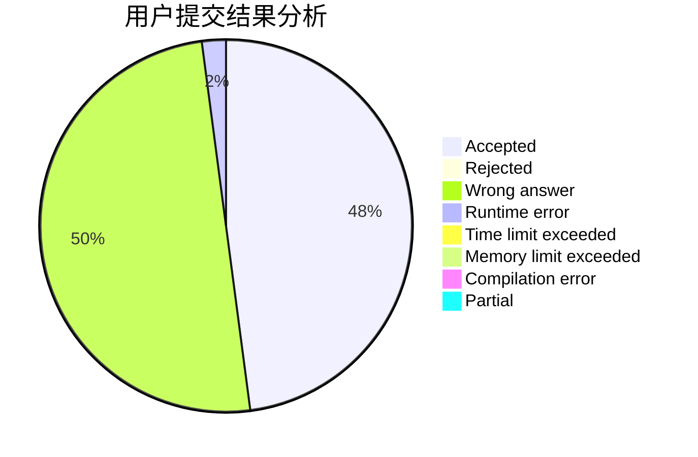
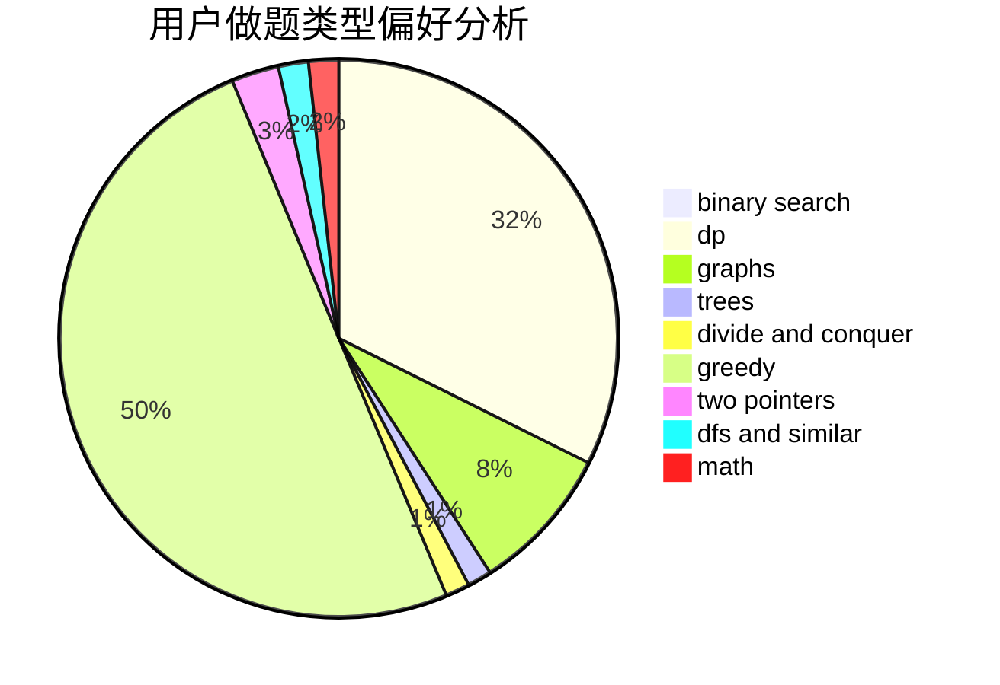

# Leogruece

<!-- tabs:start -->

#### **用户提交结果分析**

#### **用户做题类型偏好分析**

<!-- tabs:end -->
# 推荐题目
[1491C](https://codeforces.com/contest/1491/problem/C)
[798C](https://codeforces.com/contest/798/problem/C)
[274D](https://codeforces.com/contest/274/problem/D)
[1059E](https://codeforces.com/contest/1059/problem/E)
[13571](https://codeforces.com/contest/1357/problem/1)
[634B](https://codeforces.com/contest/634/problem/B)
[13132](https://codeforces.com/contest/1313/problem/2)
[1297D](https://codeforces.com/contest/1297/problem/D)
[319C](https://codeforces.com/contest/319/problem/C)
[931F](https://codeforces.com/contest/931/problem/F)
