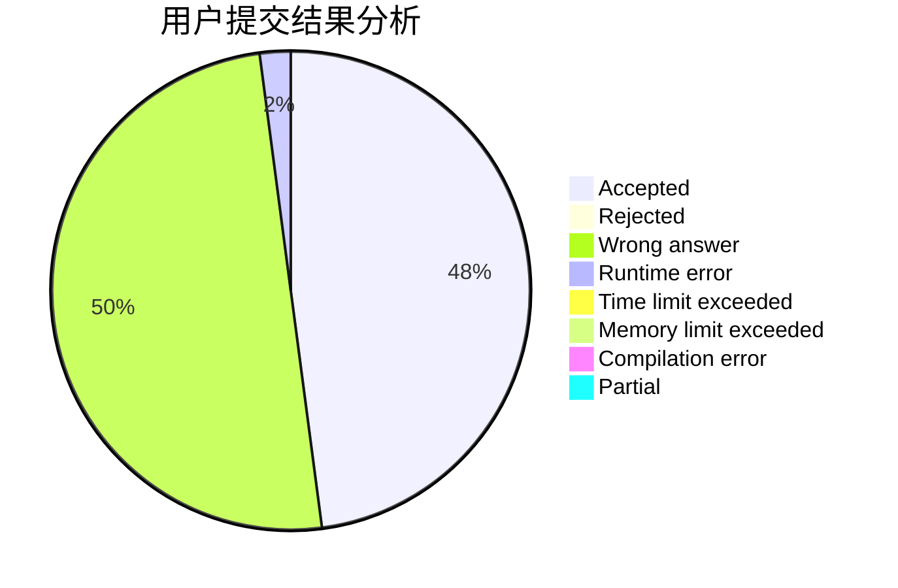
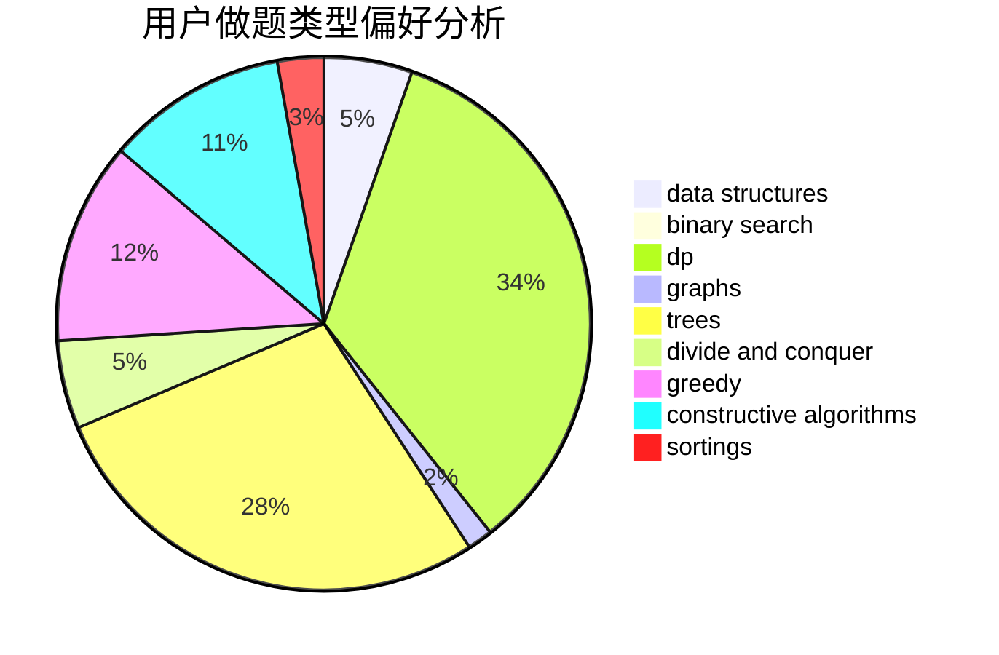
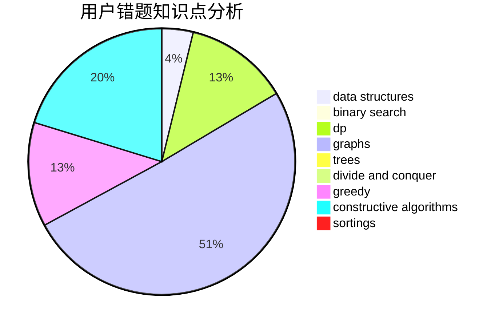

# Leogruece
<!-- tabs:start -->
#### **用户提交结果分析**

#### **用户做题类型偏好分析**

#### **用户错题知识点分析**

<!-- tabs:end -->
# 推荐题目
[1349F1](http://codeforces.com/problemset/problem/1349/F1)		dp,
                        fft,
                        math		  
[300E](http://codeforces.com/problemset/problem/300/E)		binary search,
                        math,
                        number theory		  
[727A](http://codeforces.com/problemset/problem/727/A)		brute force,
                        dfs and similar,
                        math		  
[1483E](https://codeforces.com/contest/1483/problem/E)		binary search,
                        interactive		  
[616E](http://codeforces.com/problemset/problem/616/E)		implementation,
                        math,
                        number theory		  
[762B](http://codeforces.com/problemset/problem/762/B)		greedy,
                        implementation,
                        sortings,
                        two pointers		  
[257D](http://codeforces.com/problemset/problem/257/D)		greedy,
                        math		  
[1059B](http://codeforces.com/problemset/problem/1059/B)		implementation		  
[77E](http://codeforces.com/problemset/problem/77/E)		geometry		  
[709B](http://codeforces.com/problemset/problem/709/B)		greedy,
                        implementation,
                        sortings		  
<!-- tabs:start -->
#### **data structures**
[797C](http://codeforces.com/problemset/problem/797/C)		data structures,
                        greedy,
                        strings		  
[651C](https://codeforces.com/contest/651/problem/C)		data structures,
                        geometry,
                        math		  
[568E](http://codeforces.com/problemset/problem/568/E)		data structures,
                        dp		  
[1416E](http://codeforces.com/problemset/problem/1416/E)		binary search,
                        data structures,
                        dp,
                        greedy		  
[1506D](http://codeforces.com/problemset/problem/1506/D)		constructive algorithms,
                        data structures,
                        greedy		  
[1142B](http://codeforces.com/problemset/problem/1142/B)		data structures,
                        dfs and similar,
                        dp,
                        math,
                        trees		  
[1404C](http://codeforces.com/problemset/problem/1404/C)		binary search,
                        constructive algorithms,
                        data structures,
                        greedy,
                        two pointers		  
[1408E](http://codeforces.com/problemset/problem/1408/E)		data structures,
                        dsu,
                        graphs,
                        greedy,
                        sortings,
                        trees		  
[1492C](http://codeforces.com/problemset/problem/1492/C)		binary search,
                        data structures,
                        dp,
                        greedy,
                        two pointers		  
[1490G](http://codeforces.com/problemset/problem/1490/G)		binary search,
                        data structures,
                        math		  
#### **binary search**
[300E](http://codeforces.com/problemset/problem/300/E)		binary search,
                        math,
                        number theory		  
[1483E](https://codeforces.com/contest/1483/problem/E)		binary search,
                        interactive		  
[1416E](http://codeforces.com/problemset/problem/1416/E)		binary search,
                        data structures,
                        dp,
                        greedy		  
[804D](http://codeforces.com/problemset/problem/804/D)		binary search,
                        brute force,
                        dfs and similar,
                        dp,
                        sortings,
                        trees		  
[1474B](http://codeforces.com/problemset/problem/1474/B)		binary search,
                        constructive algorithms,
                        greedy,
                        math,
                        number theory		  
[1404C](http://codeforces.com/problemset/problem/1404/C)		binary search,
                        constructive algorithms,
                        data structures,
                        greedy,
                        two pointers		  
[1492C](http://codeforces.com/problemset/problem/1492/C)		binary search,
                        data structures,
                        dp,
                        greedy,
                        two pointers		  
[1463D](http://codeforces.com/problemset/problem/1463/D)		binary search,
                        constructive algorithms,
                        greedy,
                        two pointers		  
[1490G](http://codeforces.com/problemset/problem/1490/G)		binary search,
                        data structures,
                        math		  
[1479D](http://codeforces.com/problemset/problem/1479/D)		binary search,
                        bitmasks,
                        brute force,
                        data structures,
                        probabilities,
                        trees		  
#### **dp**
[1349F1](http://codeforces.com/problemset/problem/1349/F1)		dp,
                        fft,
                        math		  
[1040B](http://codeforces.com/problemset/problem/1040/B)		dp,
                        greedy,
                        math		  
[1182E](http://codeforces.com/problemset/problem/1182/E)		dp,
                        math,
                        matrices,
                        number theory		  
[954H](http://codeforces.com/problemset/problem/954/H)		combinatorics,
                        dp		  
[1400G](http://codeforces.com/problemset/problem/1400/G)		bitmasks,
                        brute force,
                        combinatorics,
                        dp,
                        dsu,
                        math,
                        two pointers		  
[568E](http://codeforces.com/problemset/problem/568/E)		data structures,
                        dp		  
[1416E](http://codeforces.com/problemset/problem/1416/E)		binary search,
                        data structures,
                        dp,
                        greedy		  
[6D](http://codeforces.com/problemset/problem/6/D)		brute force,
                        dp		  
[1283E](http://codeforces.com/problemset/problem/1283/E)		dp,
                        greedy		  
[804D](http://codeforces.com/problemset/problem/804/D)		binary search,
                        brute force,
                        dfs and similar,
                        dp,
                        sortings,
                        trees		  
#### **graph**
[1304D](http://codeforces.com/problemset/problem/1304/D)		constructive algorithms,
                        graphs,
                        greedy,
                        two pointers		  
[240E](http://codeforces.com/problemset/problem/240/E)		dfs and similar,
                        graphs,
                        greedy		  
[1316D](http://codeforces.com/problemset/problem/1316/D)		constructive algorithms,
                        dfs and similar,
                        graphs,
                        implementation		  
[1408E](http://codeforces.com/problemset/problem/1408/E)		data structures,
                        dsu,
                        graphs,
                        greedy,
                        sortings,
                        trees		  
[1487C](http://codeforces.com/problemset/problem/1487/C)		brute force,
                        constructive algorithms,
                        dfs and similar,
                        graphs,
                        greedy,
                        implementation,
                        math		  
[1437C](http://codeforces.com/problemset/problem/1437/C)		dp,
                        flows,
                        graph matchings,
                        greedy,
                        math,
                        sortings		  
[1470D](http://codeforces.com/problemset/problem/1470/D)		constructive algorithms,
                        dfs and similar,
                        graph matchings,
                        graphs,
                        greedy		  
[1476C](http://codeforces.com/problemset/problem/1476/C)		dp,
                        graphs,
                        greedy		  
[1304D](http://codeforces.com/problemset/problem/1304/D)		constructive algorithms,
                        graphs,
                        greedy,
                        two pointers		  
[1475C](http://codeforces.com/problemset/problem/1475/C)		combinatorics,
                        graphs,
                        math		  
#### **trees**
[913B](http://codeforces.com/problemset/problem/913/B)		implementation,
                        trees		  
[1311E](http://codeforces.com/problemset/problem/1311/E)		brute force,
                        constructive algorithms,
                        trees		  
[804D](http://codeforces.com/problemset/problem/804/D)		binary search,
                        brute force,
                        dfs and similar,
                        dp,
                        sortings,
                        trees		  
[1142B](http://codeforces.com/problemset/problem/1142/B)		data structures,
                        dfs and similar,
                        dp,
                        math,
                        trees		  
[566E](http://codeforces.com/problemset/problem/566/E)		bitmasks,
                        constructive algorithms,
                        trees		  
[1408E](http://codeforces.com/problemset/problem/1408/E)		data structures,
                        dsu,
                        graphs,
                        greedy,
                        sortings,
                        trees		  
[1481F](http://codeforces.com/problemset/problem/1481/F)		dp,
                        greedy,
                        trees		  
[1479D](http://codeforces.com/problemset/problem/1479/D)		binary search,
                        bitmasks,
                        brute force,
                        data structures,
                        probabilities,
                        trees		  
[1511C](http://codeforces.com/problemset/problem/1511/C)		brute force,
                        data structures,
                        implementation,
                        trees		  
[1499F](http://codeforces.com/problemset/problem/1499/F)		combinatorics,
                        dfs and similar,
                        dp,
                        trees		  
#### **divide and conquer**
[1461D](http://codeforces.com/problemset/problem/1461/D)		binary search,
                        brute force,
                        data structures,
                        divide and conquer,
                        implementation,
                        sortings		  
[1466G](http://codeforces.com/problemset/problem/1466/G)		combinatorics,
                        divide and conquer,
                        hashing,
                        math,
                        string suffix structures,
                        strings		  
[1490D](http://codeforces.com/problemset/problem/1490/D)		dfs and similar,
                        divide and conquer,
                        implementation		  
[1483C](https://codeforces.com/contest/1483/problem/C)		data structures,
                        divide and conquer,
                        dp		  
[1491E](http://codeforces.com/problemset/problem/1491/E)		brute force,
                        dfs and similar,
                        divide and conquer,
                        number theory,
                        trees		  
[1303G](http://codeforces.com/problemset/problem/1303/G)		data structures,
                        divide and conquer,
                        geometry,
                        trees		  
[1494D](http://codeforces.com/problemset/problem/1494/D)		constructive algorithms,
                        data structures,
                        dfs and similar,
                        divide and conquer,
                        dsu,
                        greedy,
                        sortings,
                        trees		  
[1482E](http://codeforces.com/problemset/problem/1482/E)		data structures,
                        divide and conquer,
                        dp		  
[566C](http://codeforces.com/problemset/problem/566/C)		dfs and similar,
                        divide and conquer,
                        trees		  
[1428F](http://codeforces.com/problemset/problem/1428/F)		binary search,
                        data structures,
                        divide and conquer,
                        dp,
                        two pointers		  
#### **greedy**
[762B](http://codeforces.com/problemset/problem/762/B)		greedy,
                        implementation,
                        sortings,
                        two pointers		  
[257D](http://codeforces.com/problemset/problem/257/D)		greedy,
                        math		  
[709B](http://codeforces.com/problemset/problem/709/B)		greedy,
                        implementation,
                        sortings		  
[1304D](http://codeforces.com/problemset/problem/1304/D)		constructive algorithms,
                        graphs,
                        greedy,
                        two pointers		  
[1040B](http://codeforces.com/problemset/problem/1040/B)		dp,
                        greedy,
                        math		  
[240E](http://codeforces.com/problemset/problem/240/E)		dfs and similar,
                        graphs,
                        greedy		  
[797C](http://codeforces.com/problemset/problem/797/C)		data structures,
                        greedy,
                        strings		  
[1291A](http://codeforces.com/problemset/problem/1291/A)		greedy,
                        math,
                        strings		  
[1416E](http://codeforces.com/problemset/problem/1416/E)		binary search,
                        data structures,
                        dp,
                        greedy		  
[1119A](http://codeforces.com/problemset/problem/1119/A)		greedy,
                        implementation		  
#### **constructive algorithms**
[1304D](http://codeforces.com/problemset/problem/1304/D)		constructive algorithms,
                        graphs,
                        greedy,
                        two pointers		  
[1311E](http://codeforces.com/problemset/problem/1311/E)		brute force,
                        constructive algorithms,
                        trees		  
[1316D](http://codeforces.com/problemset/problem/1316/D)		constructive algorithms,
                        dfs and similar,
                        graphs,
                        implementation		  
[1506D](http://codeforces.com/problemset/problem/1506/D)		constructive algorithms,
                        data structures,
                        greedy		  
[566E](http://codeforces.com/problemset/problem/566/E)		bitmasks,
                        constructive algorithms,
                        trees		  
[1365E](http://codeforces.com/problemset/problem/1365/E)		brute force,
                        constructive algorithms		  
[1455C](http://codeforces.com/problemset/problem/1455/C)		constructive algorithms,
                        games,
                        math		  
[1474B](http://codeforces.com/problemset/problem/1474/B)		binary search,
                        constructive algorithms,
                        greedy,
                        math,
                        number theory		  
[1404C](http://codeforces.com/problemset/problem/1404/C)		binary search,
                        constructive algorithms,
                        data structures,
                        greedy,
                        two pointers		  
[1493A](http://codeforces.com/problemset/problem/1493/A)		constructive algorithms,
                        greedy		  
#### **sortings**
[762B](http://codeforces.com/problemset/problem/762/B)		greedy,
                        implementation,
                        sortings,
                        two pointers		  
[709B](http://codeforces.com/problemset/problem/709/B)		greedy,
                        implementation,
                        sortings		  
[807A](http://codeforces.com/problemset/problem/807/A)		implementation,
                        sortings		  
[1012A](http://codeforces.com/problemset/problem/1012/A)		brute force,
                        implementation,
                        math,
                        sortings		  
[804D](http://codeforces.com/problemset/problem/804/D)		binary search,
                        brute force,
                        dfs and similar,
                        dp,
                        sortings,
                        trees		  
[1408E](http://codeforces.com/problemset/problem/1408/E)		data structures,
                        dsu,
                        graphs,
                        greedy,
                        sortings,
                        trees		  
[1496C](https://codeforces.com/contest/1496/problem/C)		geometry,
                        greedy,
                        math,
                        sortings		  
[1495A](http://codeforces.com/problemset/problem/1495/A)		geometry,
                        greedy,
                        math,
                        sortings		  
[1497A](http://codeforces.com/problemset/problem/1497/A)		brute force,
                        data structures,
                        greedy,
                        sortings		  
[1427A](http://codeforces.com/problemset/problem/1427/A)		math,
                        sortings		  
<!-- tabs:end -->
