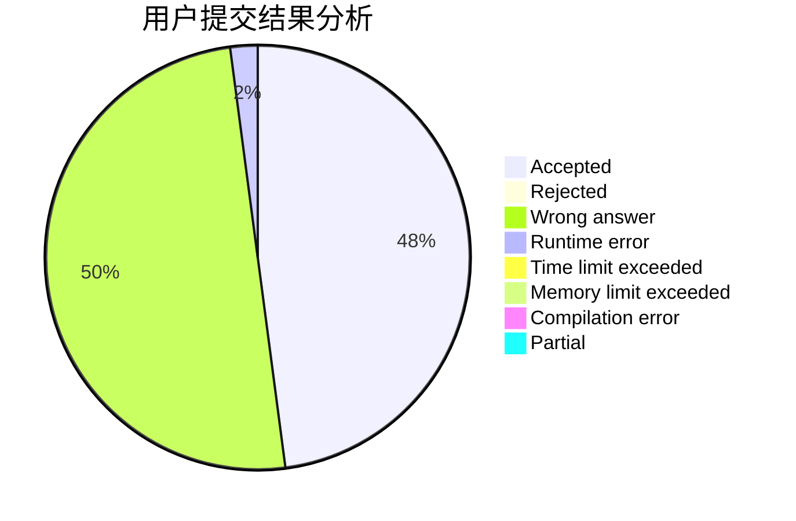
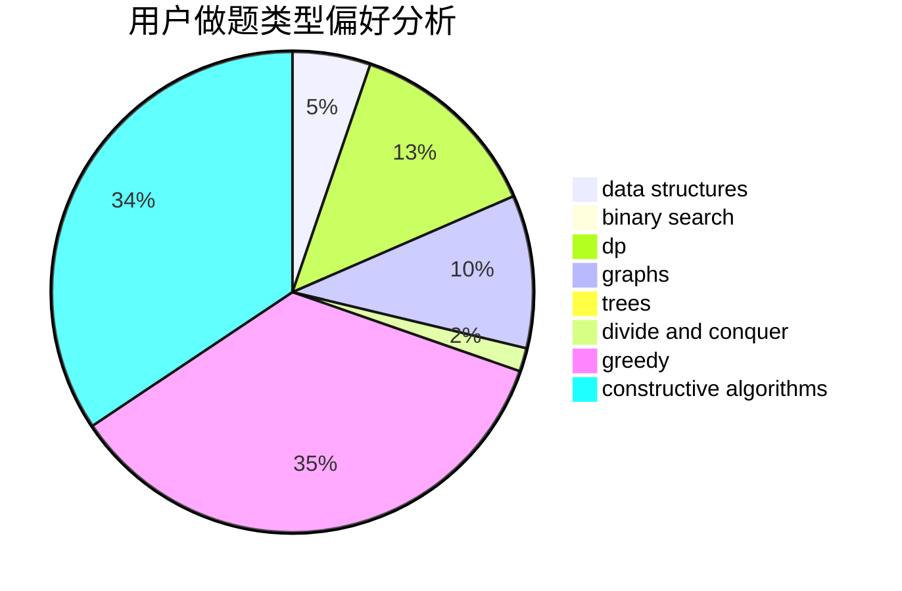
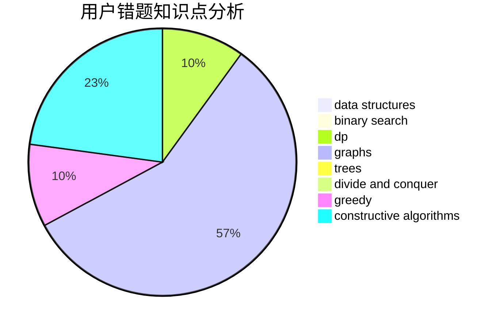

# Leogruece

<!-- tabs:start -->

#### **用户提交结果分析**

#### **用户做题类型偏好分析**

#### **用户错题知识点分析**

<!-- tabs:end -->
# 推荐题目
[1491C](https://codeforces.com/contest/1491/problem/C)		brute force,
                        data structures,
                        dp,
                        greedy,
                        implementation		  
[798C](https://codeforces.com/contest/798/problem/C)		dp,
                        greedy,
                        number theory		  
[274D](https://codeforces.com/contest/274/problem/D)		dfs and similar,
                        graphs,
                        greedy,
                        sortings		  
[1059E](https://codeforces.com/contest/1059/problem/E)		binary search,
                        data structures,
                        dp,
                        greedy,
                        trees		  
[13571](https://codeforces.com/contest/1357/problem/1)		dsu,graphs,sortings,trees		  
[634B](https://codeforces.com/contest/634/problem/B)		dsu,graphs,sortings,trees		  
[13132](https://codeforces.com/contest/1313/problem/2)		dsu,graphs,sortings,trees		  
[1297D](https://codeforces.com/contest/1297/problem/D)		*special problem,
                        binary search,
                        greedy,
                        sortings		  
[319C](https://codeforces.com/contest/319/problem/C)		dp,
                        geometry		  
[931F](https://codeforces.com/contest/931/problem/F)		dsu,graphs,sortings,trees		  
