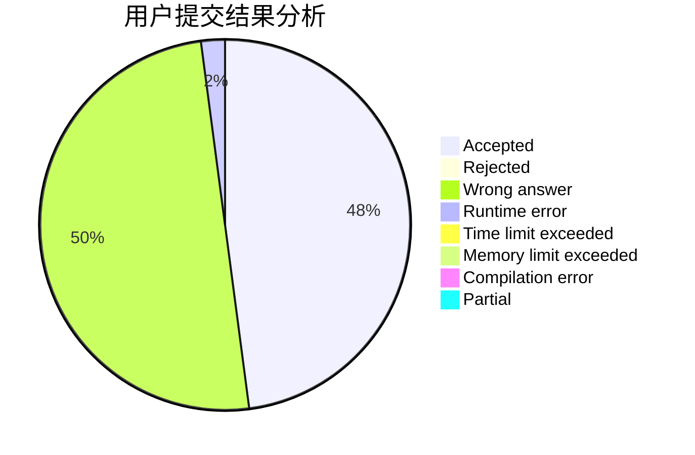
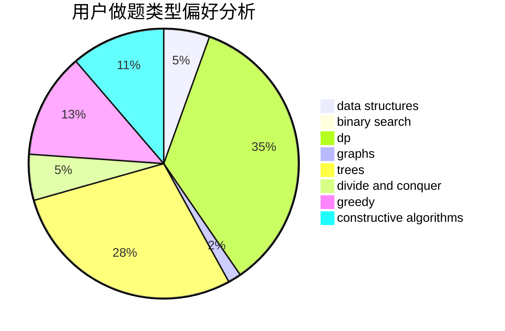
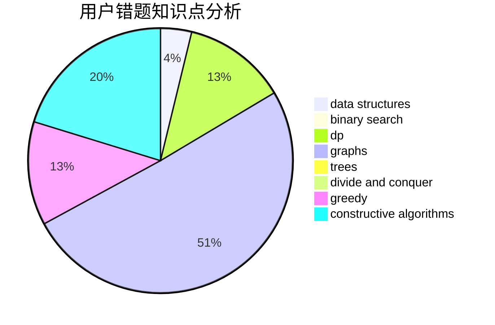

# Leogruece

<!-- tabs:start -->

#### **用户提交结果分析**

#### **用户做题类型偏好分析**

#### **用户错题知识点分析**

<!-- tabs:end -->
# 推荐题目
[1483E](https://codeforces.com/contest/1483/problem/E)		dsu,graphs,sortings,trees		  
[77E](https://codeforces.com/contest/77/problem/E)		geometry		  
[257D](https://codeforces.com/contest/257/problem/D)		greedy,
                        math		  
[1059B](https://codeforces.com/contest/1059/problem/B)		implementation		  
[1349F1](https://codeforces.com/contest/1349F/problem/1)		dp,
                        fft,
                        math		  
[616E](https://codeforces.com/contest/616/problem/E)		implementation,
                        math,
                        number theory		  
[1304D](https://codeforces.com/contest/1304/problem/D)		constructive algorithms,
                        graphs,
                        greedy,
                        two pointers		  
[1291A](https://codeforces.com/contest/1291/problem/A)		greedy,
                        math,
                        strings		  
[300E](https://codeforces.com/contest/300/problem/E)		binary search,
                        math,
                        number theory		  
[913B](https://codeforces.com/contest/913/problem/B)		implementation,
                        trees		  
