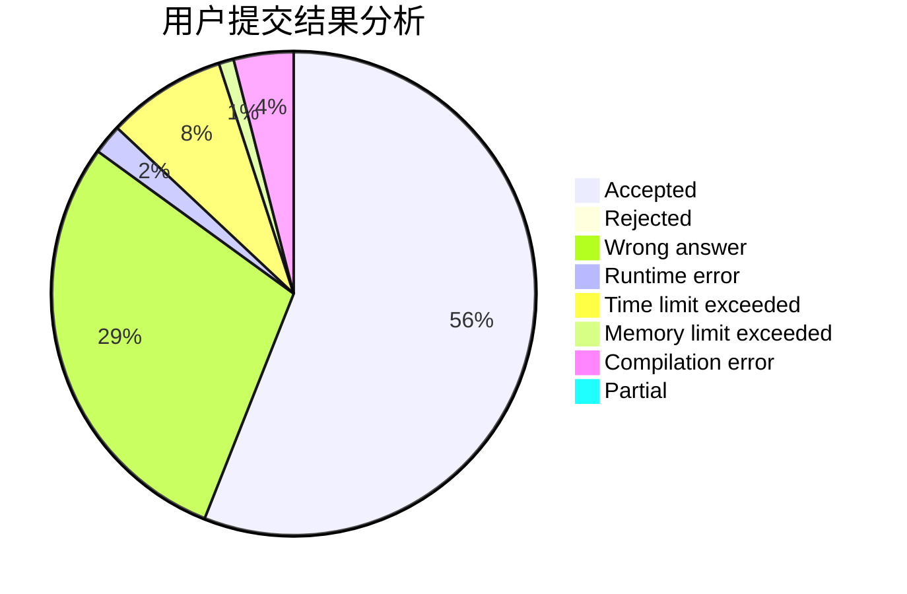
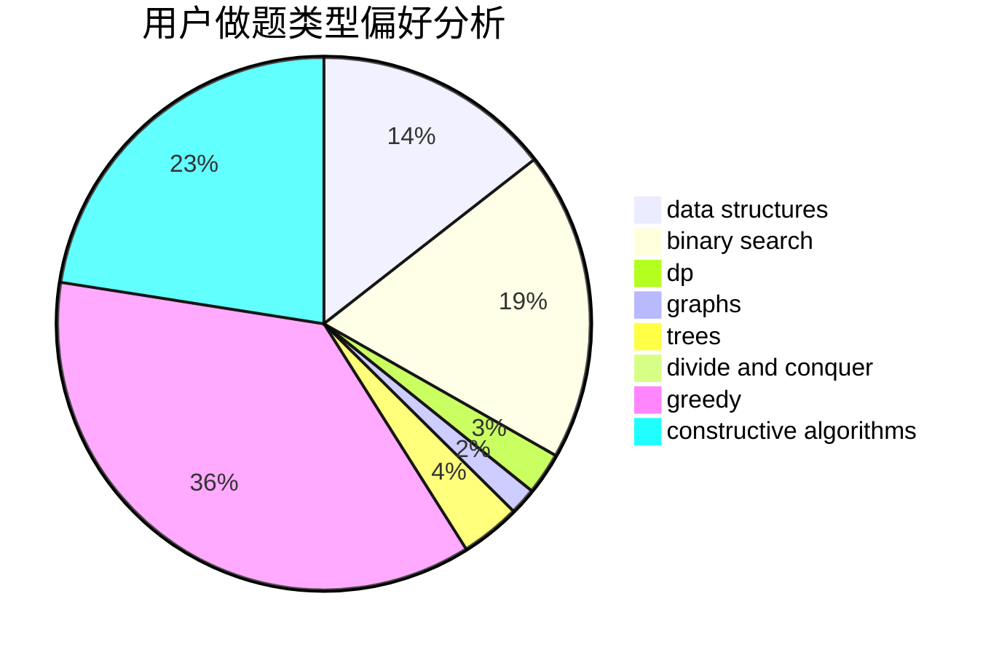
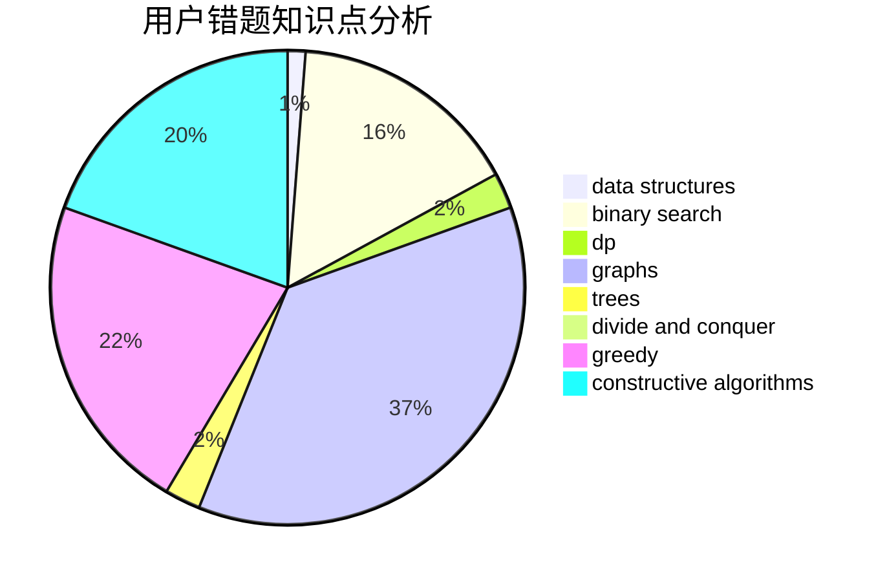

# Leohh123
<!-- tabs:start -->
#### **用户提交结果分析**

#### **用户做题类型偏好分析**

#### **用户错题知识点分析**

<!-- tabs:end -->
# 推荐题目
[Vasya And The Matrix](http://codeforces.com/problemset/problem/1016/D)		constructive algorithms,
                        flows,
                        math		  
[Minimum Triangulation](http://codeforces.com/problemset/problem/1140/D)		dp,
                        greedy,
                        math		  
[Ancient Berland Circus](http://codeforces.com/problemset/problem/1/C)		geometry,
                        math		  
[Correcting Mistakes](http://codeforces.com/problemset/problem/533/E)		constructive algorithms,
                        dp,
                        greedy,
                        hashing,
                        strings,
                        two pointers		  
[Odd-Even Subsequence](http://codeforces.com/problemset/problem/1370/D)		binary search,
                        dp,
                        dsu,
                        greedy,
                        implementation		  
[Divide Candies](http://codeforces.com/problemset/problem/1056/B)		math,
                        number theory		  
[Random Elections](http://codeforces.com/problemset/problem/850/E)		bitmasks,
                        brute force,
                        divide and conquer,
                        fft,
                        math		  
[Event Dates](http://codeforces.com/problemset/problem/45/D)		greedy,
                        meet-in-the-middle,
                        sortings		  
[Numbers on Whiteboard](http://codeforces.com/problemset/problem/1430/C)		constructive algorithms,
                        data structures,
                        greedy,
                        implementation,
                        math		  
[Mentors](https://codeforces.com/contest/1298/problem/E)		binary search,
                        data structures,
                        implementation		  
<!-- tabs:start -->
#### **data structures**
[Numbers on Whiteboard](http://codeforces.com/problemset/problem/1430/C)		constructive algorithms,
                        data structures,
                        greedy,
                        implementation,
                        math		  
[Mentors](https://codeforces.com/contest/1298/problem/E)		binary search,
                        data structures,
                        implementation		  
[Hot is Cold](http://codeforces.com/problemset/problem/1146/E)		bitmasks,
                        data structures,
                        divide and conquer,
                        implementation		  
[Julia the snail](http://codeforces.com/problemset/problem/793/F)		data structures,
                        divide and conquer,
                        dp		  
[Store](http://codeforces.com/problemset/problem/1010/E)		data structures		  
[Replacement](http://codeforces.com/problemset/problem/570/C)		constructive algorithms,
                        data structures,
                        implementation		  
[Iqea](http://codeforces.com/problemset/problem/936/E)		data structures,
                        dfs and similar,
                        divide and conquer,
                        dsu,
                        shortest paths,
                        trees		  
[Lazy Student](http://codeforces.com/problemset/problem/605/B)		constructive algorithms,
                        data structures,
                        graphs		  
[Watching Fireworks is Fun](http://codeforces.com/problemset/problem/372/C)		data structures,
                        dp,
                        math		  
[Propagating tree](http://codeforces.com/problemset/problem/383/C)		data structures,
                        dfs and similar,
                        trees		  
#### **binary search**
[Odd-Even Subsequence](http://codeforces.com/problemset/problem/1370/D)		binary search,
                        dp,
                        dsu,
                        greedy,
                        implementation		  
[Mentors](https://codeforces.com/contest/1298/problem/E)		binary search,
                        data structures,
                        implementation		  
[Rock Is Push](https://codeforces.com/contest/1247/problem/E)		binary search,
                        dp		  
[Maximum width](http://codeforces.com/problemset/problem/1492/C)		binary search,
                        data structures,
                        dp,
                        greedy,
                        two pointers		  
[Pairs](http://codeforces.com/problemset/problem/1463/D)		binary search,
                        constructive algorithms,
                        greedy,
                        two pointers		  
[Old Floppy Drive](http://codeforces.com/problemset/problem/1490/G)		binary search,
                        data structures,
                        math		  
[Odd Mineral Resource](http://codeforces.com/problemset/problem/1479/D)		binary search,
                        bitmasks,
                        brute force,
                        data structures,
                        probabilities,
                        trees		  
[Complicated Computations](http://codeforces.com/problemset/problem/1436/E)		binary search,
                        data structures,
                        two pointers		  
[Divide and Summarize](http://codeforces.com/problemset/problem/1461/D)		binary search,
                        brute force,
                        data structures,
                        divide and conquer,
                        implementation,
                        sortings		  
[K-beautiful Strings](http://codeforces.com/problemset/problem/1493/C)		binary search,
                        brute force,
                        constructive algorithms,
                        greedy,
                        strings		  
#### **dp**
[Minimum Triangulation](http://codeforces.com/problemset/problem/1140/D)		dp,
                        greedy,
                        math		  
[Correcting Mistakes](http://codeforces.com/problemset/problem/533/E)		constructive algorithms,
                        dp,
                        greedy,
                        hashing,
                        strings,
                        two pointers		  
[Odd-Even Subsequence](http://codeforces.com/problemset/problem/1370/D)		binary search,
                        dp,
                        dsu,
                        greedy,
                        implementation		  
[Basketball Team](http://codeforces.com/problemset/problem/107/B)		combinatorics,
                        dp,
                        math,
                        probabilities		  
[Bear and Tree Jumps](http://codeforces.com/problemset/problem/771/C)		dfs and similar,
                        dp,
                        trees		  
[Julia the snail](http://codeforces.com/problemset/problem/793/F)		data structures,
                        divide and conquer,
                        dp		  
[Jeff and Brackets](http://codeforces.com/problemset/problem/351/C)		dp,
                        matrices		  
[Quick Tortoise](http://codeforces.com/problemset/problem/232/E)		bitmasks,
                        divide and conquer,
                        dp		  
[Recycling Bottles](http://codeforces.com/problemset/problem/671/A)		dp,
                        geometry,
                        greedy,
                        implementation		  
[Array Shrinking](http://codeforces.com/problemset/problem/1312/E)		dp,
                        greedy		  
#### **graph**
[Cutting Figure](http://codeforces.com/problemset/problem/193/A)		constructive algorithms,
                        graphs,
                        trees		  
[Lazy Student](http://codeforces.com/problemset/problem/605/B)		constructive algorithms,
                        data structures,
                        graphs		  
[Sleepy Game](http://codeforces.com/problemset/problem/936/B)		dfs and similar,
                        dp,
                        games,
                        graphs		  
[Number of Simple Paths](http://codeforces.com/problemset/problem/1454/E)		combinatorics,
                        dfs and similar,
                        graphs,
                        trees		  
[Minimum Ties](http://codeforces.com/problemset/problem/1487/C)		brute force,
                        constructive algorithms,
                        dfs and similar,
                        graphs,
                        greedy,
                        implementation,
                        math		  
[Chef Monocarp](http://codeforces.com/problemset/problem/1437/C)		dp,
                        flows,
                        graph matchings,
                        greedy,
                        math,
                        sortings		  
[Strange Housing](http://codeforces.com/problemset/problem/1470/D)		constructive algorithms,
                        dfs and similar,
                        graph matchings,
                        graphs,
                        greedy		  
[Longest Simple Cycle](http://codeforces.com/problemset/problem/1476/C)		dp,
                        graphs,
                        greedy		  
[Shortest and Longest LIS](http://codeforces.com/problemset/problem/1304/D)		constructive algorithms,
                        graphs,
                        greedy,
                        two pointers		  
[Ball in Berland](http://codeforces.com/problemset/problem/1475/C)		combinatorics,
                        graphs,
                        math		  
#### **trees**
[Bear and Tree Jumps](http://codeforces.com/problemset/problem/771/C)		dfs and similar,
                        dp,
                        trees		  
[Kamil and Making a Stream](https://codeforces.com/contest/1230/problem/E)		math,
                        number theory,
                        trees		  
[Cutting Figure](http://codeforces.com/problemset/problem/193/A)		constructive algorithms,
                        graphs,
                        trees		  
[Iqea](http://codeforces.com/problemset/problem/936/E)		data structures,
                        dfs and similar,
                        divide and conquer,
                        dsu,
                        shortest paths,
                        trees		  
[Number of Simple Paths](http://codeforces.com/problemset/problem/1454/E)		combinatorics,
                        dfs and similar,
                        graphs,
                        trees		  
[Propagating tree](http://codeforces.com/problemset/problem/383/C)		data structures,
                        dfs and similar,
                        trees		  
[Tree Shuffling](http://codeforces.com/problemset/problem/1363/E)		dfs and similar,
                        dp,
                        greedy,
                        trees		  
[Odd Mineral Resource](http://codeforces.com/problemset/problem/1479/D)		binary search,
                        bitmasks,
                        brute force,
                        data structures,
                        probabilities,
                        trees		  
[Yet Another Card Deck](http://codeforces.com/problemset/problem/1511/C)		brute force,
                        data structures,
                        implementation,
                        trees		  
[Diameter Cuts](http://codeforces.com/problemset/problem/1499/F)		combinatorics,
                        dfs and similar,
                        dp,
                        trees		  
#### **divide and conquer**
[Random Elections](http://codeforces.com/problemset/problem/850/E)		bitmasks,
                        brute force,
                        divide and conquer,
                        fft,
                        math		  
[Hot is Cold](http://codeforces.com/problemset/problem/1146/E)		bitmasks,
                        data structures,
                        divide and conquer,
                        implementation		  
[Julia the snail](http://codeforces.com/problemset/problem/793/F)		data structures,
                        divide and conquer,
                        dp		  
[Quick Tortoise](http://codeforces.com/problemset/problem/232/E)		bitmasks,
                        divide and conquer,
                        dp		  
[Iqea](http://codeforces.com/problemset/problem/936/E)		data structures,
                        dfs and similar,
                        divide and conquer,
                        dsu,
                        shortest paths,
                        trees		  
[Divide and Summarize](http://codeforces.com/problemset/problem/1461/D)		binary search,
                        brute force,
                        data structures,
                        divide and conquer,
                        implementation,
                        sortings		  
[Song of the Sirens](http://codeforces.com/problemset/problem/1466/G)		combinatorics,
                        divide and conquer,
                        hashing,
                        math,
                        string suffix structures,
                        strings		  
[Permutation Transformation](http://codeforces.com/problemset/problem/1490/D)		dfs and similar,
                        divide and conquer,
                        implementation		  
[Skyline Photo](https://codeforces.com/contest/1483/problem/C)		data structures,
                        divide and conquer,
                        dp		  
[Fib-tree](http://codeforces.com/problemset/problem/1491/E)		brute force,
                        dfs and similar,
                        divide and conquer,
                        number theory,
                        trees		  
#### **greedy**
[Minimum Triangulation](http://codeforces.com/problemset/problem/1140/D)		dp,
                        greedy,
                        math		  
[Correcting Mistakes](http://codeforces.com/problemset/problem/533/E)		constructive algorithms,
                        dp,
                        greedy,
                        hashing,
                        strings,
                        two pointers		  
[Odd-Even Subsequence](http://codeforces.com/problemset/problem/1370/D)		binary search,
                        dp,
                        dsu,
                        greedy,
                        implementation		  
[Event Dates](http://codeforces.com/problemset/problem/45/D)		greedy,
                        meet-in-the-middle,
                        sortings		  
[Numbers on Whiteboard](http://codeforces.com/problemset/problem/1430/C)		constructive algorithms,
                        data structures,
                        greedy,
                        implementation,
                        math		  
[Sorting Railway Cars](https://codeforces.com/contest/606/problem/C)		constructive algorithms,
                        greedy		  
[Recycling Bottles](http://codeforces.com/problemset/problem/671/A)		dp,
                        geometry,
                        greedy,
                        implementation		  
[Toy Train](https://codeforces.com/contest/1130/problem/D2)		brute force,
                        greedy		  
[Array Shrinking](http://codeforces.com/problemset/problem/1312/E)		dp,
                        greedy		  
[Birthday](http://codeforces.com/problemset/problem/623/D)		greedy,
                        math,
                        probabilities		  
#### **constructive algorithms**
[Vasya And The Matrix](http://codeforces.com/problemset/problem/1016/D)		constructive algorithms,
                        flows,
                        math		  
[Correcting Mistakes](http://codeforces.com/problemset/problem/533/E)		constructive algorithms,
                        dp,
                        greedy,
                        hashing,
                        strings,
                        two pointers		  
[Numbers on Whiteboard](http://codeforces.com/problemset/problem/1430/C)		constructive algorithms,
                        data structures,
                        greedy,
                        implementation,
                        math		  
[Sorting Railway Cars](https://codeforces.com/contest/606/problem/C)		constructive algorithms,
                        greedy		  
[Cutting Figure](http://codeforces.com/problemset/problem/193/A)		constructive algorithms,
                        graphs,
                        trees		  
[Guess the Array](http://codeforces.com/problemset/problem/727/C)		constructive algorithms,
                        interactive,
                        math		  
[Replacement](http://codeforces.com/problemset/problem/570/C)		constructive algorithms,
                        data structures,
                        implementation		  
[Lazy Student](http://codeforces.com/problemset/problem/605/B)		constructive algorithms,
                        data structures,
                        graphs		  
[Nezzar and Nice Beatmap](https://codeforces.com/contest/1478/problem/F)		constructive algorithms,
                        geometry,
                        greedy,
                        math,
                        sortings		  
[Egor and an RPG game](http://codeforces.com/problemset/problem/1097/E)		constructive algorithms,
                        greedy		  
#### **sortings**
[Event Dates](http://codeforces.com/problemset/problem/45/D)		greedy,
                        meet-in-the-middle,
                        sortings		  
[Page Numbers](http://codeforces.com/problemset/problem/34/C)		expression parsing,
                        implementation,
                        sortings,
                        strings		  
[Nezzar and Nice Beatmap](https://codeforces.com/contest/1478/problem/F)		constructive algorithms,
                        geometry,
                        greedy,
                        math,
                        sortings		  
[Diamond Miner](https://codeforces.com/contest/1496/problem/C)		geometry,
                        greedy,
                        math,
                        sortings		  
[Meximization](http://codeforces.com/problemset/problem/1497/A)		brute force,
                        data structures,
                        greedy,
                        sortings		  
[Avoiding Zero](http://codeforces.com/problemset/problem/1427/A)		math,
                        sortings		  
[Divide and Summarize](http://codeforces.com/problemset/problem/1461/D)		binary search,
                        brute force,
                        data structures,
                        divide and conquer,
                        implementation,
                        sortings		  
[Chef Monocarp](http://codeforces.com/problemset/problem/1437/C)		dp,
                        flows,
                        graph matchings,
                        greedy,
                        math,
                        sortings		  
[Replacing Elements](http://codeforces.com/problemset/problem/1473/A)		greedy,
                        implementation,
                        math,
                        sortings		  
[Eastern Exhibition](http://codeforces.com/problemset/problem/1486/B)		binary search,
                        geometry,
                        shortest paths,
                        sortings		  
<!-- tabs:end -->
