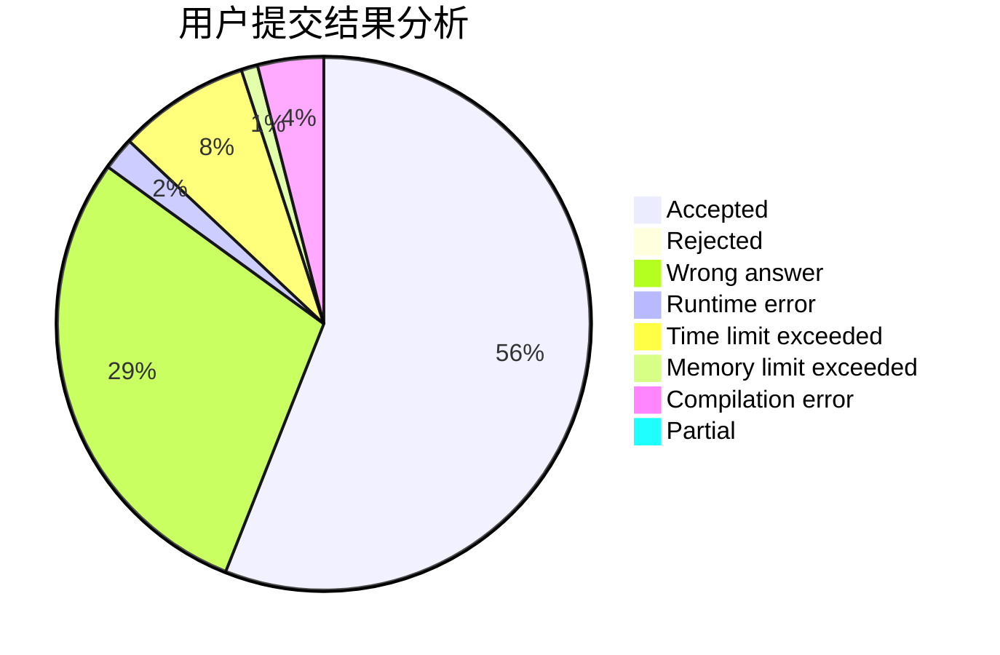
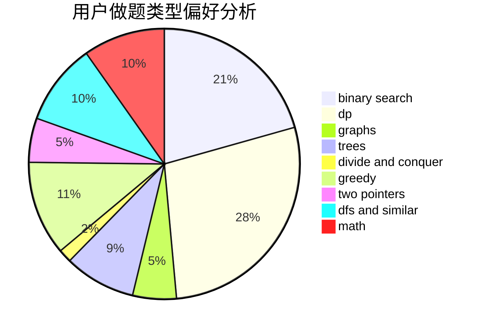

# Leohh123

<!-- tabs:start -->

#### **用户提交结果分析**

#### **用户做题类型偏好分析**

<!-- tabs:end -->
# 推荐题目
[1379A](https://codeforces.com/contest/1379/problem/A)
[555C](https://codeforces.com/contest/555/problem/C)
[1464B](https://codeforces.com/contest/1464/problem/B)
[651D](https://codeforces.com/contest/651/problem/D)
[1078D](https://codeforces.com/contest/1078/problem/D)
[479A](https://codeforces.com/contest/479/problem/A)
[791B](https://codeforces.com/contest/791/problem/B)
[1056E](https://codeforces.com/contest/1056/problem/E)
[224B](https://codeforces.com/contest/224/problem/B)
[1080A](https://codeforces.com/contest/1080/problem/A)
