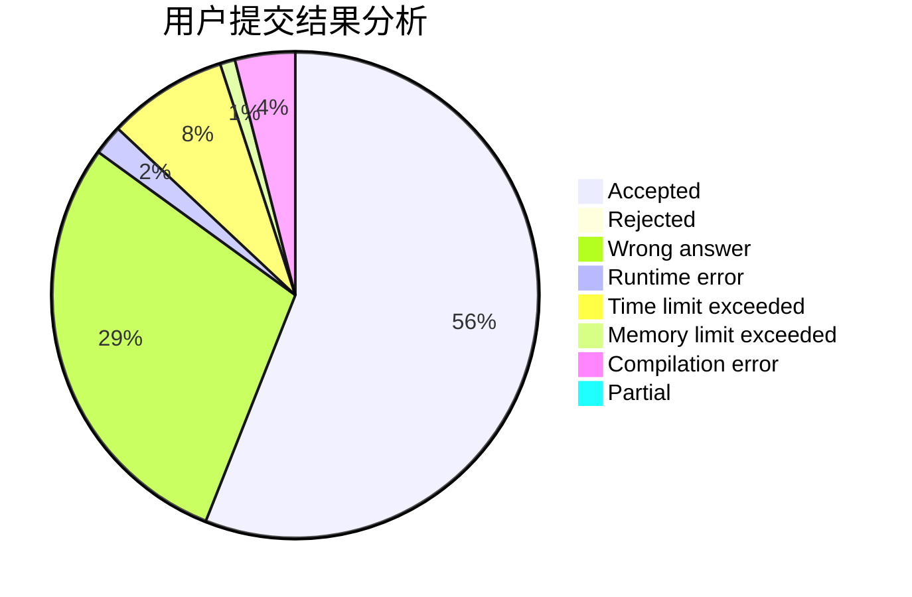
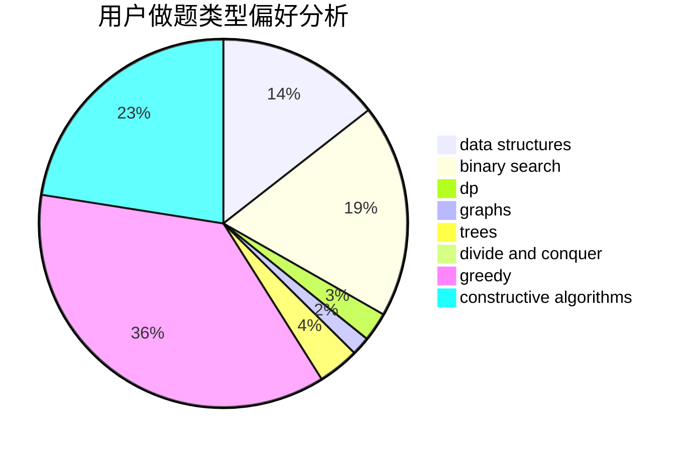
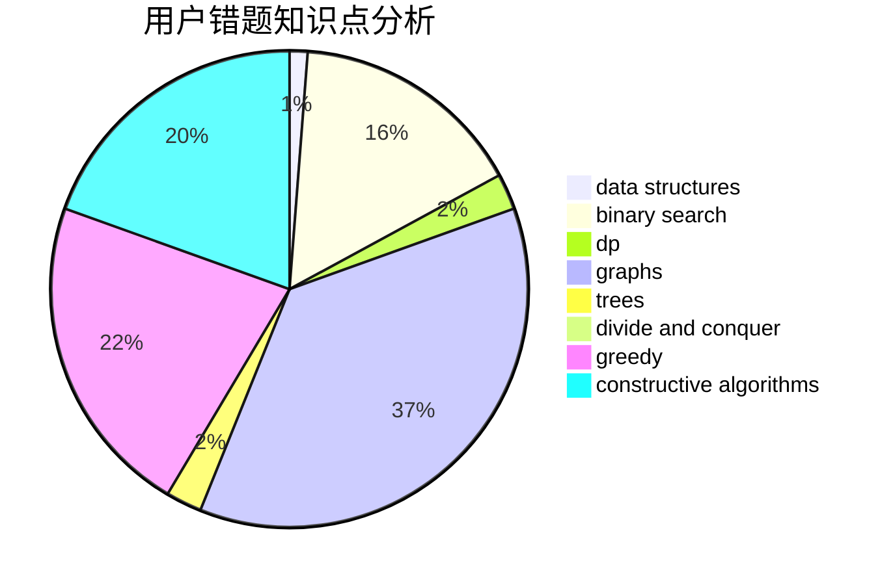

# Leohh123

<!-- tabs:start -->

#### **用户提交结果分析**

#### **用户做题类型偏好分析**

#### **用户错题知识点分析**

<!-- tabs:end -->
# 推荐题目
[1370D](https://codeforces.com/contest/1370/problem/D)		binary search,
                        dp,
                        dsu,
                        greedy,
                        implementation		  
[533E](https://codeforces.com/contest/533/problem/E)		constructive algorithms,
                        dp,
                        greedy,
                        hashing,
                        strings,
                        two pointers		  
[1454E](https://codeforces.com/contest/1454/problem/E)		combinatorics,
                        dfs and similar,
                        graphs,
                        trees		  
[623D](https://codeforces.com/contest/623/problem/D)		greedy,
                        math,
                        probabilities		  
[1078A](https://codeforces.com/contest/1078/problem/A)		dsu,graphs,sortings,trees		  
[45D](https://codeforces.com/contest/45/problem/D)		greedy,
                        meet-in-the-middle,
                        sortings		  
[771C](https://codeforces.com/contest/771/problem/C)		dfs and similar,
                        dp,
                        trees		  
[1056B](https://codeforces.com/contest/1056/problem/B)		math,
                        number theory		  
[1C](https://codeforces.com/contest/1/problem/C)		geometry,
                        math		  
[107B](https://codeforces.com/contest/107/problem/B)		combinatorics,
                        dp,
                        math,
                        probabilities		  
