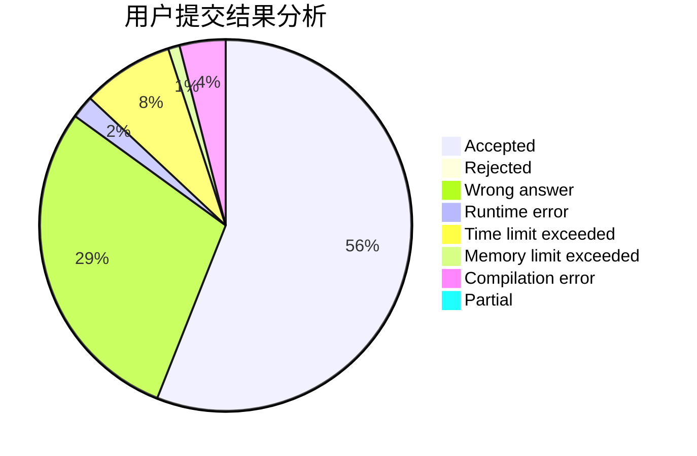
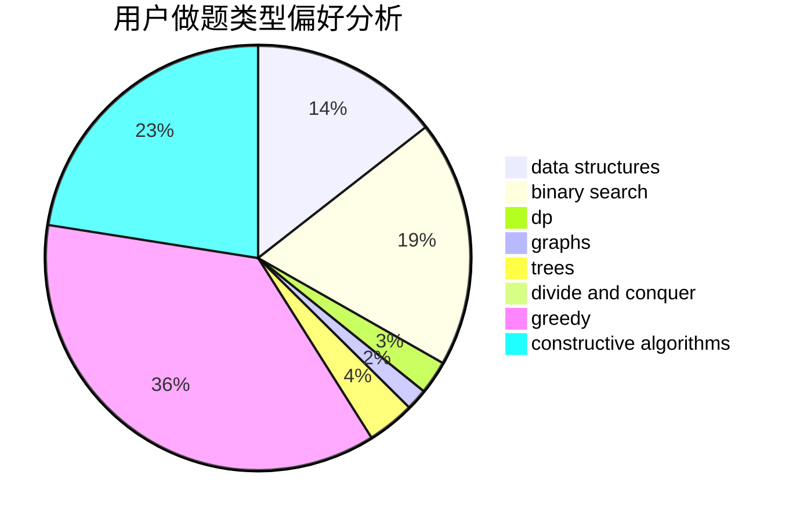
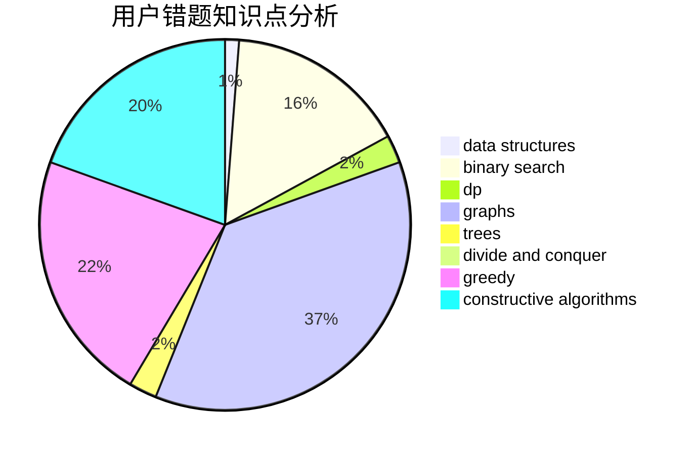

# Leohh123
<!-- tabs:start -->
#### **用户提交结果分析**

#### **用户做题类型偏好分析**

#### **用户错题知识点分析**

<!-- tabs:end -->
# 推荐题目
[Vasya And The Matrix](http://codeforces.com/problemset/problem/1016/D)		constructive algorithms,
                        flows,
                        math		  
[Minimum Triangulation](http://codeforces.com/problemset/problem/1140/D)		dp,
                        greedy,
                        math		  
[Ancient Berland Circus](http://codeforces.com/problemset/problem/1/C)		geometry,
                        math		  
[Correcting Mistakes](http://codeforces.com/problemset/problem/533/E)		constructive algorithms,
                        dp,
                        greedy,
                        hashing,
                        strings,
                        two pointers		  
[Odd-Even Subsequence](http://codeforces.com/problemset/problem/1370/D)		binary search,
                        dp,
                        dsu,
                        greedy,
                        implementation		  
[Divide Candies](http://codeforces.com/problemset/problem/1056/B)		math,
                        number theory		  
[Random Elections](http://codeforces.com/problemset/problem/850/E)		bitmasks,
                        brute force,
                        divide and conquer,
                        fft,
                        math		  
[Event Dates](http://codeforces.com/problemset/problem/45/D)		greedy,
                        meet-in-the-middle,
                        sortings		  
[Numbers on Whiteboard](http://codeforces.com/problemset/problem/1430/C)		constructive algorithms,
                        data structures,
                        greedy,
                        implementation,
                        math		  
[Mentors](https://codeforces.com/contest/1298/problem/E)		binary search,
                        data structures,
                        implementation		  
<!-- tabs:start -->
#### **data structures**
[Vasya And The Matrix](http://codeforces.com/problemset/problem/1430/C)		constructive algorithms,
                        data structures,
                        greedy,
                        implementation,
                        math		  
[Minimum Triangulation](https://codeforces.com/contest/1298/problem/E)		binary search,
                        data structures,
                        implementation		  
[Ancient Berland Circus](http://codeforces.com/problemset/problem/1146/E)		bitmasks,
                        data structures,
                        divide and conquer,
                        implementation		  
[Correcting Mistakes](http://codeforces.com/problemset/problem/793/F)		data structures,
                        divide and conquer,
                        dp		  
[Odd-Even Subsequence](http://codeforces.com/problemset/problem/1010/E)		data structures		  
[Divide Candies](http://codeforces.com/problemset/problem/570/C)		constructive algorithms,
                        data structures,
                        implementation		  
[Random Elections](http://codeforces.com/problemset/problem/936/E)		data structures,
                        dfs and similar,
                        divide and conquer,
                        dsu,
                        shortest paths,
                        trees		  
[Event Dates](http://codeforces.com/problemset/problem/605/B)		constructive algorithms,
                        data structures,
                        graphs		  
[Numbers on Whiteboard](http://codeforces.com/problemset/problem/372/C)		data structures,
                        dp,
                        math		  
[Mentors](http://codeforces.com/problemset/problem/383/C)		data structures,
                        dfs and similar,
                        trees		  
#### **binary search**
[Vasya And The Matrix](http://codeforces.com/problemset/problem/1370/D)		binary search,
                        dp,
                        dsu,
                        greedy,
                        implementation		  
[Minimum Triangulation](https://codeforces.com/contest/1298/problem/E)		binary search,
                        data structures,
                        implementation		  
[Ancient Berland Circus](https://codeforces.com/contest/1247/problem/E)		binary search,
                        dp		  
[Correcting Mistakes](http://codeforces.com/problemset/problem/1492/C)		binary search,
                        data structures,
                        dp,
                        greedy,
                        two pointers		  
[Odd-Even Subsequence](http://codeforces.com/problemset/problem/1463/D)		binary search,
                        constructive algorithms,
                        greedy,
                        two pointers		  
[Divide Candies](http://codeforces.com/problemset/problem/1490/G)		binary search,
                        data structures,
                        math		  
[Random Elections](http://codeforces.com/problemset/problem/1479/D)		binary search,
                        bitmasks,
                        brute force,
                        data structures,
                        probabilities,
                        trees		  
[Event Dates](http://codeforces.com/problemset/problem/1436/E)		binary search,
                        data structures,
                        two pointers		  
[Numbers on Whiteboard](http://codeforces.com/problemset/problem/1461/D)		binary search,
                        brute force,
                        data structures,
                        divide and conquer,
                        implementation,
                        sortings		  
[Mentors](http://codeforces.com/problemset/problem/1493/C)		binary search,
                        brute force,
                        constructive algorithms,
                        greedy,
                        strings		  
#### **dp**
[Vasya And The Matrix](http://codeforces.com/problemset/problem/1140/D)		dp,
                        greedy,
                        math		  
[Minimum Triangulation](http://codeforces.com/problemset/problem/533/E)		constructive algorithms,
                        dp,
                        greedy,
                        hashing,
                        strings,
                        two pointers		  
[Ancient Berland Circus](http://codeforces.com/problemset/problem/1370/D)		binary search,
                        dp,
                        dsu,
                        greedy,
                        implementation		  
[Correcting Mistakes](http://codeforces.com/problemset/problem/107/B)		combinatorics,
                        dp,
                        math,
                        probabilities		  
[Odd-Even Subsequence](http://codeforces.com/problemset/problem/771/C)		dfs and similar,
                        dp,
                        trees		  
[Divide Candies](http://codeforces.com/problemset/problem/793/F)		data structures,
                        divide and conquer,
                        dp		  
[Random Elections](http://codeforces.com/problemset/problem/351/C)		dp,
                        matrices		  
[Event Dates](http://codeforces.com/problemset/problem/232/E)		bitmasks,
                        divide and conquer,
                        dp		  
[Numbers on Whiteboard](http://codeforces.com/problemset/problem/671/A)		dp,
                        geometry,
                        greedy,
                        implementation		  
[Mentors](http://codeforces.com/problemset/problem/1312/E)		dp,
                        greedy		  
#### **graph**
[Vasya And The Matrix](http://codeforces.com/problemset/problem/193/A)		constructive algorithms,
                        graphs,
                        trees		  
[Minimum Triangulation](http://codeforces.com/problemset/problem/605/B)		constructive algorithms,
                        data structures,
                        graphs		  
[Ancient Berland Circus](http://codeforces.com/problemset/problem/936/B)		dfs and similar,
                        dp,
                        games,
                        graphs		  
[Correcting Mistakes](http://codeforces.com/problemset/problem/1454/E)		combinatorics,
                        dfs and similar,
                        graphs,
                        trees		  
[Odd-Even Subsequence](http://codeforces.com/problemset/problem/1487/C)		brute force,
                        constructive algorithms,
                        dfs and similar,
                        graphs,
                        greedy,
                        implementation,
                        math		  
[Divide Candies](http://codeforces.com/problemset/problem/1437/C)		dp,
                        flows,
                        graph matchings,
                        greedy,
                        math,
                        sortings		  
[Random Elections](http://codeforces.com/problemset/problem/1470/D)		constructive algorithms,
                        dfs and similar,
                        graph matchings,
                        graphs,
                        greedy		  
[Event Dates](http://codeforces.com/problemset/problem/1476/C)		dp,
                        graphs,
                        greedy		  
[Numbers on Whiteboard](http://codeforces.com/problemset/problem/1304/D)		constructive algorithms,
                        graphs,
                        greedy,
                        two pointers		  
[Mentors](http://codeforces.com/problemset/problem/1475/C)		combinatorics,
                        graphs,
                        math		  
#### **trees**
[Vasya And The Matrix](http://codeforces.com/problemset/problem/771/C)		dfs and similar,
                        dp,
                        trees		  
[Minimum Triangulation](https://codeforces.com/contest/1230/problem/E)		math,
                        number theory,
                        trees		  
[Ancient Berland Circus](http://codeforces.com/problemset/problem/193/A)		constructive algorithms,
                        graphs,
                        trees		  
[Correcting Mistakes](http://codeforces.com/problemset/problem/936/E)		data structures,
                        dfs and similar,
                        divide and conquer,
                        dsu,
                        shortest paths,
                        trees		  
[Odd-Even Subsequence](http://codeforces.com/problemset/problem/1454/E)		combinatorics,
                        dfs and similar,
                        graphs,
                        trees		  
[Divide Candies](http://codeforces.com/problemset/problem/383/C)		data structures,
                        dfs and similar,
                        trees		  
[Random Elections](http://codeforces.com/problemset/problem/1363/E)		dfs and similar,
                        dp,
                        greedy,
                        trees		  
[Event Dates](http://codeforces.com/problemset/problem/1479/D)		binary search,
                        bitmasks,
                        brute force,
                        data structures,
                        probabilities,
                        trees		  
[Numbers on Whiteboard](http://codeforces.com/problemset/problem/1511/C)		brute force,
                        data structures,
                        implementation,
                        trees		  
[Mentors](http://codeforces.com/problemset/problem/1499/F)		combinatorics,
                        dfs and similar,
                        dp,
                        trees		  
#### **divide and conquer**
[Vasya And The Matrix](http://codeforces.com/problemset/problem/850/E)		bitmasks,
                        brute force,
                        divide and conquer,
                        fft,
                        math		  
[Minimum Triangulation](http://codeforces.com/problemset/problem/1146/E)		bitmasks,
                        data structures,
                        divide and conquer,
                        implementation		  
[Ancient Berland Circus](http://codeforces.com/problemset/problem/793/F)		data structures,
                        divide and conquer,
                        dp		  
[Correcting Mistakes](http://codeforces.com/problemset/problem/232/E)		bitmasks,
                        divide and conquer,
                        dp		  
[Odd-Even Subsequence](http://codeforces.com/problemset/problem/936/E)		data structures,
                        dfs and similar,
                        divide and conquer,
                        dsu,
                        shortest paths,
                        trees		  
[Divide Candies](http://codeforces.com/problemset/problem/1461/D)		binary search,
                        brute force,
                        data structures,
                        divide and conquer,
                        implementation,
                        sortings		  
[Random Elections](http://codeforces.com/problemset/problem/1466/G)		combinatorics,
                        divide and conquer,
                        hashing,
                        math,
                        string suffix structures,
                        strings		  
[Event Dates](http://codeforces.com/problemset/problem/1490/D)		dfs and similar,
                        divide and conquer,
                        implementation		  
[Numbers on Whiteboard](https://codeforces.com/contest/1483/problem/C)		data structures,
                        divide and conquer,
                        dp		  
[Mentors](http://codeforces.com/problemset/problem/1491/E)		brute force,
                        dfs and similar,
                        divide and conquer,
                        number theory,
                        trees		  
#### **greedy**
[Vasya And The Matrix](http://codeforces.com/problemset/problem/1140/D)		dp,
                        greedy,
                        math		  
[Minimum Triangulation](http://codeforces.com/problemset/problem/533/E)		constructive algorithms,
                        dp,
                        greedy,
                        hashing,
                        strings,
                        two pointers		  
[Ancient Berland Circus](http://codeforces.com/problemset/problem/1370/D)		binary search,
                        dp,
                        dsu,
                        greedy,
                        implementation		  
[Correcting Mistakes](http://codeforces.com/problemset/problem/45/D)		greedy,
                        meet-in-the-middle,
                        sortings		  
[Odd-Even Subsequence](http://codeforces.com/problemset/problem/1430/C)		constructive algorithms,
                        data structures,
                        greedy,
                        implementation,
                        math		  
[Divide Candies](https://codeforces.com/contest/606/problem/C)		constructive algorithms,
                        greedy		  
[Random Elections](http://codeforces.com/problemset/problem/671/A)		dp,
                        geometry,
                        greedy,
                        implementation		  
[Event Dates](https://codeforces.com/contest/1130/problem/D2)		brute force,
                        greedy		  
[Numbers on Whiteboard](http://codeforces.com/problemset/problem/1312/E)		dp,
                        greedy		  
[Mentors](http://codeforces.com/problemset/problem/623/D)		greedy,
                        math,
                        probabilities		  
#### **constructive algorithms**
[Vasya And The Matrix](http://codeforces.com/problemset/problem/1016/D)		constructive algorithms,
                        flows,
                        math		  
[Minimum Triangulation](http://codeforces.com/problemset/problem/533/E)		constructive algorithms,
                        dp,
                        greedy,
                        hashing,
                        strings,
                        two pointers		  
[Ancient Berland Circus](http://codeforces.com/problemset/problem/1430/C)		constructive algorithms,
                        data structures,
                        greedy,
                        implementation,
                        math		  
[Correcting Mistakes](https://codeforces.com/contest/606/problem/C)		constructive algorithms,
                        greedy		  
[Odd-Even Subsequence](http://codeforces.com/problemset/problem/193/A)		constructive algorithms,
                        graphs,
                        trees		  
[Divide Candies](http://codeforces.com/problemset/problem/727/C)		constructive algorithms,
                        interactive,
                        math		  
[Random Elections](http://codeforces.com/problemset/problem/570/C)		constructive algorithms,
                        data structures,
                        implementation		  
[Event Dates](http://codeforces.com/problemset/problem/605/B)		constructive algorithms,
                        data structures,
                        graphs		  
[Numbers on Whiteboard](https://codeforces.com/contest/1478/problem/F)		constructive algorithms,
                        geometry,
                        greedy,
                        math,
                        sortings		  
[Mentors](http://codeforces.com/problemset/problem/1097/E)		constructive algorithms,
                        greedy		  
#### **sortings**
[Vasya And The Matrix](http://codeforces.com/problemset/problem/45/D)		greedy,
                        meet-in-the-middle,
                        sortings		  
[Minimum Triangulation](http://codeforces.com/problemset/problem/34/C)		expression parsing,
                        implementation,
                        sortings,
                        strings		  
[Ancient Berland Circus](https://codeforces.com/contest/1478/problem/F)		constructive algorithms,
                        geometry,
                        greedy,
                        math,
                        sortings		  
[Correcting Mistakes](https://codeforces.com/contest/1496/problem/C)		geometry,
                        greedy,
                        math,
                        sortings		  
[Odd-Even Subsequence](http://codeforces.com/problemset/problem/1495/A)		geometry,
                        greedy,
                        math,
                        sortings		  
[Divide Candies](http://codeforces.com/problemset/problem/1497/A)		brute force,
                        data structures,
                        greedy,
                        sortings		  
[Random Elections](http://codeforces.com/problemset/problem/1427/A)		math,
                        sortings		  
[Event Dates](http://codeforces.com/problemset/problem/1461/D)		binary search,
                        brute force,
                        data structures,
                        divide and conquer,
                        implementation,
                        sortings		  
[Numbers on Whiteboard](http://codeforces.com/problemset/problem/1437/C)		dp,
                        flows,
                        graph matchings,
                        greedy,
                        math,
                        sortings		  
[Mentors](http://codeforces.com/problemset/problem/1473/A)		greedy,
                        implementation,
                        math,
                        sortings		  
<!-- tabs:end -->
