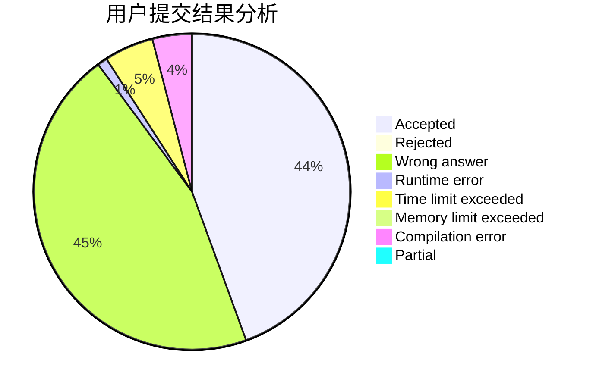
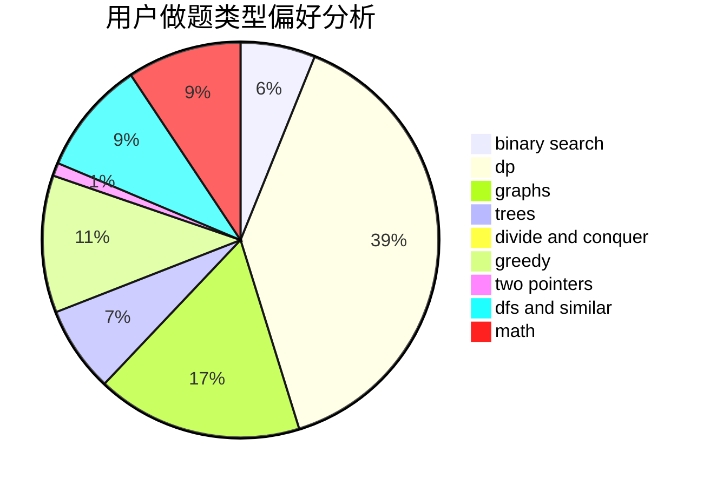

# LetMeFly

<!-- tabs:start -->

#### **用户提交结果分析**

#### **用户做题类型偏好分析**

<!-- tabs:end -->
# 推荐题目
[1131D](https://codeforces.com/contest/1131/problem/D)
[976F](https://codeforces.com/contest/976/problem/F)
[86C](https://codeforces.com/contest/86/problem/C)
[1042F](https://codeforces.com/contest/1042/problem/F)
[1431G](https://codeforces.com/contest/1431/problem/G)
[27C](https://codeforces.com/contest/27/problem/C)
[486C](https://codeforces.com/contest/486/problem/C)
[662B](https://codeforces.com/contest/662/problem/B)
[1025C](https://codeforces.com/contest/1025/problem/C)
[832D](https://codeforces.com/contest/832/problem/D)
