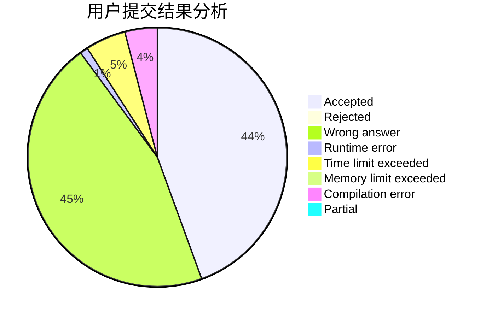
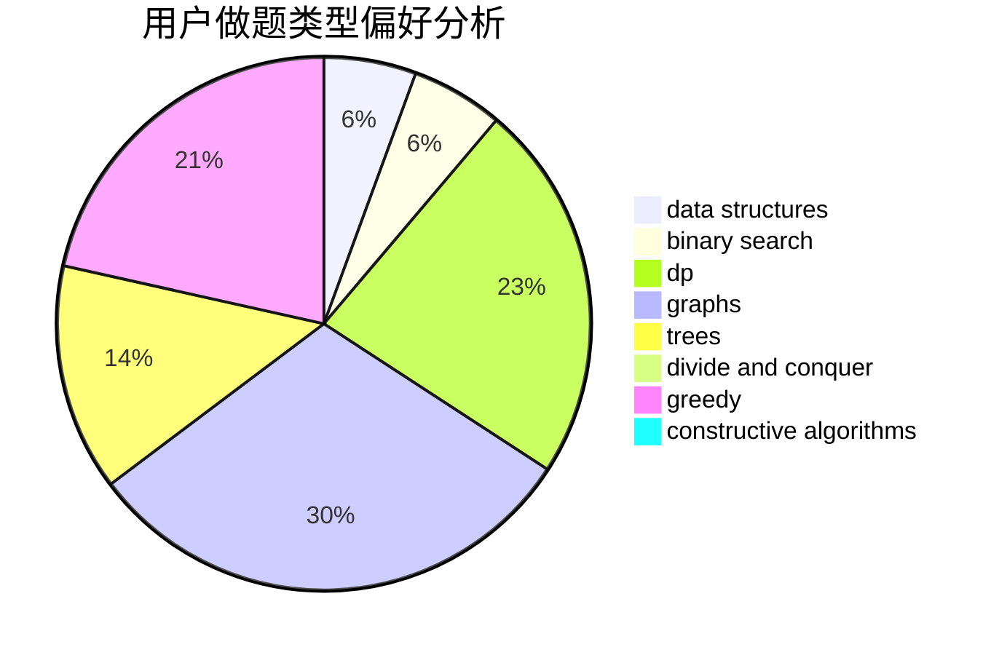

# LetMeFly

<!-- tabs:start -->

#### **用户提交结果分析**

#### **用户做题类型偏好分析**

#### **用户错题知识点分析**

<!-- tabs:end -->
# 推荐题目
[1131D](https://codeforces.com/contest/1131/problem/D)		dfs and similar,
                        dp,
                        dsu,
                        graphs,
                        greedy		  
[976F](https://codeforces.com/contest/976/problem/F)		flows,
                        graphs		  
[86C](https://codeforces.com/contest/86/problem/C)		dp,
                        string suffix structures,
                        trees		  
[1042F](https://codeforces.com/contest/1042/problem/F)		data structures,
                        dfs and similar,
                        dsu,
                        graphs,
                        greedy,
                        sortings,
                        trees		  
[1431G](https://codeforces.com/contest/1431/problem/G)		*special problem,
                        dp,
                        games,
                        greedy		  
[27C](https://codeforces.com/contest/27/problem/C)		constructive algorithms,
                        greedy		  
[486C](https://codeforces.com/contest/486/problem/C)		brute force,
                        greedy,
                        implementation		  
[662B](https://codeforces.com/contest/662/problem/B)		dfs and similar,
                        graphs		  
[1025C](https://codeforces.com/contest/1025/problem/C)		constructive algorithms,
                        implementation		  
[832D](https://codeforces.com/contest/832/problem/D)		dfs and similar,
                        graphs,
                        trees		  
