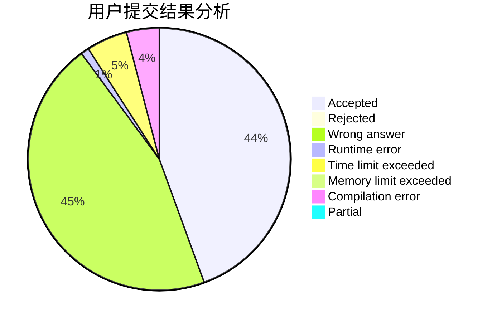
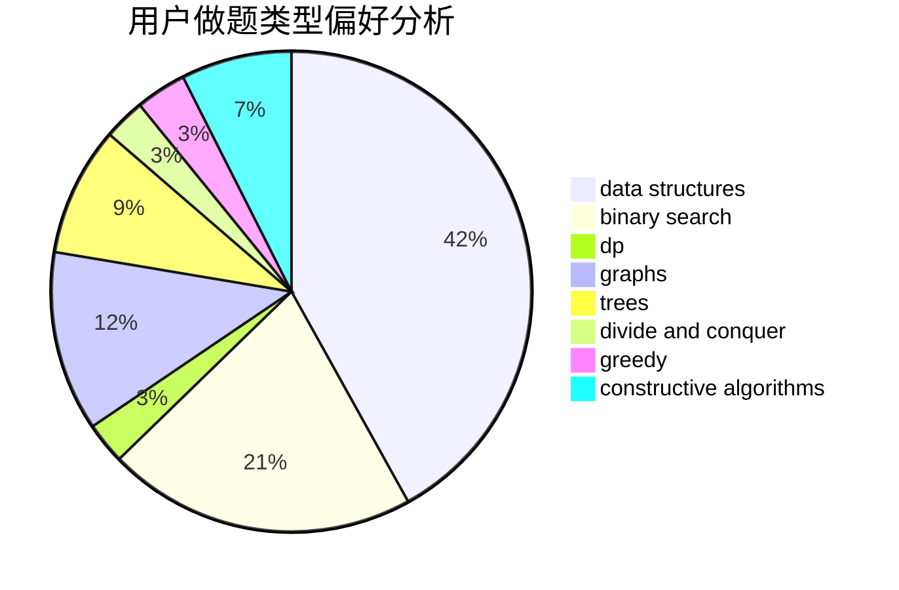

# LetMeFly

<!-- tabs:start -->

#### **用户提交结果分析**

#### **用户做题类型偏好分析**

#### **用户错题知识点分析**

<!-- tabs:end -->
# 推荐题目
[1129D](https://codeforces.com/contest/1129/problem/D)		data structures,
                        dp		  
[954I](https://codeforces.com/contest/954/problem/I)		fft,
                        math		  
[851B](https://codeforces.com/contest/851/problem/B)		geometry,
                        math		  
[1042C](https://codeforces.com/contest/1042/problem/C)		constructive algorithms,
                        greedy,
                        math		  
[1423J](https://codeforces.com/contest/1423/problem/J)		bitmasks,
                        constructive algorithms,
                        dp,
                        math		  
[261E](https://codeforces.com/contest/261/problem/E)		brute force,
                        dp,
                        two pointers		  
[466E](https://codeforces.com/contest/466/problem/E)		dfs and similar,
                        dsu,
                        graphs,
                        trees		  
[631B](https://codeforces.com/contest/631/problem/B)		constructive algorithms,
                        implementation		  
[1023G](https://codeforces.com/contest/1023/problem/G)		data structures,
                        flows,
                        trees		  
[814B](https://codeforces.com/contest/814/problem/B)		constructive algorithms		  
