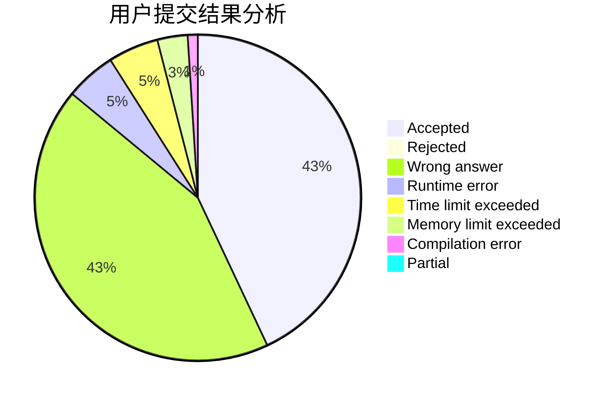
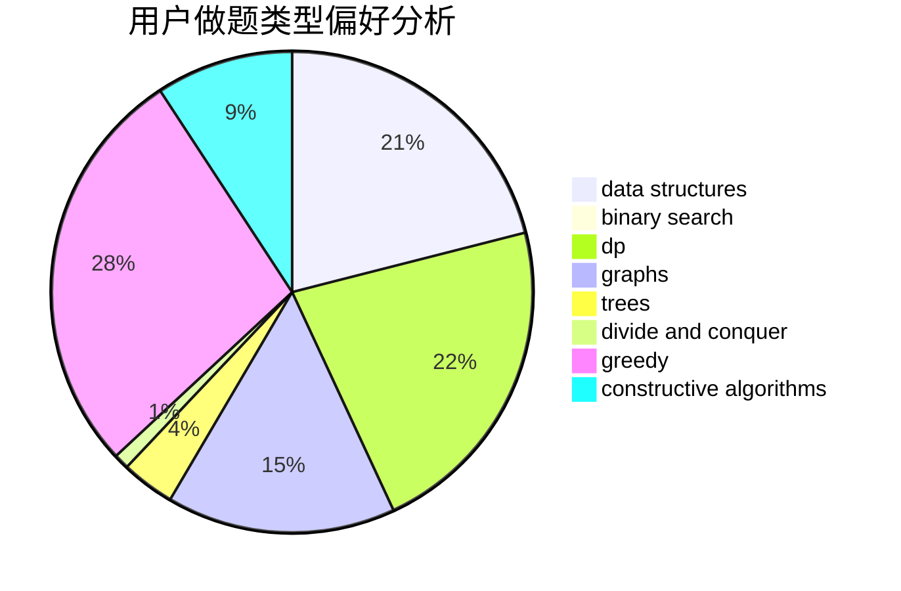

# LetheCcc

<!-- tabs:start -->

#### **用户提交结果分析**

#### **用户做题类型偏好分析**

#### **用户错题知识点分析**

<!-- tabs:end -->
# 推荐题目
[1322D](https://codeforces.com/contest/1322/problem/D)		bitmasks,
                        dp		  
[438B](https://codeforces.com/contest/438/problem/B)		dsu,graphs,sortings,trees		  
[777A](https://codeforces.com/contest/777/problem/A)		constructive algorithms,
                        implementation,
                        math		  
[1132A](https://codeforces.com/contest/1132/problem/A)		greedy,
                        implementation		  
[1243A](https://codeforces.com/contest/1243/problem/A)		implementation		  
[782D](https://codeforces.com/contest/782/problem/D)		dsu,graphs,sortings,trees		  
[1511F](https://codeforces.com/contest/1511/problem/F)		brute force,
                        data structures,
                        dp,
                        matrices,
                        string suffix structures,
                        strings		  
[1017E](https://codeforces.com/contest/1017/problem/E)		geometry,
                        hashing,
                        strings		  
[116A](https://codeforces.com/contest/116/problem/A)		implementation		  
[852E](https://codeforces.com/contest/852/problem/E)		dp		  
