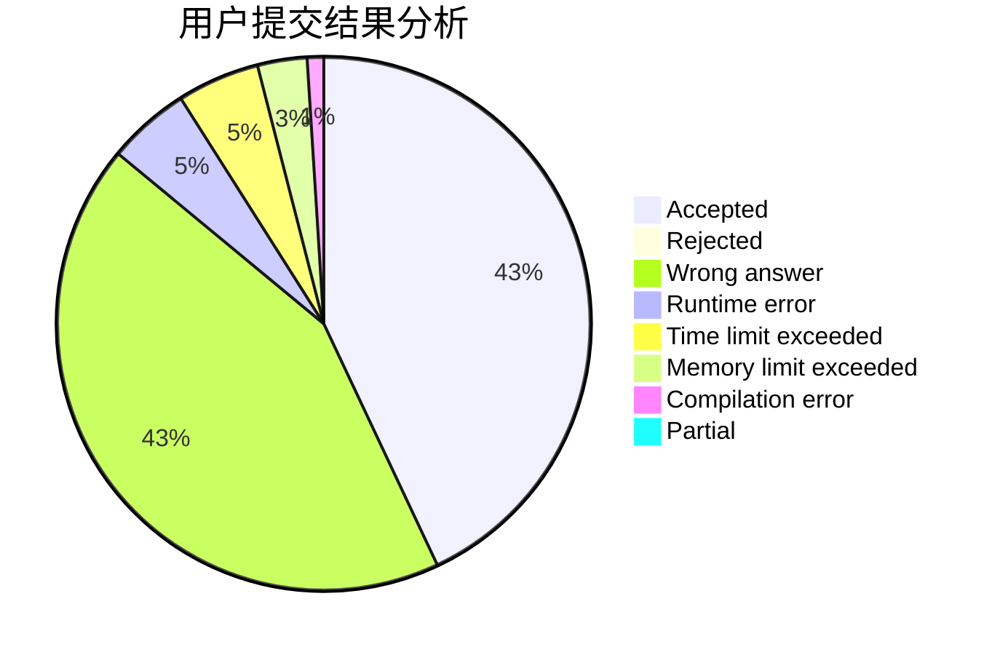
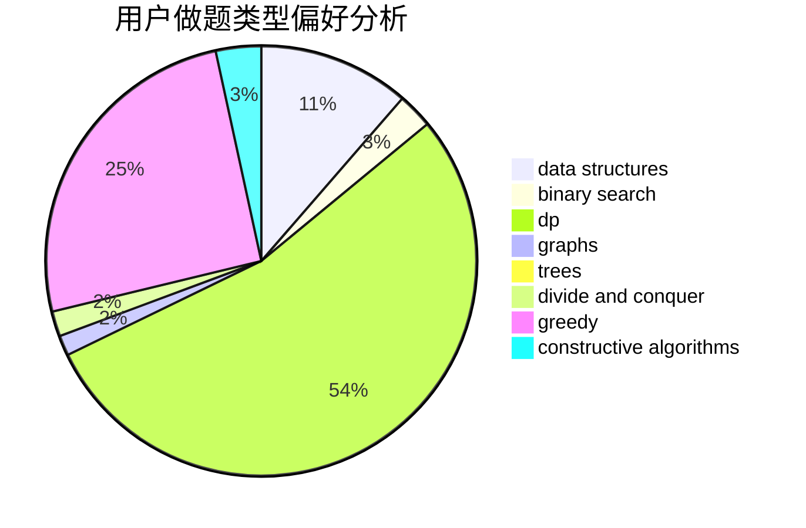

# LetheCcc

<!-- tabs:start -->

#### **用户提交结果分析**

#### **用户做题类型偏好分析**

#### **用户错题知识点分析**

<!-- tabs:end -->
# 推荐题目
[1329C](https://codeforces.com/contest/1329/problem/C)		constructive algorithms,
                        data structures,
                        greedy,
                        implementation		  
[45G](https://codeforces.com/contest/45/problem/G)		number theory		  
[794G](https://codeforces.com/contest/794/problem/G)		combinatorics,
                        dp,
                        math		  
[1133E](https://codeforces.com/contest/1133/problem/E)		dp,
                        sortings,
                        two pointers		  
[12482](https://codeforces.com/contest/1248/problem/2)		dsu,graphs,sortings,trees		  
[800C](https://codeforces.com/contest/800/problem/C)		dsu,graphs,sortings,trees		  
[16C](https://codeforces.com/contest/16/problem/C)		binary search,
                        number theory		  
[1019A](https://codeforces.com/contest/1019/problem/A)		brute force,
                        greedy		  
[1173F](https://codeforces.com/contest/1173/problem/F)		dsu,graphs,sortings,trees		  
[870E](https://codeforces.com/contest/870/problem/E)		dfs and similar,
                        dsu,
                        graphs,
                        trees		  
