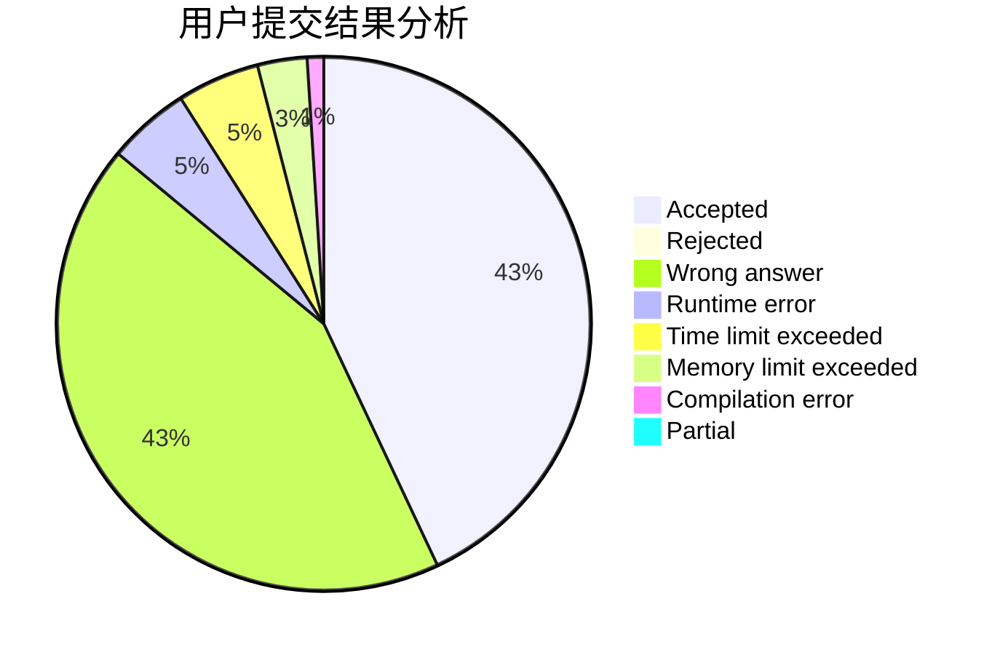
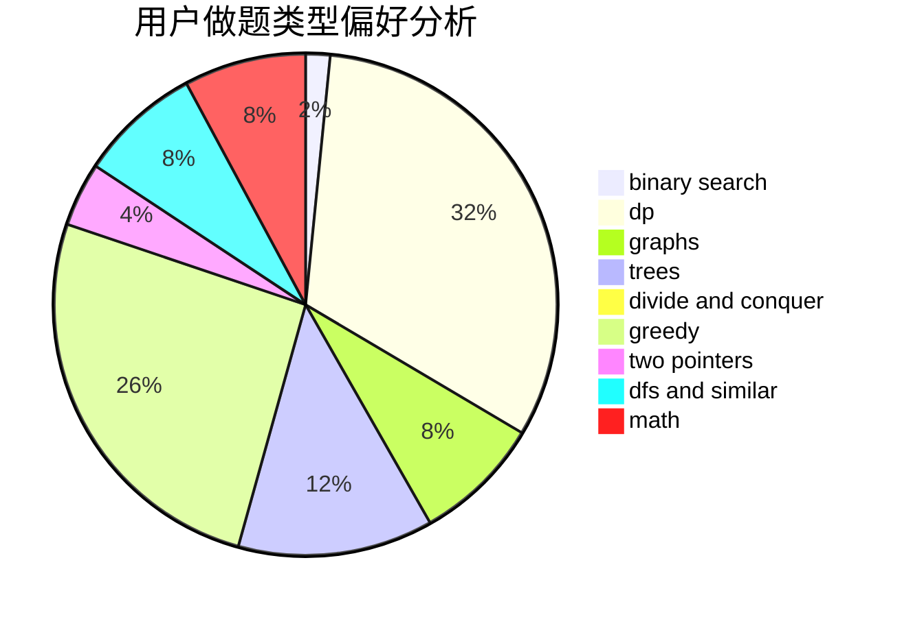

# LetheCcc

<!-- tabs:start -->

#### **用户提交结果分析**

#### **用户做题类型偏好分析**

<!-- tabs:end -->
# 推荐题目
[1329C](https://codeforces.com/contest/1329/problem/C)
[45G](https://codeforces.com/contest/45/problem/G)
[794G](https://codeforces.com/contest/794/problem/G)
[1133E](https://codeforces.com/contest/1133/problem/E)
[12482](https://codeforces.com/contest/1248/problem/2)
[800C](https://codeforces.com/contest/800/problem/C)
[16C](https://codeforces.com/contest/16/problem/C)
[1019A](https://codeforces.com/contest/1019/problem/A)
[1173F](https://codeforces.com/contest/1173/problem/F)
[870E](https://codeforces.com/contest/870/problem/E)
