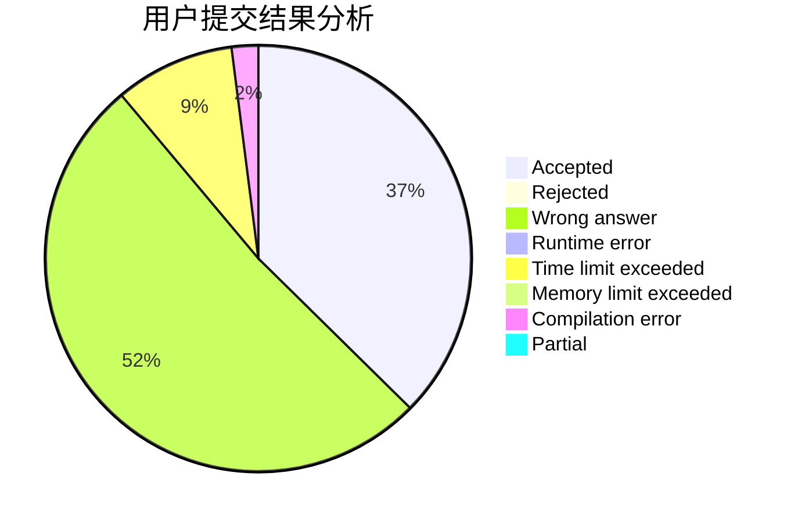
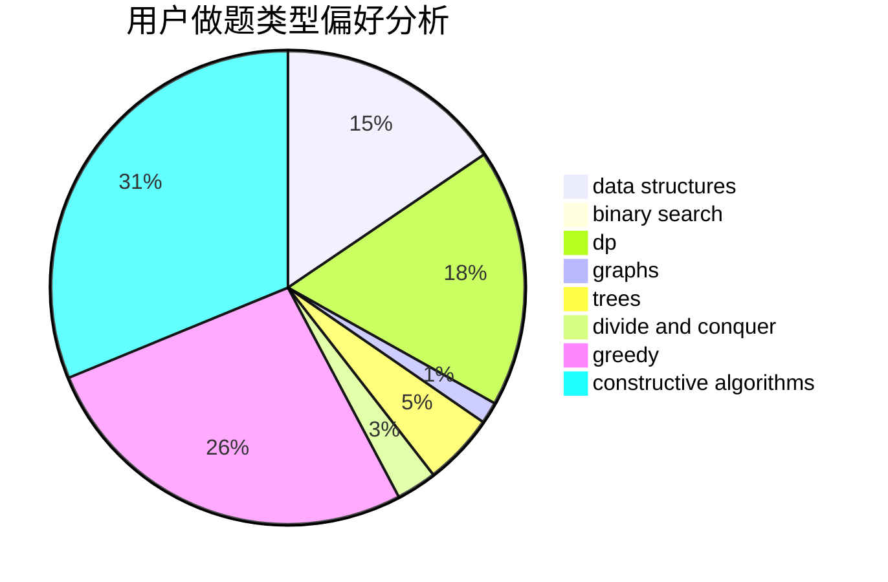
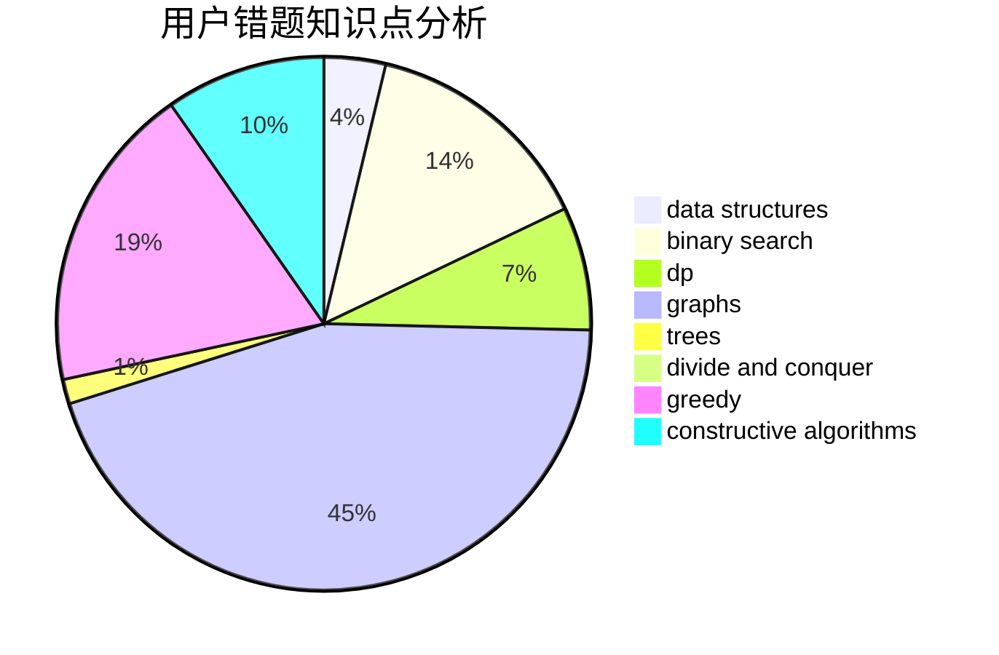

# 6ziv

<!-- tabs:start -->

#### **用户提交结果分析**

#### **用户做题类型偏好分析**

#### **用户错题知识点分析**

<!-- tabs:end -->
# 推荐题目
[1399D](https://codeforces.com/contest/1399/problem/D)		constructive algorithms,
                        data structures,
                        greedy,
                        implementation		  
[1398F](https://codeforces.com/contest/1398/problem/F)		binary search,
                        data structures,
                        dp,
                        greedy,
                        two pointers		  
[1396C](https://codeforces.com/contest/1396/problem/C)		dp,
                        greedy,
                        implementation		  
[1399C](https://codeforces.com/contest/1399/problem/C)		brute force,
                        greedy,
                        two pointers		  
[1339A](https://codeforces.com/contest/1339/problem/A)		brute force,
                        dp,
                        implementation,
                        math		  
[1020E](https://codeforces.com/contest/1020/problem/E)		dsu,graphs,sortings,trees		  
[1156B](https://codeforces.com/contest/1156/problem/B)		dfs and similar,
                        greedy,
                        implementation,
                        sortings,
                        strings		  
[1399F](https://codeforces.com/contest/1399/problem/F)		data structures,
                        dp,
                        graphs,
                        sortings		  
[1398A](https://codeforces.com/contest/1398/problem/A)		geometry,
                        math		  
[13A](https://codeforces.com/contest/13/problem/A)		implementation,
                        math		  
