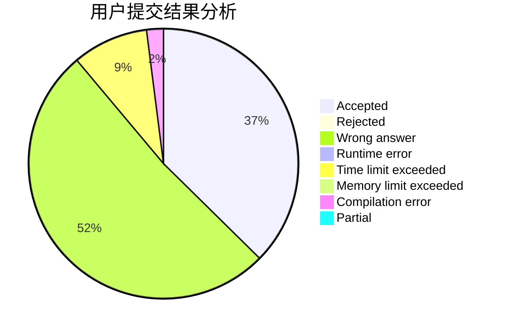
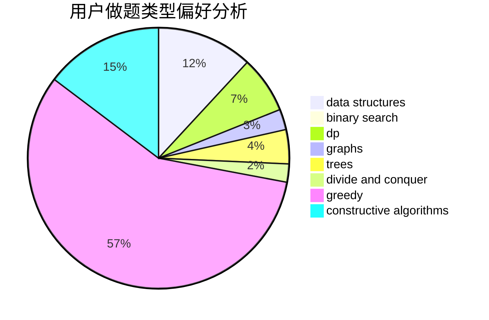
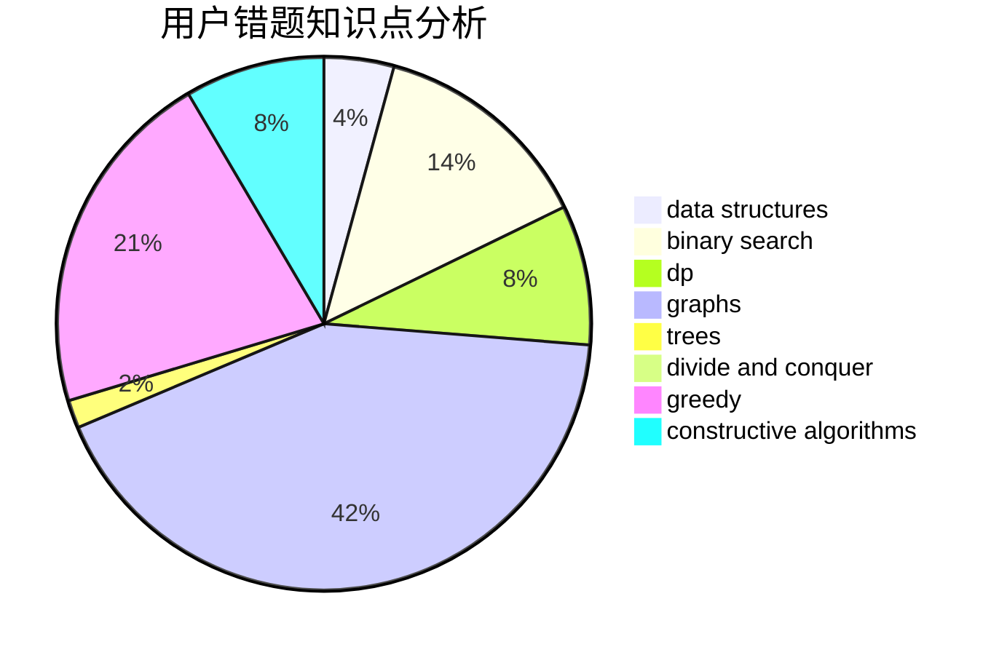

# 6ziv

<!-- tabs:start -->

#### **用户提交结果分析**

#### **用户做题类型偏好分析**

#### **用户错题知识点分析**

<!-- tabs:end -->
# 推荐题目
[1408E](https://codeforces.com/contest/1408/problem/E)		data structures,
                        dsu,
                        graphs,
                        greedy,
                        sortings,
                        trees		  
[1407E](https://codeforces.com/contest/1407/problem/E)		constructive algorithms,
                        dfs and similar,
                        dp,
                        graphs,
                        greedy,
                        shortest paths		  
[1405B](https://codeforces.com/contest/1405/problem/B)		constructive algorithms,
                        implementation		  
[1408D](https://codeforces.com/contest/1408/problem/D)		binary search,
                        brute force,
                        data structures,
                        dp,
                        implementation,
                        sortings,
                        two pointers		  
[1346A](https://codeforces.com/contest/1346/problem/A)		*special problem,
                        math		  
[1023C](https://codeforces.com/contest/1023/problem/C)		greedy		  
[1157G](https://codeforces.com/contest/1157/problem/G)		brute force,
                        constructive algorithms		  
[1408H](https://codeforces.com/contest/1408/problem/H)		binary search,
                        data structures,
                        flows,
                        greedy		  
[1406E](https://codeforces.com/contest/1406/problem/E)		interactive,
                        math,
                        number theory		  
[1409A](https://codeforces.com/contest/1409/problem/A)		greedy,
                        math		  
